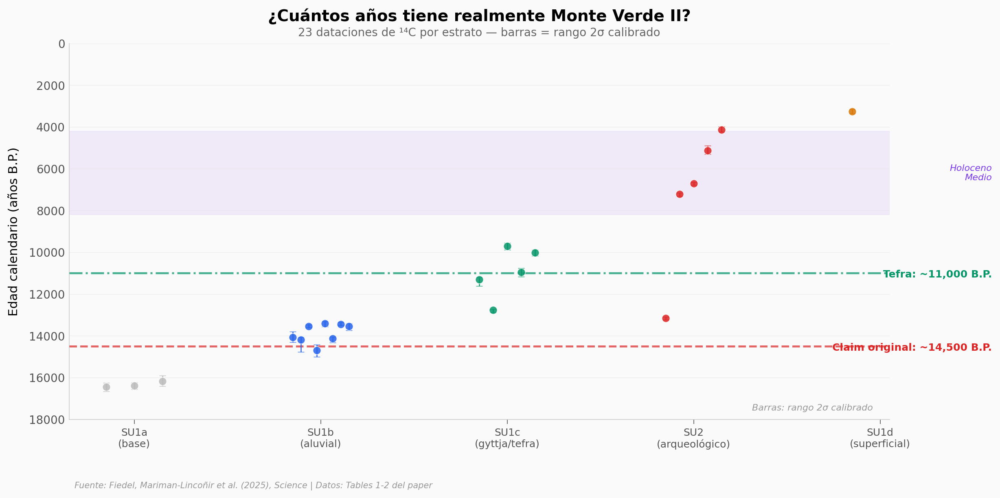

# Ciencia a Mordiscos

**La ciencia que contamos en video, aquí se puede tocar.**



Un video de 90 segundos engancha. Pero no puedes ver los datos, no puedes cuestionar los números, no puedes explorar por tu cuenta.

Aquí sí. Cada notebook toma un paper de Nature, Science o revistas similares, carga los datos originales, genera las gráficas, y te deja cambiar lo que quieras. No necesitas saber programar — abre en Google Colab, dale "Ejecutar todo", y los datos hablan solos.

---

## Notebooks

### Biodiversidad resiliente en un bosque tropical

¿Cuánto tarda un bosque tropical en volver a la vida? 16 grupos taxonómicos en Ecuador — desde bacterias hasta murciélagos. La abundancia recupera >90% en 30 años, pero la composición de especies se queda en ~75%.

[Notebook](papers/2026-04-09-biodiversidad-resiliencia-bosque-tropical/notebook.ipynb) · [README](papers/2026-04-09-biodiversidad-resiliencia-bosque-tropical/README.md) · [](https://colab.research.google.com/github/Ciencia-a-Mordiscos/lab/blob/main/papers/2026-04-09-biodiversidad-resiliencia-bosque-tropical/notebook.ipynb)

---


### 🏭 Una Industria Causa el 86% de Estos Contaminantes

**Ecología** · Nature Sustainability · Yang et al. (2025), inventario global de emisiones de Cl/BrPAHs usando XGBoost: 5.143 kg en 184 países, la sinterización de mineral de hierro genera el 86,1% del total. Australia lidera con 1.393 kg (27% global, 47 g/persona — 236× la mediana)

[Ver notebook](papers/2026-01-17-industria-86-contaminantes-emergentes/notebook) · [Leer más](papers/2026-01-17-industria-86-contaminantes-emergentes/README) · [](https://colab.research.google.com/github/Ciencia-a-Mordiscos/lab/blob/main/papers/2026-01-17-industria-86-contaminantes-emergentes/notebook.ipynb)

---

### 🤖 ¿Puede una IA Entrenada con Imágenes Inventadas Superar a 9 Radiólogos?

**Tecnología** · Nature Biomedical Engineering · Chen et al. (2026), BUSGen — primer modelo generativo fundacional para ecografía mamaria, pre-entrenado con 3,5 millones de imágenes. A partir de 25K imágenes sintéticas, el modelo supera a los entrenados con datos reales (AUC 0,932 vs 0,925). Evaluado contra 9 radiólogos certificados: +15,9 pp de sensibilidad

[Ver notebook](papers/2026-04-08-busgen-ecografia-mama-ia/notebook) · [Leer más](papers/2026-04-08-busgen-ecografia-mama-ia/README) · [](https://colab.research.google.com/github/Ciencia-a-Mordiscos/lab/blob/main/papers/2026-04-08-busgen-ecografia-mama-ia/notebook.ipynb)

---

### 🌊 Agricultura Circular con Agua de Mar y Sol

**Ecología** · Nature Water · Sun et al. (2026), ensayo de campo de 3 meses en Hainan — desalinización solar + agricultura circular: las sojas crecen +134% vs evaporación natural, +49% más semilla que con ósmosis inversa industrial, el sistema elimina 99,99% del sodio y alimenta a 47 personas por 0,6 ha

[Ver notebook](papers/2026-04-08-desalinizacion-solar-agricultura-circular/notebook) · [Leer más](papers/2026-04-08-desalinizacion-solar-agricultura-circular/README) · [](https://colab.research.google.com/github/Ciencia-a-Mordiscos/lab/blob/main/papers/2026-04-08-desalinizacion-solar-agricultura-circular/notebook.ipynb)

---

### 🌿 Los Bosques Tropicales Ahora Liberan Carbono

**Ecología** · Nature · Carle et al. (2025), 48 años de censos forestales en 20 parcelas de Queensland, Australia — los bosques pasaron de absorber +0,62 Mg C ha⁻¹ yr⁻¹ a liberar −0,93, impulsados por mortalidad extrema sin evidencia de fertilización por CO₂

[Ver notebook](papers/2026-01-17-bosques-tropicales-liberan-carbono/notebook) · [Leer más](papers/2026-01-17-bosques-tropicales-liberan-carbono/README) · [](https://colab.research.google.com/github/Ciencia-a-Mordiscos/lab/blob/main/papers/2026-01-17-bosques-tropicales-liberan-carbono/notebook.ipynb)

---

### 🦴 Discontinuidad Genética en la Cuenca de París al Final del Neolítico

**Arqueología** · Nature Ecology & Evolution · Tallman et al. (2026), 132 genomas antiguos de una tumba colectiva cerca de París — dos fases de entierro separadas por ~316 años revelan un recambio poblacional completo: de un grupo diverso a uno casi clonal con más ancestría agrícola, evidencia de *Yersinia pestis* y *Borrelia recurrentis*

[Ver notebook](papers/2026-04-07-discontinuidad-paris-neolitico/notebook) · [Leer más](papers/2026-04-07-discontinuidad-paris-neolitico/README) · [](https://colab.research.google.com/github/Ciencia-a-Mordiscos/lab/blob/main/papers/2026-04-07-discontinuidad-paris-neolitico/notebook.ipynb)

---

### ⚡ Renovables Fortalecen a Ecuador Contra la Sequía

**Ecología** · Nature Water · Sterl et al. (2026), 14 años de datos hidrológicos y factores de capacidad renovable — el río Paute cayó 42,4% en 2024 pero solar y eólica habrían seguido generando, revelando una "sinergia de año extremo"

[Ver notebook](papers/2026-04-07-renovables-fortalecen-ecuador-sequia/notebook) · [Leer más](papers/2026-04-07-renovables-fortalecen-ecuador-sequia/README) · [](https://colab.research.google.com/github/Ciencia-a-Mordiscos/lab/blob/main/papers/2026-04-07-renovables-fortalecen-ecuador-sequia/notebook.ipynb)

---

### 🧬 9 Billones de Bases de ADN Enseñaron a una IA a Escribir Vida

**Tecnología** · Nature · Nguyen et al. (2026), 705 benchmarks de predicción de variantes genéticas — Evo 2 (40B parámetros) compite con modelos especializados sin entrenamiento específico y lidera en BRCA1 (AUROC 0,901)

[Ver notebook](papers/2026-03-09-evo2-ia-adn-escribir-vida/notebook) · [Leer más](papers/2026-03-09-evo2-ia-adn-escribir-vida/README) · [](https://colab.research.google.com/github/Ciencia-a-Mordiscos/lab/blob/main/papers/2026-03-09-evo2-ia-adn-escribir-vida/notebook.ipynb)

---

### 🌊 Las Olas de Calor Cambian 176% la Vida en el Océano

**Ecología** · Nature Ecology & Evolution · Blowes et al. (2026), 702.037 estimaciones de biomasa en 1.566 especies de peces — las olas de calor crean ganadores (+176%) en el borde frío y perdedores (-43,4%) en el borde cálido

[Ver notebook](papers/2026-02-27-olas-calor-biomasa-peces-oceano/notebook) · [Leer más](papers/2026-02-27-olas-calor-biomasa-peces-oceano/README) · [](https://colab.research.google.com/github/Ciencia-a-Mordiscos/lab/blob/main/papers/2026-02-27-olas-calor-biomasa-peces-oceano/notebook.ipynb)

---


### 🌊 La circulación oceánica más débil en 1.300 años

**Geología** · Nature Geoscience · Thresher et al. (2026), corales bambú del Pacífico suroeste revelan que la circulación del Océano Sur y del Atlántico Norte están en mínimos del último milenio — y el Sur se mueve primero, con 20-50 años de ventaja

[Ver notebook](papers/2026-04-06-circulacion-atlantico-oceano-sur/notebook) · [Leer más](papers/2026-04-06-circulacion-atlantico-oceano-sur/README) · [](https://colab.research.google.com/github/Ciencia-a-Mordiscos/lab/blob/main/papers/2026-04-06-circulacion-atlantico-oceano-sur/notebook.ipynb)

---

### ⭐ Una estrella casi prístina de la Nube de Magallanes

**Astronomía** · Nature Astronomy · Ezzeddine et al. (2026), J0715−7334 tiene 20.000× menos hierro que el Sol — la única estrella ultra metal-poor que NO tiene exceso de carbono, huella de una supernova primordial de 30 M☉

[Ver notebook](papers/2026-04-04-estrella-pristina-nube-magallanes/notebook) · [Leer más](papers/2026-04-04-estrella-pristina-nube-magallanes/README) · [](https://colab.research.google.com/github/Ciencia-a-Mordiscos/lab/blob/main/papers/2026-04-04-estrella-pristina-nube-magallanes/notebook.ipynb)

---

### TRAPPIST-1 b y c: rocas desnudas a 40 años-luz

El JWST observó 52 horas continuas los dos planetas más cercanos a TRAPPIST-1. Resultado: rocas desnudas sin atmósfera. 490 K de día, cero de noche.

[Notebook](papers/2026-04-03-trappist-1-sin-atmosfera-jwst/notebook.ipynb) · [README](papers/2026-04-03-trappist-1-sin-atmosfera-jwst/README.md) · [](https://colab.research.google.com/github/Ciencia-a-Mordiscos/lab/blob/main/papers/2026-04-03-trappist-1-sin-atmosfera-jwst/notebook.ipynb)

### 📊 ¿Se puede confiar en un solo análisis?

**Tecnología** · Nature · Kovács et al. (2025), 504 reanálisis de 100 estudios sociales, solo 34% coinciden en tamaño del efecto (±0,05 d), 74% llegan a la misma conclusión

[Ver notebook](papers/2026-04-05-robustez-analitica-ciencias-sociales/notebook) · [Leer más](papers/2026-04-05-robustez-analitica-ciencias-sociales/README) · [](https://colab.research.google.com/github/Ciencia-a-Mordiscos/lab/blob/main/papers/2026-04-05-robustez-analitica-ciencias-sociales/notebook.ipynb)

---

### ✈️ Las estelas de los aviones limpios siguen calentando el planeta

**Ecología** · Nature · Voigt et al. (2026), motores lean-burn con bajo hollín forman estelas masivas, datos de mediciones in-flight y modelo ACM (Zenodo)

[Ver notebook](papers/2026-04-04-estelas-aviones-hollin-bajo/notebook) · [Leer más](papers/2026-04-04-estelas-aviones-hollin-bajo/README) · [](https://colab.research.google.com/github/Ciencia-a-Mordiscos/lab/blob/main/papers/2026-04-04-estelas-aviones-hollin-bajo/notebook.ipynb)

---

### 🔬 ¿Se puede replicar la ciencia social?

**Tecnología** · Nature · Protzko et al. (2025), 274 claims de 164 papers replicados, 55,1% se replica, efecto mediano se reduce a la mitad

[Ver notebook](papers/2026-04-05-replicabilidad-ciencias-sociales/notebook) · [Leer más](papers/2026-04-05-replicabilidad-ciencias-sociales/README) · [](https://colab.research.google.com/github/Ciencia-a-Mordiscos/lab/blob/main/papers/2026-04-05-replicabilidad-ciencias-sociales/notebook.ipynb)

---

### 🔬 ¿Se puede confiar en la ciencia social?

**Tecnología** · Nature · 600 papers de 62 revistas (2009–2018), 573 claims evaluados, 55,5% precisamente reproducible, solo 19,6% comparte datos

[Ver notebook](papers/2026-04-04-reproducibilidad-ciencias-sociales/notebook) · [Leer más](papers/2026-04-04-reproducibilidad-ciencias-sociales/README) · [](https://colab.research.google.com/github/Ciencia-a-Mordiscos/lab/blob/main/papers/2026-04-04-reproducibilidad-ciencias-sociales/notebook.ipynb)

---

### 🤖 La IA aduladora reduce la intención prosocial

**Tecnología** · Science · 1.604 participantes, diseño experimental, IA aduladora vs directa, repair d = 0,92, convicción d = 1,26

[Ver notebook](papers/2026-04-04-ia-aduladora-reduce-intencion-prosocial/notebook) · [Leer más](papers/2026-04-04-ia-aduladora-reduce-intencion-prosocial/README) · [](https://colab.research.google.com/github/Ciencia-a-Mordiscos/lab/blob/main/papers/2026-04-04-ia-aduladora-reduce-intencion-prosocial/notebook.ipynb)

---


### 🌧️ Nadie sabe cuánto llueve en casi todo el planeta

**Ecología** · Nature · 221.483 pluviómetros, 15.386 tiles globales, 68,7% sin cobertura, solo 13,4% cumple WMO

[Ver notebook](papers/2026-04-02-lluvia-pluviometros-planeta/notebook) · [Leer más](papers/2026-04-02-lluvia-pluviometros-planeta/README) · [](https://colab.research.google.com/github/Ciencia-a-Mordiscos/lab/blob/main/papers/2026-04-02-lluvia-pluviometros-planeta/notebook.ipynb)

---

### 🤖 ¿Puede una IA revisar papers como un humano?

**Tecnología** · Nature · 500 papers ICLR 2024, Claude-3.5-Sonnet vs GPT-4o vs revisores humanos, confusion matrix, Spearman ρ = 0,323

[Ver notebook](papers/2026-04-02-ia-scientist-paper-autonomo/notebook) · [Leer más](papers/2026-04-02-ia-scientist-paper-autonomo/README) · [](https://colab.research.google.com/github/Ciencia-a-Mordiscos/lab/blob/main/papers/2026-04-02-ia-scientist-paper-autonomo/notebook.ipynb)

---

### 🐕 Los mismos perros cruzaron toda Europa

**Biología** · Nature · 148 cánidos antiguos (74 perros, 73 lobos) de 25 países, genomas nucleares y mitocondriales, isótopos estables δ¹³C/δ¹⁵N

[Ver notebook](papers/2026-04-01-perros-cruzaron-europa/notebook) · [Leer más](papers/2026-04-01-perros-cruzaron-europa/README) · [](https://colab.research.google.com/github/Ciencia-a-Mordiscos/lab/blob/main/papers/2026-04-01-perros-cruzaron-europa/notebook.ipynb)

---

### 🧬 Descubrieron 74 Antibióticos Imposibles de Encontrar

**Tecnología** · Nature Biomedical Engineering · HMD-AMP detecta 100% de AMPs remotos (vs 0% otros métodos), 91 validados experimentalmente, 74 activos, 4 de amplio espectro, MIC 1-4 µg/mL

[Ver notebook](papers/2026-03-31-antibioticos-imposibles-ia-proteinas/notebook) · [Leer más](papers/2026-03-31-antibioticos-imposibles-ia-proteinas/README) · [](https://colab.research.google.com/github/Ciencia-a-Mordiscos/lab/blob/main/papers/2026-03-31-antibioticos-imposibles-ia-proteinas/notebook.ipynb)

---

### 🧠 Hambre después de estudiar

**Neurociencia** · Nature · Memoria en *Drosophila* por tipo de entrenamiento, silenciamiento Gr43a, preferencia por sucrosa post-aprendizaje

[Ver notebook](papers/2026-03-30-hambre-despues-estudiar/notebook) · [Leer más](papers/2026-03-30-hambre-despues-estudiar/README) · [](https://colab.research.google.com/github/Ciencia-a-Mordiscos/lab/blob/main/papers/2026-03-30-hambre-despues-estudiar/notebook.ipynb)

---

### 🧬 Hormona alimenta tumores en niños

**Medicina** · Nature · Respuesta dosis-efecto de testosterona en 6 líneas PFA, comparación de hormonas, control en otros tumores cerebrales

[Ver notebook](papers/2026-03-30-hormona-alimenta-tumores-ninos/notebook) · [Leer más](papers/2026-03-30-hormona-alimenta-tumores-ninos/README) · [](https://colab.research.google.com/github/Ciencia-a-Mordiscos/lab/blob/main/papers/2026-03-30-hormona-alimenta-tumores-ninos/notebook.ipynb)

---

### 🧫 Cáncer despierta armas contra tu cerebro

**Medicina** · Nature · Tumores TNBC expresan receptores NMDA del cerebro, anticuerpos anti-tumor causan encefalitis autoinmune — trade-off inmunidad vs neurotoxicidad

[Ver notebook](papers/2026-03-29-cancer-despierta-armas-cerebro/notebook) · [Leer más](papers/2026-03-29-cancer-despierta-armas-cerebro/README) · [](https://colab.research.google.com/github/Ciencia-a-Mordiscos/lab/blob/main/papers/2026-03-29-cancer-despierta-armas-cerebro/notebook.ipynb)

---

### 🌲 Carbono de los bosques vírgenes de Suecia

**Ecología** · Science · 324 parcelas primarias vs 28,580 secundarias, carbono en vegetación + madera muerta + suelo, análisis pareado por humedad

[Ver notebook](papers/2026-03-28-carbono-bosques-virgenes/notebook) · [Leer más](papers/2026-03-28-carbono-bosques-virgenes/README) · [](https://colab.research.google.com/github/Ciencia-a-Mordiscos/lab/blob/main/papers/2026-03-28-carbono-bosques-virgenes/notebook.ipynb)

---

### 🧊 Rocas atrapadas en el hielo de Groenlandia

**Geología** · Nature Geoscience · 4,946 ubicaciones de escombros rocosos en el manto de hielo, 11 modelos de extensión durante el último interglacial, radar 3D aerotransportado

[Ver notebook](papers/2026-03-28-rocas-hielo-groenlandia/notebook) · [Leer más](papers/2026-03-28-rocas-hielo-groenlandia/README) · [](https://colab.research.google.com/github/Ciencia-a-Mordiscos/lab/blob/main/papers/2026-03-28-rocas-hielo-groenlandia/notebook.ipynb)

---

### 🌊 Océano dispara olas de calor

**Ecología** · Nature Geoscience · 42 años de olas de calor húmedo, mapa global de tendencias, comparación por décadas

[Ver notebook](papers/2026-03-28-oceano-dispara-olas-de-calor/notebook) · [Leer más](papers/2026-03-28-oceano-dispara-olas-de-calor/README) · [](https://colab.research.google.com/github/Ciencia-a-Mordiscos/lab/blob/main/papers/2026-03-28-oceano-dispara-olas-de-calor/notebook.ipynb)

---

### 🏛️ Monte Verde: la fecha estaba mal

**Arqueología** · Science · 23 dataciones ¹⁴C + 6 de luminiscencia, tefra volcánica debajo de la capa arqueológica, re-datación del sitio pre-Clovis más icónico de Sudamérica

[Ver notebook](papers/2026-03-27-monte-verde-fecha-mal/notebook) · [Leer más](papers/2026-03-27-monte-verde-fecha-mal/README) · [](https://colab.research.google.com/github/Ciencia-a-Mordiscos/lab/blob/main/papers/2026-03-27-monte-verde-fecha-mal/notebook.ipynb)

---

### 🎵 Música: preferencias compartidas con animales

**Biología** · Science · 48,567 trials, 16 especies, 4196 participantes globales — los humanos coinciden con las preferencias acústicas de ranas, grillos y aves un 54% de las veces

[Ver notebook](papers/2026-03-26-musica-preferencias-animales/notebook) · [Leer más](papers/2026-03-26-musica-preferencias-animales/README) · [](https://colab.research.google.com/github/Ciencia-a-Mordiscos/lab/blob/main/papers/2026-03-26-musica-preferencias-animales/notebook.ipynb)

---

### 🏔️ Las cumbres cambian 5 veces más rápido

**Ecología** · Nature · 6,067 parcelas europeas re-visitadas (12-78 años), termofilización 4.8x mayor en cumbres alpinas que bosques, deuda climática acumulada de 0.37°C

[Ver notebook](papers/2026-03-24-termofilizacion-cumbres-alpinas/notebook) · [Leer más](papers/2026-03-24-termofilizacion-cumbres-alpinas/README) · [](https://colab.research.google.com/github/Ciencia-a-Mordiscos/lab/blob/main/papers/2026-03-24-termofilizacion-cumbres-alpinas/notebook.ipynb)

---

### 🧊 CO₂ estable 3 millones de años

**Geología** · Nature · Hielo antártico de 3 Ma, ciclos glaciales, correlación CO₂-CH₄, histograma de anomalía

[Ver notebook](papers/2026-03-23-co2-estable-3-millones-anos/notebook) · [Leer más](papers/2026-03-23-co2-estable-3-millones-anos/README) · [](https://colab.research.google.com/github/Ciencia-a-Mordiscos/lab/blob/main/papers/2026-03-23-co2-estable-3-millones-anos/notebook.ipynb)

---

### 🌊 165,000 km de ríos donde el océano manda

**Ecología** · Nature · 41,910 tramos SWORD, satélite SWOT — 49.9% tidal, amplitud mediana 0.78 m, 3 tipos de marea (semidiurna/mixta/diurna)

[Ver notebook](papers/2026-03-22-rios-mareas-swot-satelite/notebook) · [Leer más](papers/2026-03-22-rios-mareas-swot-satelite/README) · [](https://colab.research.google.com/github/Ciencia-a-Mordiscos/lab/blob/main/papers/2026-03-22-rios-mareas-swot-satelite/notebook.ipynb)

---

### 🧪 248 químicos sintéticos en el océano

**Ecología** · Nature Geoscience · 2,315 muestras de agua de mar, 21 datasets, 248 xenobióticos — ftalatos, protector solar, fármacos y pesticidas desde arrecifes hasta mar abierto

[Ver notebook](papers/2026-03-21-oceano-248-quimicos-sinteticos/notebook) · [Leer más](papers/2026-03-21-oceano-248-quimicos-sinteticos/README) · [](https://colab.research.google.com/github/Ciencia-a-Mordiscos/lab/blob/main/papers/2026-03-21-oceano-248-quimicos-sinteticos/notebook.ipynb)

---

### 🌊 El océano profundo y la promesa de emisiones cero

**Ecología** · Nature Geoscience · 14 modelos CMIP6, 300 años de simulación — 12/14 muestran rebound de temperatura post net-zero por calor devuelto del océano profundo

[Ver notebook](papers/2026-03-21-oceano-profundo-emisiones-cero/notebook) · [Leer más](papers/2026-03-21-oceano-profundo-emisiones-cero/README) · [](https://colab.research.google.com/github/Ciencia-a-Mordiscos/lab/blob/main/papers/2026-03-21-oceano-profundo-emisiones-cero/notebook.ipynb)

---

### 🧬 Las 5 bases del ADN en un asteroide

**Astronomía** · Nature Astronomy · A, G, C, T y U detectadas en Ryugu (Hayabusa2) — comparación con Bennu, Orgueil y Murchison, ratios purina/pirimidina distintos por cuerpo

[Ver notebook](papers/2026-03-20-adn-bases-asteroide-ryugu/notebook) · [Leer más](papers/2026-03-20-adn-bases-asteroide-ryugu/README) · [](https://colab.research.google.com/github/Ciencia-a-Mordiscos/lab/blob/main/papers/2026-03-20-adn-bases-asteroide-ryugu/notebook.ipynb)

---

### ⌚ Tu reloj ya predice diabetes tipo 2

**Tecnología** · Nature · 1.165 participantes WEAR-ME, wearables + biomarcadores sanguíneos, HOMA-IR, redes neuronales profundas, AUROC 0,80

[Ver notebook](papers/2026-03-20-reloj-predice-diabetes/notebook) · [Leer más](papers/2026-03-20-reloj-predice-diabetes/README) · [](https://colab.research.google.com/github/Ciencia-a-Mordiscos/lab/blob/main/papers/2026-03-20-reloj-predice-diabetes/notebook.ipynb)

---

### ⭐ Estrellas naciendo fuera de la Vía Láctea

**Astronomía** · Nature Astronomy · 32 estrellas en 2 cúmulos abiertos (Emei-1 y Emei-2) dentro del Complejo H, Gaia DR3, isócronas PARSEC 11,2 Myr, metalicidad 0,05 Z⊙, distancia 13,8 kpc

[Ver notebook](papers/2026-03-19-estrellas-fuera-via-lactea/notebook) · [Leer más](papers/2026-03-19-estrellas-fuera-via-lactea/README) · [](https://colab.research.google.com/github/Ciencia-a-Mordiscos/lab/blob/main/papers/2026-03-19-estrellas-fuera-via-lactea/notebook.ipynb)

---

### 🌡️ Ola de calor vs 32 especies

**Ecología** · Nature Ecology & Evolution · Meta-análisis de 25 especies, ola de calor 2021 Norteamérica, tamaños de efecto (log response ratio), incendios MODIS 2000-2021

[Ver notebook](papers/2026-03-17-ola-calor-32-especies/notebook) · [Leer más](papers/2026-03-17-ola-calor-32-especies/README) · [](https://colab.research.google.com/github/Ciencia-a-Mordiscos/lab/blob/main/papers/2026-03-17-ola-calor-32-especies/notebook.ipynb)

---

### 🧪 Los "forever chemicals" fabrican baterías

**Química** · Nature Water · 10 tipos de PFAS degradados >99,8%, fluorinación electrotérmica, recuperación de litio ~82% yield, ΔG de 5 cloruros metálicos, solubilidad 275× LiF vs NaCl

[Ver notebook](papers/2026-03-17-pfas-fabrican-baterias-litio/notebook) · [Leer más](papers/2026-03-17-pfas-fabrican-baterias-litio/README) · [](https://colab.research.google.com/github/Ciencia-a-Mordiscos/lab/blob/main/papers/2026-03-17-pfas-fabrican-baterias-litio/notebook.ipynb)

---

### 🐠 2.795 arrecifes: ¿sirve protegerlos?

**Ecología** · Nature Ecology & Evolution · 2.795 arrecifes tropicales, 22 contribuciones de peces, modelo bayesiano contrafactual, MPAs compensan ~5% de degradación, Cohen's d = 0,33 (protección total vs sin)

[Ver notebook](papers/2026-03-16-arrecifes-mpa-solo-5-porciento/notebook) · [Leer más](papers/2026-03-16-arrecifes-mpa-solo-5-porciento/README) · [](https://colab.research.google.com/github/Ciencia-a-Mordiscos/lab/blob/main/papers/2026-03-16-arrecifes-mpa-solo-5-porciento/notebook.ipynb)

---

### 🐟 Descubrieron un Pez Imposible de 436 Millones de Años

**Biología** · Nature · 163 taxa × 709 caracteres morfológicos, matriz filogenética NEXUS, Eosteus 30,5% completitud, similitud 90,6% con actinopterigios

[Ver notebook](papers/2026-03-13-pez-imposible-436-millones-anos/notebook) · [Leer más](papers/2026-03-13-pez-imposible-436-millones-anos/README) · [](https://colab.research.google.com/github/Ciencia-a-Mordiscos/lab/blob/main/papers/2026-03-13-pez-imposible-436-millones-anos/notebook.ipynb)

---

### 🛰️ 126.674 ríos: SWOT mide el agua del mundo

**Ecología** · Nature · 126.674 tramos fluviales medidos por SWOT, ΔRSA global 313,1 ± 129,5 km³, 28% menos que modelos, Amazon 55% de variabilidad, Nilo −91% vs predicho

[Ver notebook](papers/2026-03-12-rios-swot-126mil-volumen/notebook) · [Leer más](papers/2026-03-12-rios-swot-126mil-volumen/README) · [](https://colab.research.google.com/github/Ciencia-a-Mordiscos/lab/blob/main/papers/2026-03-12-rios-swot-126mil-volumen/notebook.ipynb)

---

### 🌫️ En 1 minuto esta IA destruye décadas de pronósticos del aire

**Tecnología** · Nature · AI-GAMFS vs CAMS y GEOS-FP, 289 estaciones AERONET, 42 años MERRA-2, Vision Transformer + U-Net, AOD r = 0,978

[Ver notebook](papers/2026-03-12-ia-pronostico-aerosoles/notebook) · [Leer más](papers/2026-03-12-ia-pronostico-aerosoles/README) · [](https://colab.research.google.com/github/Ciencia-a-Mordiscos/lab/blob/main/papers/2026-03-12-ia-pronostico-aerosoles/notebook.ipynb)

---

### 🌊 Nadie midió bien el nivel del mar y 132 millones lo pagarán

**Ecología** · Nature · 386 evaluaciones de riesgo costero, offset MDT vs geoide EGM96/EGM2008, 4 DEMs, 77–132M personas bajo nivel del mar con +1 m de subida

[Ver notebook](papers/2026-03-11-nivel-mar-132-millones/notebook) · [Leer más](papers/2026-03-11-nivel-mar-132-millones/README) · [](https://colab.research.google.com/github/Ciencia-a-Mordiscos/lab/blob/main/papers/2026-03-11-nivel-mar-132-millones/notebook.ipynb)

---

### 💎 Crearon el diamante imposible que solo existía en meteoritos

**Física** · Nature · Diamante hexagonal (lonsdaleíta) puro a escala milimétrica, dureza Vickers 280 GPa, XRD con 9 picos hexagonales, TGA estabilidad térmica

[Ver notebook](papers/2026-03-11-diamante-hexagonal-meteoritos/notebook) · [Leer más](papers/2026-03-11-diamante-hexagonal-meteoritos/README) · [](https://colab.research.google.com/github/Ciencia-a-Mordiscos/lab/blob/main/papers/2026-03-11-diamante-hexagonal-meteoritos/notebook.ipynb)

---

## ¿Cómo funciona?

1. **Elige un paper** de la lista
2. **Click en "Abrir en Colab"** — el botón azul de cada notebook
3. **Runtime → Run all**
4. **Explora** — cambia valores, haz zoom, cuestiona cada número

Cada notebook tiene una sección **"Ahora tú"** con preguntas para explorar y código listo para arrancar.

---

## Lo que nos diferencia

- **Datos reales** — descargados directamente de los papers y repositorios públicos
- **Verificable** — cada notebook incluye una tabla de "¿qué soportan los datos?" con limitaciones explícitas
- **Transparente** — si una correlación es débil, lo decimos. Si hay un outlier sospechoso, lo mostramos
- **Reproducible** — un click en Colab y puedes ejecutar todo tú mismo

---

```{tableofcontents}
```

---

*[YouTube](https://youtube.com/@CienciaaMordiscos) · [TikTok](https://tiktok.com/@cienciaamordiscos) · [Ko-fi](https://ko-fi.com/samumirandam)*
