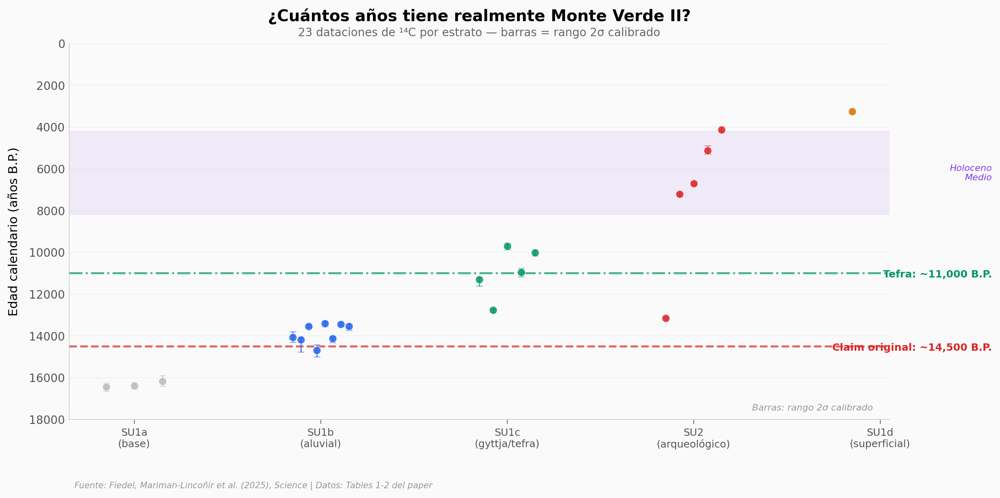

# Ciencia a Mordiscos

**La ciencia que contamos en video, aquí se puede tocar.**



Un video de 90 segundos engancha. Pero no puedes ver los datos, no puedes cuestionar los números, no puedes explorar por tu cuenta.

Aquí sí. Cada notebook toma un paper de Nature, Science o revistas similares, carga los datos originales, genera las gráficas, y te deja cambiar lo que quieras. No necesitas saber programar — abre en Google Colab, dale "Ejecutar todo", y los datos hablan solos.

---

## Notebooks

### Los huracanes liberan menos CO₂ del que creíamos

**Ecología** · *Nature Geoscience* · Huang et al. (2026) reconstruyeron la huella de carbono de los ciclones tropicales día a día durante 28 años combinando IBTrACS (todos los ciclones del mundo), SOCAT (observaciones de CO₂ en superficie) y reanálisis atmosféricos. Bajamos las 3 tablas del supplementary y desmenuzamos lo que se puede recalcular. **Acto 1:** el día 0 dos procesos compiten — efflux pico **+14,6 mmol/m²/día** vs influx pico **−12,5**; el mínimo de ΔpCO₂ (**−9,5 µatm**) no cae el día del huracán, cae el día +2 (la estela fría sigue absorbiendo después). **Acto 2:** las aguas frías pre-tormenta se vuelven más sub-saturadas con el tiempo (pendiente **−0,09 µatm/año**, p=0,066 marginal); las aguas cálidas no cambian (p=0,44). Esa asimetría es la razón física del **44% de reducción** del outgassing global que el paper reporta para los 90s vs 2010s. **Acto 3:** bajo escenarios CMIP de alta emisión, la distribución de ΔpCO₂ se desplaza de **+12 a +1 µatm de media** y la probabilidad de efflux cae de **79% a 55%** — los ciclones pasarían de fuente a sumidero. ⚠️ La tendencia clave es marginal (p=0,066) y el fit predice ~2,5 µatm de cambio total, los endpoints raw sugieren 6 µatm. ⚠️ La validación in-situ son solo **37 ciclones**. ⚠️ La proyección CMIP es modelo, no observación. ⚠️ La cifra del 44% es cita del paper, no recálculo nuestro.

[Ver notebook](papers/2026-05-28-ciclones-tropicales-co2-oceano/notebook) · [Leer más](papers/2026-05-28-ciclones-tropicales-co2-oceano/README) · [](https://colab.research.google.com/github/Ciencia-a-Mordiscos/lab/blob/main/papers/2026-05-28-ciclones-tropicales-co2-oceano/notebook.ipynb)


### Hicieron crecer un intestino humano de 8 cm. En 10 semanas

**Medicina** · *Nature Biomedical Engineering* · Park et al. (2026) inventaron un truco simple: una bandeja impresa en 3D que **confina físicamente** los esferoides mientras crecen. Con esa restricción, los organoides desarrollan solos su propio sistema nervioso entérico — el que controla la contracción del intestino. Bajamos los CSVs de Source Data (Figs. 1f, 3f-g, 5c, 5f, 6j y Extended Data 1j-l) y los desmenuzamos. **Acto 1:** misma jugada en tres órganos distintos — **intestino delgado ~7×**, **colon ~12×**, **estómago ~12×** en tamaño de injerto a 10 semanas (Mann-Whitney p≤0,004, Cohen's d entre 2,3 y 3,8). **Acto 2:** los nervios funcionan. La tetrodotoxina apaga la contracción (Wilcoxon pareado p=0,008, d pareado=0,99); la combinación L-NAME + atropina la apaga también (p=0,001), confirmando componentes excitatorios colinérgicos e inhibitorios nitrérgicos en el ENS desarrollado de novo. **Acto 3:** al conectar el injerto al lumen del huésped, la barrera no aumenta su permeabilidad (Mann-Whitney p=0,057, Cohen's d=4,0 — tendencia clara con n=3 vs 4, intervalo amplio). ⚠️ La anchura de 8 cm vive en el abstract — el Source Data Fig 1f es área en cm², no longitud lineal. ⚠️ L-NAME solo no alcanza significancia (p=0,195) — la confirmación de neuronas nitrérgicas se apoya en el contraste L-NAME vs L-NAME+atropina. ⚠️ Trasplante en rata RRG inmunocomprometida — el salto a clínica humana sigue lejos.

[Ver notebook](papers/2026-05-22-organoides-intestino-funcional-ens/notebook) · [Leer más](papers/2026-05-22-organoides-intestino-funcional-ens/README) · [](https://colab.research.google.com/github/Ciencia-a-Mordiscos/lab/blob/main/papers/2026-05-22-organoides-intestino-funcional-ens/notebook.ipynb)


### Diseñaron una proteína desde cero. Funcionó en un ratón vivo

**Tecnología** · *Nature* · Vázquez Torres et al. (2026) diseñaron *de novo* miniproteínas (~50-80 aminoácidos) que se pegan a 4 receptores GPCR distintos (MRGPRX1, CXCR4, GLP1R, GIPR) usando los modelos generativos RFdiffusion y ProteinMPNN. Bajamos las 5 tablas del Source Data MOESM3 (Figs. 2, 3, 4, 5) y las desmenuzamos. **Acto 1:** una de las miniproteínas, dCX1_001, bloquea el receptor CXCR4 *in vitro* prácticamente al 100% — la respuesta a 100 nM del ligando natural CXCL12 cae de **50,6% a -1,4%** con la miniproteína a 1 µM. **Acto 2:** en ratones vivos, dCX1_001 moviliza **células madre hematopoyéticas** a un nivel que el abstract describe como *comparable* al fármaco FDA AMD3100 (Mozobil): la mediana del fold-change a lo largo de 9 puntos temporales es **1,71×**, queda por encima del fármaco en **6 de 9** tiempos (pico **3,71× a la 1 h**, Cohen's d=1,09), por debajo en 3. **Acto 3:** la palabra "comparable" del paper aguanta — los datos la sostienen sin escalar. ⚠️ n=5 ratones por grupo por timepoint — IC al 95% amplios. ⚠️ Bloqueo *in vitro* no garantiza efecto *in vivo* (farmacocinética, vida media). ⚠️ Claim "fewer adverse effects" del abstract no verificable con Source Data MOESM3.

[Ver notebook](papers/2026-05-28-miniproteinas-gpcr-diseno-de-novo/notebook) · [Leer más](papers/2026-05-28-miniproteinas-gpcr-diseno-de-novo/README) · [](https://colab.research.google.com/github/Ciencia-a-Mordiscos/lab/blob/main/papers/2026-05-28-miniproteinas-gpcr-diseno-de-novo/notebook.ipynb)


### El buffer del mercado de carbono forestal: probablemente 6,3 veces más pequeño de lo que el clima exige

**Ecología** · *Nature* · Badgley et al. (2026) construyeron un modelo de riesgo de pérdida de carbono a 100 años para los 95 supersections forestales de Estados Unidos continental combinando inventario, satélite, disturbance modelling y machine learning. Bajamos las 4 tablas de Source Data (Figs. 1, 3 y 4) y las desmenuzamos. **Acto 1:** el fuego es el único disturbio que responde fuerte al cambio climático — pasa de **13% a 35%** de probabilidad media a 100 años (**+22 pp, +171% relativo**); sequía e insectos suben mucho menos. **Acto 2:** **Sierra Nevada** suma 85 puntos porcentuales adicionales de riesgo combinado por clima; California y el Intermountain West dominan el top 10, pero también aparecen Blue Ridge y Laurentian. **Acto 3:** sobre los 116 proyectos reales del programa CARB, **79% tienen riesgo natural mayor que su buffer** y en **61% solo el fuego ya se come el colchón**. El factor promedio de subdimensionamiento del buffer pool es **6,3×** (rango 2,2–8,0× según escenario). ⚠️ Es paper de modelado, no observación. ⚠️ El riesgo combinado puede superar 100% porque los disturbios pueden ocurrir secuencialmente en un siglo. ⚠️ El 6,3× es promedio entre 7 escenarios de sensibilidad — la decisión de política depende de cuál se considere relevante.

[Ver notebook](papers/2026-05-28-buffer-pool-bosques-carbono/notebook) · [Leer más](papers/2026-05-28-buffer-pool-bosques-carbono/README) · [](https://colab.research.google.com/github/Ciencia-a-Mordiscos/lab/blob/main/papers/2026-05-28-buffer-pool-bosques-carbono/notebook.ipynb)


### Tormentas urbanas en Texas: la ciudad las parte en dos

**Ecología** · *Nature* · Liu et al. (2026) clasificaron **más de 40.000 tormentas** de temporada cálida en cuatro ciudades de Texas — Dallas, Austin, San Antonio y Houston — con datos de radar 3D entre 1995 y 2017. Bajamos los pickles de Zenodo, los aplanamos a 4 CSVs y los desmenuzamos. **Acto 1:** las tormentas locales (célula única + aisladas) crecen +7-31% sobre tres ciudades — Houston suma casi un tercio más; Dallas es la excepción (-5,2% en célula única). **Acto 2:** el pico es nocturno — **99,9%** de las tormentas locales sobre Houston caen entre 0-4 UTC (atardecer-noche local en Texas). **Acto 3:** los frentes fríos hacen lo contrario — pierden intensidad a baja altitud (1-5 km) al cruzar la ciudad: Dallas -17,8%, Austin -14,8%, San Antonio -14,2%, Houston -11,5%. El paper titula -16 a -28% con una métrica de intensidad más fina que no es reproducible solo con los datos públicos; el patrón cualitativo es idéntico. ⚠️ Solo Texas, solo temporada cálida (May-Sep). ⚠️ Es estudio observacional — los mecanismos (efectos térmicos, rugosidad urbana) son hipótesis del paper, no probados. ⚠️ Dallas no encaja en el rango +7-31% del headline — el rango refleja máximos por ciudad.

[Ver notebook](papers/2026-05-20-tormentas-urbanas-texas/notebook) · [Leer más](papers/2026-05-20-tormentas-urbanas-texas/README) · [](https://colab.research.google.com/github/Ciencia-a-Mordiscos/lab/blob/main/papers/2026-05-20-tormentas-urbanas-texas/notebook.ipynb)


### Granizos más grandes en un clima más cálido

**Ecología** · *Nature* · Wang et al. (2026) corrieron un modelo semi-3D de trayectorias de granizo forzado por **5 corridas del ensemble EC-Earth3** y validado contra observaciones reales en EEUU (**9.462 reportes**, 2010-2020) y China (**8.818 reportes**, 1986-1999). Bajamos 4 CSVs de Figshare y los desmenuzamos. **Acto 1:** el modelo proyecta para finales del s. XXI un incremento de **36,5–42,1%** en el daño global por granizo, **37,9–51,8%** más granizos ≥30 mm y **4,2–12,3%** menos pequeños (rangos según escenario SSP245/370/585). **Acto 2:** la validación US se sostiene — ratio simulado/observado **= 1,20** en la media del histograma agregado. **Acto 3:** el caso China muestra que el "error" 2,5x del modelo no es del modelo: entre los 70s y 90s, los reportes se cuadruplican (~170 → ~630/año) mientras el diámetro medio cae **40%** (17,1 → 10,2 mm) — densificación de la red de observación, no señal climática. ⚠️ Las cifras del futuro son proyecciones de modelo, no observaciones. ⚠️ Los NetCDFs del futuro pesan >5 GB y no son descargables; los rangos vienen del abstract. ⚠️ El muestreo global está sesgado a baja latitud por diseño (diversidad de entornos convectivos).

[Ver notebook](papers/2026-05-27-granizo-global-clima/notebook) · [Leer más](papers/2026-05-27-granizo-global-clima/README) · [](https://colab.research.google.com/github/Ciencia-a-Mordiscos/lab/blob/main/papers/2026-05-27-granizo-global-clima/notebook.ipynb)


### Algoritmos que distorsionan lo que crees que piensan los demás

**Tecnología** · *Nature* · Brady et al. (2026) construyeron dos feeds de redes sociales desde cero —uno ordenado por engagement como las plataformas reales, otro cronológico simple— y asignaron al azar a **1.818 personas** a usar uno u otro durante **8 semanas**, antes y después de las elecciones de Estados Unidos en 2024. **Acto 1:** la dieta cambia — el feed algorítmico casi **duplica** la exposición al contenido del propio bando alabándose (de **14% a 24,6%**) y reduce a un tercio la exposición al otro bando (de **28% a 9,9%**). **Acto 2:** cambia lo que la gente CREE — con un efecto medio (**Cohen's d = 0,346**, p = 1,1 × 10⁻¹³), los usuarios del feed algorítmico creen que más gente alaba públicamente al propio bando. **Acto 3:** dos sorpresas — el algoritmo **redujo** la percepción de extremismo del entorno (d = -0,19) y la polarización afectiva (d = -0,13). Direcciones inesperadas, pequeñas pero significativas. ⚠️ Solo Estados Unidos, una elección, 8 semanas. ⚠️ Los participantes sabían que estaban en un experimento. ⚠️ La tercera condición del paper (algoritmo "diversified extremity") no está en el CSV abierto.

[Ver notebook](papers/2026-05-27-algoritmos-redes-percepcion-normas/notebook) · [Leer más](papers/2026-05-27-algoritmos-redes-percepcion-normas/README) · [](https://colab.research.google.com/github/Ciencia-a-Mordiscos/lab/blob/main/papers/2026-05-27-algoritmos-redes-percepcion-normas/notebook.ipynb)


### Un péptido modular contra MRSA — 99,500× más potente que vancomicina

**Medicina** · *Nature Biomedical Engineering* · Garrood et al. (2026) construyeron un péptido **modular de tres piezas** — ancla bifenilo + enlazador difenilalanina + cabeza catiónica — y probaron 7 anclas distintas sobre el mismo esqueleto contra MRSA. Bajamos las **Source Data Figs. 1, 2 y 4** del paper (4 CSVs, n=3 réplicas in vitro y n=3 ratones por dosis in vivo) y las desmenuzamos. **Acto 1:** a **128 μM**, Bip-FK9 deja MRSA en **100 CFU/mL** (límite de detección) mientras vancomicina sigue dejando **9,95 millones de CFU/mL** — diferencia de **~99.500×**. **Acto 2:** el ancla importa — las otras 6 variantes se quedan en el rango 1,3×10⁹–5,4×10⁹ CFU/mL; Bip-FK9 baja a 1,6×10⁷ (80× por debajo del siguiente mejor, Iso-FK9). **Acto 3:** PG (fosfatidilglicerol) es el blanco — solo PG libre bloquea la actividad (reducción 0,04 log) mientras CL, PA y Lysyl-PG no protegen (reducción 2,3–2,7 log). **Cierre in vivo:** la carga bacteriana pulmonar en ratones con neumonía MRSA cae de **82,4%** (0,5 μg/mL inhalado) a **1,4%** (24 μg/mL). ⚠️ n=3 por dosis (in vitro e in vivo). ⚠️ Eje Y in vivo en porcentaje según convención del paper (carga relativa al control), no CFU absolutos. ⚠️ Body del paper en paywall — verificación cruzada limitada al supplementary accesible. ⚠️ Resistencia tras pases y toxicidad histológica son claims del paper sin CSV propio en el Lab.

[Ver notebook](papers/2026-05-20-peptide-nanofibres-antimicrobial/notebook) · [Leer más](papers/2026-05-20-peptide-nanofibres-antimicrobial/README) · [](https://colab.research.google.com/github/Ciencia-a-Mordiscos/lab/blob/main/papers/2026-05-20-peptide-nanofibres-antimicrobial/notebook.ipynb)


### 1,6 millones de km² de selva no han vuelto a "sudar" igual

**Ecología** · *Nature Geoscience* · Ahmad et al. (2026) cruzaron el modelo hidrológico **Noah-MP** con datos satelitales de humedad del suelo, biomasa y agua subterránea a **1 km de resolución, 2003–2020**, para mapear cómo cae y se recupera la evapotranspiración (ET) en casi **12 millones de km²** de la Sudamérica tropical. Bajamos los rasters de Zenodo, los agregamos servidor-side a 5 CSVs y los desmenuzamos en tres actos. **Acto 1:** la cola larga — el **36%** del territorio recupera ET en un año, pero el **13,5%** (1,6 M km², más que Perú entero) no la ha recuperado en 7 años o más. **Acto 2:** el bajón es continental — **85%** del territorio bajo -1σ ESI, **43%** bajo -2σ (decline severo). **Acto 3:** los parches que más tardan también caen más profundo — Spearman ρ = **-0,36** (p<10⁻⁹), gradiente de **+0,09σ** (sin decline) a **-2,28σ** (decline severo) a medida que la persistencia sube de 0 a 7+ años. ⚠️ Los rasters publicados no incluyen máscara de tipo de stress (deforestación/fuego/sequía) ni de bioma — los headlines **21–22% más persistencia por deforestación** y **Cerrado vs Pantanal** son del modelo Noah-MP completo, no replicables desde el raster final.

[Ver notebook](papers/2026-05-19-evapotranspiracion-deforestacion-sudamerica/notebook) · [Leer más](papers/2026-05-19-evapotranspiracion-deforestacion-sudamerica/README) · [](https://colab.research.google.com/github/Ciencia-a-Mordiscos/lab/blob/main/papers/2026-05-19-evapotranspiracion-deforestacion-sudamerica/notebook.ipynb)


### 450 vecinos invisibles dentro de una vaca

**Biología** · *Science* · Xie et al. (2026) catalogaron **450 genomas de ciliados del rumen** (87% nuevos para la ciencia), midieron emisiones de metano en **100 vacas** e integraron **1.877 datasets** metagenómicos/metatranscriptómicos públicos. Bajamos los catálogos abiertos del portal NGDC y desmenuzamos lo que cubre la data accesible. **Acto 1:** los tres dominios del rumen, ahora con sus protistas adentro — bacterias **12.540**, arqueas **158** (todas metanógenas), ciliados **450** (87% inéditos). **Acto 2:** Entodiniomorphida es **1,6× más diverso** que Vestibuliferida (277 vs 173 genomas), pero el paper enmarca a Vestibuliferida — cargado de **hidrogenobodies (HBs)** — como el orden que más promueve metanogénesis. Más diverso no es lo mismo que más impacto funcional. **Acto 3:** las células únicas (SAG) rinden mejores genomas que los reconstruidos de comunidad (MAG) — diferencia BUSCO de **17,6 pp**, Cohen's d = **1,65** (efecto grande), Mann-Whitney p ≈ 8,6×10⁻³⁰. ⚠️ Solo trabajamos con metadatos del catálogo — los genomas completos (>6,9 GB) y las Tables S1-S9 con las correlaciones ciliado-metano por vaca están detrás de paywall. ⚠️ El paper habla de **correlación** y **promoción mecanística** vía HBs, no de causalidad directa.

[Ver notebook](papers/2026-04-30-ciliados-rumen-metano/notebook) · [Leer más](papers/2026-04-30-ciliados-rumen-metano/README) · [](https://colab.research.google.com/github/Ciencia-a-Mordiscos/lab/blob/main/papers/2026-04-30-ciliados-rumen-metano/notebook.ipynb)


### Chacal dorado en Europa: el lobo lo limita, los humanos lo escudan

**Ecología** · *Nature Ecology & Evolution* · Ranc et al. (2026) compilaron **8.991 muestreos acústicos** en **12 países** entre 2001 y 2019 para entender qué expande al chacal dorado por Europa. Bajamos los datos de Zenodo y los desmenuzamos en tres actos. **Acto 1:** la prevalencia del chacal cae de **23,9%** (n=6.185) sin lobo a **17,3%** (n=2.806) con lobo — una caída relativa del **28%**, chi² = 49,1, p < 10⁻¹¹. **Acto 2:** el efecto no es uniforme — en paisajes abiertos (0-30% bosque) la diferencia con/sin lobo casi desaparece, pero en bosques densos (>30%) la presencia del chacal con lobo se reduce de **~25% a ~10%**. El bosque es el árbitro. **Acto 3:** Hungría — **3.385 muestreos, el 38% del dataset**, prácticamente sin lobos (0,06% de prevalencia). Ahí el chacal está al **22,7%**, en el cuartil superior de Europa: el "experimento natural" que el resto del continente quizá esté a punto de repetir. ⚠️ Dataset observacional — la causalidad lobo → menos chacal sale del modelo multivariado del paper, no del análisis bivariado. ⚠️ Los porcentajes 75%, 6×, 18% son proyecciones del SDM, no estadísticos descriptivos.

[Ver notebook](papers/2026-05-26-chacal-dorado-europa/notebook) · [Leer más](papers/2026-05-26-chacal-dorado-europa/README) · [](https://colab.research.google.com/github/Ciencia-a-Mordiscos/lab/blob/main/papers/2026-05-26-chacal-dorado-europa/notebook.ipynb)


### Bacterias atrapadas seis meses: el hidrogel que no las deja escapar

**Medicina** · *Science* · Harimoto et al. (2026, lab de David Mooney en Harvard) **logran** lo que la literatura previa había rondado pero no alcanzaba: **6 meses de contención completa** de bacterias modificadas dentro de un implante. Transcribimos las Tablas S1-S4 del Supplementary PDF (paper paywalled, SM accesible) y verificamos número por número. **Acto 1:** 4.320 horas de contención frente a una **mediana previa de 36 h** (24 estudios) y un **mejor previo de 504 h** — saltos de **120×** y **8,6×** respectivamente, mostrados en una escala logarítmica donde el nuevo punto vive en otro plano. **Acto 2:** la región rigidez+tenacidad que ocupan las 31 formulaciones de PVA está **vacía** en la literatura — work of fracture hasta **2,4·10⁷ J/m³** contra los **2.400 J/m³** del mejor no-PVA (cuatro órdenes de magnitud). **Acto 3:** la honestidad — **51 mutaciones en 31 colonias** recuperadas, de las cuales un **7,8%** son deleciones de gen completo. El hidrogel aguanta seis meses; el medicamento, en algunas colonias, ya no se produce al final del experimento. ⚠️ Modelo murino — falta validación clínica. ⚠️ N=1 de PVA frente a N=24 previos: marca técnica, no estadística inferencial. ⚠️ Sin datasets externos: la reproducibilidad depende de las tablas transcritas a mano.

[Ver notebook](papers/2026-05-14-hidrogel-bacterias-terapia/notebook) · [Leer más](papers/2026-05-14-hidrogel-bacterias-terapia/README) · [](https://colab.research.google.com/github/Ciencia-a-Mordiscos/lab/blob/main/papers/2026-05-14-hidrogel-bacterias-terapia/notebook.ipynb)


### Tu cerebro tiene 72 autopistas blancas. Ahora hay un mapa de cómo cambian del nacimiento a los 90 años

**Neurociencia** · *Nature* · Kim et al. (2026) procesaron **35.120 escáneres cerebrales** de estudios globales para construir los primeros charts normativos lifespan de **72 vías de sustancia blanca**, de 0 a 100 años — el equivalente para los "cables" del cerebro de las curvas de crecimiento pediátrico. Bajamos los datos derivados (Zenodo) y los desmenuzamos en tres actos. **Acto 1:** el volumen del Fascículo Arcuato izquierdo (vía clave del lenguaje) pica cerca de los **16 años** y se mantiene en meseta hasta los 40 antes de declinar. **Acto 2:** en una cohorte de validación (38 controles + 33 pacientes con esclerosis múltiple), la **Radiación Óptica** muestra un efecto **grande** (Cohen's d = **1,21**, p < 0,001) mientras que los **tractos motores** (cortico-espinal) están **preservados** (d = 0,02, p = 0,96). **Acto 3:** el volumen del Fascículo Arcuato izquierdo NO discrimina MS de controles — 35/38 controles y 32/33 pacientes caen dentro de la banda normativa. La señal clínica vive en la microestructura por tracto, no en el volumen agregado. ⚠️ Cohorte clínica pequeña (n = 71) con desbalance de sexo. ⚠️ Estudio observacional transversal — asociación entre MS y baja FA, no causalidad establecida en un solo corte. ⚠️ El dataset público derivado cubre 1 de los 72 tractos del chart normativo.

[Ver notebook](papers/2026-05-25-white-matter-brain-charts/notebook) · [Leer más](papers/2026-05-25-white-matter-brain-charts/README) · [](https://colab.research.google.com/github/Ciencia-a-Mordiscos/lab/blob/main/papers/2026-05-25-white-matter-brain-charts/notebook.ipynb)


### Frenar UN gen mantiene la microglia reparadora 8 semanas tras un derrame

**Medicina** · *Nature* · Du et al. (2026) identifican `Zfp384` como el interruptor que convierte a la microglia de reparadora a dañina después de un derrame en ratones. Silenciarlo con un fármaco antisentido (ASO) 3 días post-derrame **mantiene la microglia en modo reparador hasta D56** — dos meses después de una sola intervención. Bajamos los Source Data de Fig 6 y verificamos por nuestra cuenta. **Acto 1:** en el Corner test al día 14, el grupo Zfp384-silenciado baja la asimetría motora de **0.38 a 0.17** (Cohen *d* = **2.16**, Mann-Whitney *p* = **0.0006**, *n* = 11 vs 10). **Acto 2:** el efecto se sostiene hasta D56 (*d* = 1.24, *p* = 0.0154) y replica en una prueba motora independiente (Cylinder), donde aparece desde D21 (*d* = 1.65) y dura hasta D56. **Acto 3:** la microglia rescatada habla con **12 tipos celulares** — OPCs el principal socio (388 interacciones moleculares), seguido de neuronas excitatorias y pericitos. ⚠️ Estudio en ratones — la confirmación humana del paper es observacional, no terapéutica. ⚠️ *n* pequeños (10-11) y la ventana terapéutica humana sigue por confirmarse.

[Ver notebook](papers/2026-05-25-microglia-reparativa-stroke-zfp384/notebook) · [Leer más](papers/2026-05-25-microglia-reparativa-stroke-zfp384/README) · [](https://colab.research.google.com/github/Ciencia-a-Mordiscos/lab/blob/main/papers/2026-05-25-microglia-reparativa-stroke-zfp384/notebook.ipynb)


### RNAs que detienen TDP-43

**Medicina** · *Science* · TDP-43 es una proteína que se atasca dentro de las neuronas motoras hasta matarlas — eso pasa en el 97% de los casos de ELA. Este paper prueba 17 RNAs cortos como chaperonas que la mantienen soluble. **Acto 1:** la potencia (IC50) varía 9× entre el mejor (UG)17 = 0,20 µM y el peor AUG12 = 1,79 µM. **Acto 2:** el número de repeticiones UG predice la potencia (Spearman ρ = -0,66, *p* = 0,007, *n* = 15) — pero ni el % UG ni la estabilidad estructural lo hacen. **Acto 3:** RNAs modificados con más UGs son ~18% más potentes que sus contrapartes naturales (Cohen's d = -1,01, n=8 vs 4). ⚠️ Solo replicamos la capa in vitro (Tabla S1); los experimentos en ratones y neuronas humanas del paper viven en otras figuras. ⚠️ (UG)17 es un control sintético puro, no un candidato terapéutico.

[Ver notebook](papers/2026-05-23-rna-chaperones-tdp-43/notebook) · [Leer más](papers/2026-05-23-rna-chaperones-tdp-43/README) · [](https://colab.research.google.com/github/Ciencia-a-Mordiscos/lab/blob/main/papers/2026-05-23-rna-chaperones-tdp-43/notebook.ipynb)


### La sorpresa de los andrógenos en el cerebro

**Medicina** · *Nature* · En la mayoría de los cánceres los andrógenos ayudan al tumor — por eso bloquearlos es estándar contra próstata. En glioblastoma, este equipo demostró lo contrario. **Acto 1 (Fig 1a):** castrar ratones con GBM intracraneal redujo la mediana de supervivencia 23% (26 → 20 días, *d* = 0,94, log-rank *p* = 0,020, *n* = 27). **Acto 2 (Fig 3b):** bloquear glucocorticoides con mifepristona en castrados subió la mediana 51% (17,5 → 26,5 días, *d* = 0,85, log-rank *p* = 0,048, *n* = 20). **Acto 3 (cohorte humana):** en 1.272 hombres con GBM, testosterona+temozolomida vs temozolomida sola → 38% menos riesgo de muerte (HR crudo 0,62; ajustado 0,66, *p* = 0,003). Mecanismo propuesto: sin andrógenos, el eje hipotálamo-pituitaria-adrenal (HPA) hipersuelta cortisol y apaga la inmunidad antitumoral. ⚠️ La cohorte humana es retrospectiva, no aleatorizada — asociación robusta, no causalidad probada. ⚠️ Solo replicamos las dos curvas de supervivencia; mediciones moleculares directas viven en otras figuras del paper.

[Ver notebook](papers/2026-05-06-androgenos-glioblastoma-hpa/notebook) · [Leer más](papers/2026-05-06-androgenos-glioblastoma-hpa/README) · [](https://colab.research.google.com/github/Ciencia-a-Mordiscos/lab/blob/main/papers/2026-05-06-androgenos-glioblastoma-hpa/notebook.ipynb)


### Las píldoras anti-obesidad pasan por la amígdala

**Neurociencia** · *Nature* · Las nuevas píldoras anti-obesidad (Danuglipron, Orforglipron) actúan sobre el mismo receptor que Ozempic — pero solo se unen a la versión humana. Para estudiarlas, el equipo creó ratones humanizados (S33W: una sola letra del aminoácido 33 cambiada). **Acto 1:** Liraglutide funciona en ambos genotipos (≈−52% a 2h, *d* = −1.94 en WT). Danuglipron solo en S33W (−51.5%, *d* = −1.39) — en WT no hay efecto (*d* = +0.31). **Acto 2:** las pastillas activan más Fos en CeA (amígdala central, *d* = 0.45, *p* = 0.030), NTS y AP — pero **no** en DMH (saturado por GLP-1 endógeno). **Acto 3:** rescate AAV región-específica revela la disociación causal: devolver el receptor solo en CeA basta para suprimir comida palatable (−29%, *p* = 0.031, *d* pareado = −1.03), pero no afecta el chow normal (*p* = 0.94). El hipotálamo hace lo opuesto: controla la ingesta homeostática (*d* pareado = −1.12), no la hedónica. ⚠️ Modelo S33W humaniza UN aminoácido — la arquitectura del circuito en cerebros humanos está por confirmar. ⚠️ *n* pequeños (6-10) en pareados de Fig 4.

[Ver notebook](papers/2026-05-06-glp1-amigdala-recompensa-ratones/notebook) · [Leer más](papers/2026-05-06-glp1-amigdala-recompensa-ratones/README) · [](https://colab.research.google.com/github/Ciencia-a-Mordiscos/lab/blob/main/papers/2026-05-06-glp1-amigdala-recompensa-ratones/notebook.ipynb)


### El HIV necesita tocar células para infectarlas

**Medicina** · *Nature* · Mesner et al. (2026) **muestran** por qué los linfocitos T CD4+ en reposo —donde el HIV vive en el cuerpo— no se infectan con virus libre en el laboratorio: les falta una señal que solo el contacto célula-célula activa. Bajamos los Source Data de las figuras 1, 3 y 4 (MOESM7/9/10) y verificamos los tres eslabones de la cascada. **Acto 1:** en 3 donantes pareados, el contacto multiplica la infección por **3,6×** (cell-free 3,1% vs cell-cell 11,4%, *t* pareado *p* = 0,016, Cohen *d* pareado = 4,5). **Acto 2:** silenciar **CDK1** con siRNA reduce la infección **−33%** (*p* = 0,021, *d* pareado = 4,0) — la quinasa del ciclo celular es necesaria. **Acto 3:** la quinasa no abre el poro entero. De **10 nucleoporinas** medidas, solo **3 cambian** con el contacto: **Nup54 (+32%)**, **Nup62 (+16%)** y **Tpr (+12%)**, con *d* entre 0,62 y 1,01. Las otras 7 no se mueven. ⚠️ *n* = 3 donantes en las figuras clave: efectos enormes pero potencia baja (*p* al borde). ⚠️ La cascada CD4 → LCK → CDK1 → Nup la apoyamos con la propuesta del paper, no con el Source Data — la activación de LCK no está en los CSVs abiertos.

[Ver notebook](papers/2026-05-06-hiv-poros-nucleares-infeccion/notebook) · [Leer más](papers/2026-05-06-hiv-poros-nucleares-infeccion/README) · [](https://colab.research.google.com/github/Ciencia-a-Mordiscos/lab/blob/main/papers/2026-05-06-hiv-poros-nucleares-infeccion/notebook.ipynb)

---

### Cuando el permafrost se derrite y los arroyos se vuelven ácido sulfúrico

**Ecología** · *Science* · Skierszkan et al. (2026) **documentan** un fenómeno geoquímico abrupto: al deshelarse el permafrost en cabeceras de los ríos Yukon y Mackenzie, los sulfuros minerales del bedrock se oxidan al aire por primera vez en milenios, generando ácido sulfúrico y liberando metales pesados a concentraciones tóxicas. Bajamos los datos del preprint EarthArXiv (Open Access) — Table S1, Figura S8F y series ECCC — y los desmenuzamos en tres niveles. **Las surgencias** (n=10): pH mediano **3,1** (rango 2,7–6,1) — el mismo rango del drenaje ácido de minas, pero natural. **Los arroyos receptores** (KM99/KM71/KM175, 156 muestras): cadmio supera el umbral CCME en **92–100% de las muestras** en los tres, zinc en 98%/57%/100%. La heterogeneidad refleja qué minerales sulfurosos contiene cada bedrock. **Los ríos grandes** corriente abajo (Peel, Ogilvie, Klondike): pH casi neutro (~8), pero **sulfato subiendo de forma sostenida** durante décadas — el Peel duplicó su tasa desde 2000. Dawson City se calienta **+0,04 °C/año** (p<0,001, 1961–2024). ⚠️ Estudio observacional, la causalidad climática es inferida químicamente sólida pero no aislada experimentalmente. ⚠️ n=10 surgencias frente a "decenas" del paper. ⚠️ La proyección regional (más allá del TWO) es extrapolación basada en litologías + datos históricos.

[Ver notebook](papers/2026-05-21-acidificacion-arroyos-permafrost/notebook) · [Leer más](papers/2026-05-21-acidificacion-arroyos-permafrost/README) · [](https://colab.research.google.com/github/Ciencia-a-Mordiscos/lab/blob/main/papers/2026-05-21-acidificacion-arroyos-permafrost/notebook.ipynb)

---

### Dopamina y cerebro maternal

**Neurociencia** · *Nature* · Un grupo demuestra que silenciar la liberación de **dopamina** en el **hipocampo dorsal** de una hembra virgen es **suficiente** para que recoja crías como una madre experimentada. Bajamos los datos conductuales del Supplementary (MOESM5) — 34 hembras en el test de aprendizaje contextual y 51 en el de recogida de crías — y los analizamos célula por celda. Acto 1: la maternidad casi duplica el aprendizaje contextual (Cohen *d* = 1,22, *p* = 0,021). Acto 2: el estrés postparto crónico tiende a borrar esa ventaja, con alta variabilidad individual (*d* = -0,50). Acto 3 — el golpe: **8 de 13 vírgenes con control viral nunca recogen cría** antes del cutoff de 900 s; con dopamina silenciada químicamente, **14 de 15 lo hacen en mediana 102 s** (Cohen *d* = -1,50, *p* = 0,0018). Y silenciar dopamina en madres **no** cambia su conducta — control de especificidad limpio. ⚠️ Estudio en ratón; la validación humana del paper es solo molecular, no conductual. ⚠️ Cutoff a 900 s introduce censura administrativa: subestima la diferencia real.

[Ver notebook](papers/2026-05-20-dopamina-cerebro-maternal/notebook) · [Leer más](papers/2026-05-20-dopamina-cerebro-maternal/README) · [](https://colab.research.google.com/github/Ciencia-a-Mordiscos/lab/blob/main/papers/2026-05-20-dopamina-cerebro-maternal/notebook.ipynb)

---

### BINDS: cáncer de mama por IA, examinado por dentro

**Medicina** · *Nature Biomedical Engineering* · Liu et al. (2026) **introducen BINDS**, un modelo de deep learning multimodal que combina ecografía, mamografía y resonancia para diagnosticar cáncer de mama sobre **27.048 participantes** (8 centros + 7 datasets públicos). El paper anuncia un **AUROC de 0,973**. Bajamos los Source Data (MOESM3, MOESM4, MOESM7) y desmenuzamos ese número. El headline vive en el mejor escenario: paciente con las tres modalidades y esquema two-stage. Con solo ultrasonido, BINDS cae a **0,876**. Con las tres modalidades juntas sube a **0,950** — una ganancia trimodal de **+4,1 puntos porcentuales** sobre la mejor modalidad única. En **BI-RADS 4A** (el subgrupo clínicamente más ambiguo, donde más se necesitaría ayuda) el intervalo de confianza se abre a **[0,76–0,97]** — ancho del CI = 0,21, el mayor de todos los subgrupos. Sorpresa de eficiencia: la **mamografía alcanza 0,87 con solo 10%** de los datos de entrenamiento; la señal está en la imagen, no en el volumen. ⚠️ Validación retrospectiva, no ensayo clínico prospectivo. ⚠️ El 0,973 está **+6,0 puntos porcentuales sobre la mediana** de las 69 AUROCs que reporta el propio paper. ⚠️ Los autores escriben *"highlight the potential"*, no *"demonstrates"*: el modelo **podría asistir**, no probó reemplazar al radiólogo.

[Ver notebook](papers/2026-05-19-binds-cancer-mama-ia/notebook) · [Leer más](papers/2026-05-19-binds-cancer-mama-ia/README) · [](https://colab.research.google.com/github/Ciencia-a-Mordiscos/lab/blob/main/papers/2026-05-19-binds-cancer-mama-ia/notebook.ipynb)

---

### LiDAR de US$100 ve detrás de las paredes

**Tecnología** · *Nature* · Somasundaram et al. (2026) demuestran **NLOS imaging (imaging non-line-of-sight)** sobre un sensor de mercado — el ST VL53L8CX, un multizone time-of-flight de menos de US$100, no el LiDAR del iPhone — para localizar objetos ocultos detrás de una pared con un error promedio de **3,8 cm** (vs 6,4 cm de *backprojection* y 15,7 cm de *phasor field*, los dos baselines clásicos del campo). El truco: el modelo MAS (*motion-induced aperture sampling*) que combina muchos cuadros aprovechando que cámara y objeto se mueven. Abrimos las dos tablas del Supplementary (errores por método y por dimensión) más el histograma SPAD y la trayectoria del particle filter sobre 475 cuadros (95 s a 5 fps). El titular esconde un matiz importante: los 3,8 cm son el promedio sobre 25.000 ensayos — la incertidumbre en un cuadro individual ronda los **24 cm**. La diferencia es estadística pura (el error promedio escala con √N) y el notebook la separa explícitamente. ⚠️ Solo 2 baselines comparados. ⚠️ Objetos planos en escenas controladas. ⚠️ Conocer la forma del objeto reduce el error hasta 2,5× (efecto fuerte en objetos no convexos como la "U").

[Ver notebook](papers/2026-05-21-lidar-objetos-ocultos-celular/notebook) · [Leer más](papers/2026-05-21-lidar-objetos-ocultos-celular/README) · [](https://colab.research.google.com/github/Ciencia-a-Mordiscos/lab/blob/main/papers/2026-05-21-lidar-objetos-ocultos-celular/notebook.ipynb)

---

### Co-Scientist: el AI que propone 78 hipótesis y los humanos eligen una

**Tecnología** · *Nature* · Gottweis et al. (2026) lanzan **Co-Scientist** — un sistema multi-agente AI sobre Gemini que genera, critica y refina hipótesis científicas en torneos internos. El paper lo valida en biomedicina, generando ideas para **reposicionar medicamentos (drug-repurposing)** contra **16 tipos de cáncer**. Abrimos las dos tablas cuantitativas del Supplementary (119 páginas) y la pregunta incómoda salta a la vista: de **78 propuestas totales**, **13 (17%)** fueron para leucemia mieloide aguda (LAML) — el único cáncer que el equipo llevó a validación in vitro (3 líneas celulares: MOLM-13, HL-60, NOMO-1). La distribución por cáncer no es neutral: mediana 3.5 propuestas/cáncer, LAML con 13 es outlier a **+2.67×** la media uniforme. En las ablations, **7/7 métricas mejoran** con los agentes activos, pero **2/7** lo hacen con deltas <2% (los AUCs sobre GPQA — benchmark externo). Las mejoras fuertes (Evolution calidad +19%, Reflection corrigiendo falso novelty +61%) aparecen en benchmarks construidos por el equipo. ⚠️ Validación solo in vitro, no clínica. ⚠️ Sistema sobre Gemini (de código cerrado), no reproducible de punta a punta. ⚠️ El paper usa *potential to accelerate* — el sistema propone, los humanos eligieron.

[Ver notebook](papers/2026-05-19-co-scientist/notebook) · [Leer más](papers/2026-05-19-co-scientist/README) · [](https://colab.research.google.com/github/Ciencia-a-Mordiscos/lab/blob/main/papers/2026-05-19-co-scientist/notebook.ipynb)

---

### IA escribe software científico expert-level

**Tecnología** · *Nature* · Aygün et al. (2026) presentan **ERA** (*Empirical Research Assistance*) — un sistema que combina un modelo de lenguaje (LLM) con búsqueda en árbol (*Tree Search*) para escribir software científico que maximiza una métrica de calidad. Probaron ERA en **6 tareas** y abrimos las tablas del Supplementary para ponerle números a "expert-level". En **GIFT-Eval** (pronóstico de series temporales), **ERA Per-dataset queda #1 entre 32 modelos** con **MASE = 0.671**, por **1.19 % delante del segundo puesto humano** (TTM-R2-Finetuned, 0.679). ERA Unified ocupa el #6. Los 30 puestos restantes son sistemas diseñados por equipos humanos: foundation models, deep learning, modelos estadísticos clásicos. En **DLRSD** (segmentación de imágenes satelitales), **las 3 soluciones de ERA (mIoU 0.80–0.82)** superan al mejor paper previo (RE-Net 2021, **mIoU = 0.762**) por **5–7.6 % relativo**. ⚠️ El leaderboard GIFT-Eval es snapshot del 2025-05-18; otros releases pueden tener un nuevo #1. ⚠️ Dos claims del abstract (40 métodos single-cell, 14 modelos COVID que baten al ensemble CDC) no tienen tabla numérica completa reproducible en el Supplementary. ⚠️ "Expert-level" es la caracterización de los autores, no test ciego de comité independiente.

[Ver notebook](papers/2026-05-19-ia-software-cientifico-experto/notebook) · [Leer más](papers/2026-05-19-ia-software-cientifico-experto/README) · [](https://colab.research.google.com/github/Ciencia-a-Mordiscos/lab/blob/main/papers/2026-05-19-ia-software-cientifico-experto/notebook.ipynb)

---

### Humedales y metano: 28 modelos, el mismo veredicto

**Ecología** · *Nature Geoscience* · Zhang et al. (2026) corrieron un ensamble de **7 modelos terrestres × 4 forzantes climáticos = 28 simulaciones** del metano natural de humedales 2006-2099 bajo calentamiento alto. **Los 28 caminos aumentan** — la mediana global pasa de **224,5 Tg CH₄/año (2010s) a 327,6 Tg/año (2090s)**, un **+53,9 %** (P17-P83: 37-64 %). Los autores filtran ese ensamble con **163 años-sitio de torres de flujo (eddy-covariance)** y obtienen la cifra titular del paper: **50-60 % más emisiones por los 2090s**. Nuestra mediana cruda cae justo en esa banda. La descomposición regional muestra el contraste: **los trópicos aportan 72 % del aumento absoluto** (81,6 Tg/año), pero la región boreal **duplica sus emisiones** (+102 %) — el mayor cambio relativo del planeta, aunque pequeño en términos absolutos (7,2 Tg/año). Solo en la década 2030, el aumento adicional ya equivale a **9 % del CH₄ humano de 2020 (380 Tg)**, "comparable" — dice el paper — a lo que el **Global Methane Pledge** (recorte 30 %) prometió eliminar. ⚠️ Cubre alrededor de un tercio del recorte humano comprometido, no la totalidad. ⚠️ El filtro emergente no es replicable con los datos públicos (requiere series de temperatura de cada ESM). ⚠️ La cobertura observacional está sesgada a latitudes medias y altas — los trópicos, donde está la mayor masa del aumento, son justo donde queda más incertidumbre.

[Ver notebook](papers/2026-05-20-metano-humedales-clima/notebook) · [Leer más](papers/2026-05-20-metano-humedales-clima/README) · [](https://colab.research.google.com/github/Ciencia-a-Mordiscos/lab/blob/main/papers/2026-05-20-metano-humedales-clima/notebook.ipynb)

---

### Una gota de sangre que predice si la inmunoterapia funcionará

**Medicina** · *Nature* · Newman et al. (2026) identificaron **9 ecosistemas espaciales (SEs)** integrando >10 millones de transcriptomas de tumores humanos. La sorpresa clínica: esas firmas se pueden recuperar desde sangre — fragmentos de ADN tumoral flotando libres (cfDNA). En **78 pacientes con melanoma metastásico** medidos antes de empezar inmunoterapia, **SE7 predice no-respuesta con AUC = 0,80** (z = -4,49, p = 3·10⁻⁶) y **SE4 predice respuesta con AUC = 0,76**. Siete de las ocho SEs medibles en cfDNA salen significativas; solo SE2 queda en ruido. Los 9 ecosistemas están presentes en los **17 tipos de cáncer** del atlas TCGA (7.076 muestras): la abundancia de SE7 varía hasta 1,5× entre cánceres (0,054 en tiroides → 0,080 en esófago) — conservación = presencia, no nivel uniforme. ⚠️ Estudio observacional retrospectivo — asociaciones, no causalidad. ⚠️ El AUC del subgrupo Female (0,90 con n = 25) es sospechosamente alto: bandera roja de overfitting con muestra pequeña; el subgrupo Male (n = 53) es más confiable. ⚠️ El paper enmarca el uso clínico con "implications for risk stratification" — implicación a futuro, no resultado validado.

[Ver notebook](papers/2026-05-06-tme-spatial-ecotypes/notebook) · [Leer más](papers/2026-05-06-tme-spatial-ecotypes/README) · [](https://colab.research.google.com/github/Ciencia-a-Mordiscos/lab/blob/main/papers/2026-05-06-tme-spatial-ecotypes/notebook.ipynb)

---

### Cómo se decide un terremoto en 15 milisegundos

**Geología** · *Nature* · Fryer et al. (2026) midieron **64 eventos de nucleación** en una falla artificial bajo cinco presiones (100-300 bar). Una sola variable —**Vmin**, la velocidad del pulso transitorio que aparece al inicio de la nucleación— explica el **78 por ciento** de la varianza en la duración del evento (tc), con correlación de Spearman **r = -0,91** sobre 47 eventos. El rango de Vmin cubre **5.224 veces** y aun así el ajuste se sostiene: tc ∝ Vmin⁻⁰⋅⁵⁴. La pendiente es del mismo orden que la predicción del modelo de fricción que el paper deriva (rate-and-state). **Uno de cada cuatro eventos arresta sin completar la nucleación** (17/64 = 26,6 %) — coincide con la predicción del modelo para impulsos por debajo del umbral. La medición da una distancia característica de slip de 0,3–3,0 mm — órdenes de magnitud menor que las inferidas para rotura dinámica. ⚠️ Las columnas de slip del CSV están en metros aunque el header dice [micron] — hubo que verificar dimensionalmente. ⚠️ La extensión a terremotos tectónicos reales el paper la enmarca como "seem to follow the same scaling" — consistente, no demostrada con los datos del CSV.

[Ver notebook](papers/2026-05-06-foreshocks-nucleacion-terremotos/notebook) · [Leer más](papers/2026-05-06-foreshocks-nucleacion-terremotos/README) · [](https://colab.research.google.com/github/Ciencia-a-Mordiscos/lab/blob/main/papers/2026-05-06-foreshocks-nucleacion-terremotos/notebook.ipynb)

---

### Fitoplancton reconvierte progestogenos a su forma activa

**Ecología** · *Nature Water* · Mu et al. (2025) muestran que el fitoplancton hace exactamente lo contrario que el hígado humano: el cuerpo desactiva el **acetato de noretindrona (NEA)** —el progestógeno sintético que llevan muchas pastillas anticonceptivas— para excretarlo, y el fitoplancton le arranca el acetato, devolviéndolo a **noretindrona**, un neuroesteroide más potente que la molécula original. **18 especies cultivadas en lab —todas las que probaron— lo hacen**. Y no es local: el gen responsable, una *adenylosuccinate lyase*, aparece en **135 MAGs eukariotos repartidos en 11 océanos** (del Mediterráneo al Pacífico Sur, datos de TARA Oceans). Chromista + Plantae concentran el **86,7 %** de los MAGs — dos reinos evolutivamente muy distantes, lo que sugiere una huella molecular muy antigua. El mismo gen vive además en **29.709 genomas procariotas** (Pseudomonadota concentra el 41,6 %). ⚠️ Detectar el gen no es lo mismo que verlo activo: el paper sí muestra transcripción en metatranscriptomas, pero la actividad enzimática cuantitativa *in situ* no se mide. ⚠️ El paper usa "may exacerbate" para el riesgo ecológico — plausible, no cuantificado.

[Ver notebook](papers/2026-05-19-fitoplancton-reconvierte-progestogenos/notebook) · [Leer más](papers/2026-05-19-fitoplancton-reconvierte-progestogenos/README) · [](https://colab.research.google.com/github/Ciencia-a-Mordiscos/lab/blob/main/papers/2026-05-19-fitoplancton-reconvierte-progestogenos/notebook.ipynb)

---

### Macrófagos mordisqueando células vivas

**Medicina** · *Nature* · Fan, Thota, Serwas et al. (2026) muestran que los macrófagos no solo limpian células muertas — también arrancan **vesículas sub-micrométricas de células vivas y sanas** sin matarlas. En el pulmón de ratón, un único tipo celular (macrófagos alveolares) se lleva el **62,7 %** del material etiquetado, frente a apenas **0,55 %** en monocitos clásicos — un ratio ≈ 114× (Mann-Whitney U p = 0,008, Cohen's d ≈ 15 con n = 5 ratones). Las vesículas miden de mediana **0,09 µm²** (n = 77 vesículas de 23 células) — son ~835× más pequeñas en área que la sección de una célula entera. Y el muestreo es **estrictamente célula-célula**: separar las poblaciones con una membrana porosa (transwell) reduce el uptake un **77 %** (paired t-test p = 0,0018, n = 3 réplicas biológicas). ⚠️ Los tamaños muestrales son pequeños — los efectos son enormes pero los intervalos de confianza amplios. ⚠️ Todo el sistema está en ratón; el paper no aporta datos humanos directos. ⚠️ El claim de "no destructivo" lo soporta el paper con imaging y caspase assays que no están en el Source Data MOESM7/8.

[Ver notebook](papers/2026-04-29-macrofagos-trogocitosis-celulas-vivas/notebook) · [Leer más](papers/2026-04-29-macrofagos-trogocitosis-celulas-vivas/README) · [](https://colab.research.google.com/github/Ciencia-a-Mordiscos/lab/blob/main/papers/2026-04-29-macrofagos-trogocitosis-celulas-vivas/notebook.ipynb)

---

### Dos tercios del deshielo extra de la Antártida vienen del propio deshielo

**Ecología** · *Nature Geoscience* · Youngs et al. (2026) corren la primera simulación circumpolar de la Antártida con plataformas de hielo interactivas (MITgcm + GFDL-CM4, escenario SSP5-8.5) y descomponen el aumento del derretimiento basal en dos piezas: lo que mete el calentamiento directo del océano y lo que añade el propio agua de deshielo al volver a la cavidad. **El 66% del aumento total viene de la segunda pieza** — un feedback que la mayoría de modelos climáticos ni siquiera tiene. La firma es 531 Gt/año adicionales vs 274 Gt/año del calentamiento directo (suma sobre 10 sectores). Y el feedback no es uniforme: **amplifica en 4 sectores** (Weddell, Amery, Maud, Wilkes — cavidades densas donde el agua salina aligerada deja entrar agua cálida bajo la plataforma) y **protege en 6** (Bellingshausen, Amundsen, Ross, Adelie, Península, Enderby — donde el agua dulce de las cavidades densas forma un escudo aguas abajo). Weddell solo aporta el 87% del aumento circumpolar. ⚠️ Es un solo modelo bajo un solo forzamiento; otros modelos pueden dar magnitudes distintas. ⚠️ Los 10 sectores son una partición convencional del modelo, no fronteras físicas. ⚠️ El Spearman T vs deshielo por sector da ρ=-0,20 con p=0,58 (n=10): la geometría de cavidad, no el calentamiento neto, manda la respuesta.

[Ver notebook](papers/2026-05-15-antartida-feedbacks-deshielo/notebook) · [Leer más](papers/2026-05-15-antartida-feedbacks-deshielo/README) · [](https://colab.research.google.com/github/Ciencia-a-Mordiscos/lab/blob/main/papers/2026-05-15-antartida-feedbacks-deshielo/notebook.ipynb)

---

### Imprimir circuitos de cobre a 150 °C

**Tecnología** · *Science* · Anonymous et al. (2026) presentan una tinta de cobre que se funde en conductor a **150 °C, al aire**, con resistividad de **12,8 µΩ·cm** — cuatro veces mejor que cualquiera de los 3 métodos previos que operan a esa temperatura (mediana 52 µΩ·cm en n=30 papers de literatura), y muy por debajo de los 250 °C que pide la mediana global. La clave: catecoles, la misma familia química de la dopamina. Las simulaciones DFT muestran que catecol/dopamina se une al Cu⁺ con **E_int = -0,757 eV**, 13,8× más fuerte que el ácido cítrico clásico (-0,055 eV). EXAFS confirma partículas Cu(0) cristalinas (bond length 2,537 Å, idéntico al cobre macizo) pero pequeñas (coordinación 5,4 vs 10,4 del foil). El paper reporta además estabilidad de **>1000 h en ácido, >200 h en sulfuro, >240 h a 140 °C**. ⚠️ Las cinéticas de corrosión y los datos de impresión sobre PET viven en las figuras del paper que no extrajimos. ⚠️ DFT con n=5 ligandos: orden cualitativo informativo, no ranking estadístico. ⚠️ La curva resistividad-temperatura tiene 4 puntos — suficiente para la tendencia, no para modelo físico detallado.

[Ver notebook](papers/2026-05-14-cobre-corrosion-catecol/notebook) · [Leer más](papers/2026-05-14-cobre-corrosion-catecol/README) · [](https://colab.research.google.com/github/Ciencia-a-Mordiscos/lab/blob/main/papers/2026-05-14-cobre-corrosion-catecol/notebook.ipynb)

---

### Perovskita estable a 100°C: una IA de cuatro agentes encontró la receta

**Tecnología** · *Science* · Lin et al. (2026) entrenaron una IA colaborativa de **cuatro agentes** que diseñó, pieza por pieza, las tres capas críticas de una celda solar de perovskita: el absorbente (FA₀.₉₂Cs₀.₀₈PbI₃, con apenas **8% de cesio**), la capa que transporta huecos (una molécula sintetizada ad hoc, MeO-DPPACz) y la interfaz dual de óxidos metálicos. El resultado: la celda retiene **97% del rendimiento inicial tras 1000 horas a 100°C** — un régimen donde, de **51 estudios previos** (44 DOIs únicos) que revisamos, **solo 1 había llegado** y aguantó 60%. Diferencia: 37 puntos porcentuales. Los datos confirman el porqué a nivel atómico: Cs₈ tiene **~74% menos defectos** (trampas) que la composición sin cesio, con Cohen's d ≈ 12,8 entre n=3 réplicas. La predicción del agente AI sobre la composición óptima cayó dentro de su propia banda de confianza 80%. ⚠️ El test se cortó a 1000 h; comportamiento de largo plazo desconocido. ⚠️ La curva clave son trazas single-device por composición — sin error bars inter-dispositivo en esa figura. ⚠️ La molécula HTM custom fue sintetizada ad hoc; escalabilidad no reportada.

[Ver notebook](papers/2026-05-14-perovskita-ia-multiagente-100c/notebook) · [Leer más](papers/2026-05-14-perovskita-ia-multiagente-100c/README) · [](https://colab.research.google.com/github/Ciencia-a-Mordiscos/lab/blob/main/papers/2026-05-14-perovskita-ia-multiagente-100c/notebook.ipynb)

---

### ¿Está la IA superando a los médicos en razonamiento clínico?

**Tecnología** · *Science* · Brodeur et al. (2026) pusieron al modelo o1-preview de OpenAI a competir con cientos de médicos en **seis tareas de razonamiento clínico**, desde los casos clinico-patológicos del NEJM hasta diagnóstico en urgencias reales. El titular: la IA ganó casi todas. En CPCs del NEJM, **o1 alcanzó 66.3% top-1 vs 24.3% de los médicos en los 101 casos solapados** (gap 42 pp, ratio 2.73×). Pero el gap se cierra cuando los médicos tienen información completa: en urgencias reales con n=76 pacientes, la ventaja sobre el médico de planta cae de **+11.8 pp en triage a +2.7 pp en admisión** (no significativo). Y en el experimento *Landmark*, el equipo humano-IA (médicos+GPT-4 = 76%) no fue mejor que el médico solo (74%, p=0.055) — la dyad asistida no mejoró al clínico. ⚠️ Las rúbricas aditivas premian enumeración (Grey Matters: gap 55 pp, en parte artefacto de medición). ⚠️ El test de blinding es de 3 opciones (humano/IA/no puedo decir), no binario: los raters mayoritariamente se abstuvieron (83.6% y 94.4%); al menos uno discriminaba muy bien cuando se atrevía (92.6%). ⚠️ El propio paper pide *"urgent need for prospective trials"*.

[Ver notebook](papers/2026-04-30-llm-razonamiento-medico/notebook) · [Leer más](papers/2026-04-30-llm-razonamiento-medico/README) · [](https://colab.research.google.com/github/Ciencia-a-Mordiscos/lab/blob/main/papers/2026-04-30-llm-razonamiento-medico/notebook.ipynb)

---

### 382 isoleucinas que sobraban

**Biología** · *Science* · El Wang Lab (Columbia, 2026) decidió probar si una *E. coli* podía vivir con **19 aminoácidos en vez de los 20 canónicos** — quitándole la isoleucina (Ile). Para empezar, rediseñaron el ribosoma: usando modelos generativos de IA (basados en lenguaje de proteínas y estructura) reemplazaron sistemáticamente los **382 residuos de Ile** distribuidos en sus **50 proteínas**, combinaron 21 subunidades rediseñadas en un locus genómico nativo y produjeron una célula **viable y evolutivamente estable**. Lo que abrimos aquí: el FASTA público con las 50 secuencias wild-type. Recuento desde los datos coincide **exactamente** con el headline del paper (382 Ile). La distribución es asimétrica: mediana **7 Ile/proteína**, pero **rpsA** sola tiene 30 (la más larga, 557 aa). Las **10 proteínas con más Ile concentran el 37 %** del rediseño. Ile es el **8º aminoácido más usado** en el ribosoma (5,61 %) — ni el más común ni el más raro. ⚠️ Matiz crítico: el paper rediseña SOLO el ribosoma — un organismo completo de 19 aminoácidos queda como *roadmap*. ⚠️ El FASTA público trae solo las secuencias wild-type; las variantes rediseñadas se validan dentro del paper.

[Ver notebook](papers/2026-05-16-19-aminoacidos-ec19/notebook) · [Leer más](papers/2026-05-16-19-aminoacidos-ec19/README) · [](https://colab.research.google.com/github/Ciencia-a-Mordiscos/lab/blob/main/papers/2026-05-16-19-aminoacidos-ec19/notebook.ipynb)

---

### Parches grandes de bosque capturan más carbono por hectárea

**Ecología** · *Nature Ecology & Evolution* · Zou et al. (2026) mapearon **16,9 millones de parches forestales** en Estados Unidos continental con sensores remotos y, controlando por clima, suelo y topografía, midieron la productividad por unidad de área en cada uno. La curva sube de forma monótona: una hectárea metida en un parche de **~100 000 km² es 38% más productiva** que esa misma hectárea aislada. Análisis contrafactuales indican que la fragmentación que ya existe **redujo la NPP de CONUS en 0,16 GtC al año (14%)** vs un escenario de bosques contiguos. El Random Forest confirma que el tamaño del parche pesa más que las variables topográficas y de suelo — pero ojo: **el clima (MAT, precipitación) sí supera al tamaño**, matiz que el abstract no menciona. Replicando globalmente, **5 de 6 continentes** muestran la misma relación positiva; **Europa es la única excepción** (-0,003). ⚠️ Diseño OBSERVACIONAL — la asociación es robusta, no un experimento causal. ⚠️ El bin extremo de 134 000 km² es un único parche (n=1, sin SEM); por eso preferimos la regresión continua del paper (+38%) sobre el extremo discreto (+67%). ⚠️ Datos globales por continente con resolución más gruesa que CONUS — la pendiente de Europa puede estar sub-estimada.

[Ver notebook](papers/2026-05-15-parches-bosque-productividad/notebook) · [Leer más](papers/2026-05-15-parches-bosque-productividad/README) · [](https://colab.research.google.com/github/Ciencia-a-Mordiscos/lab/blob/main/papers/2026-05-15-parches-bosque-productividad/notebook.ipynb)

---

### Los ríos del Himalaya están serpenteando casi al doble de velocidad

**Ecología** · *Science* · Lin et al. (2026) midieron cómo migra lateralmente cada uno de **650 meandros pareados** en tres cuencas mayores del Himalaya — **Yarlung Tsangpo, Ganges, Indus** — comparando dos ventanas: **1980s–90s vs 2000s–10s**. La mediana de migración pasó de **1,02 a 1,81 m/año (ratio = 1,77×)**; el **93%** de los meandros aceleró. **Wilcoxon p ≈ 10⁻⁹², Cohen's d pareado = 0,72**. Pero la aceleración no es uniforme: **Ganges 2,16×, Indus 1,91×, Yarlung Tsangpo 1,62×** — y el Yarlung aporta 75% de la muestra. La temperatura subió **+0,87 °C** en esas mismas décadas, pero la correlación directa T → migración es modesta (**ρ = 0,33**). ⚠️ Diseño **OBSERVACIONAL**: la causalidad clima → migración es hipótesis del paper, sostenida por un modelo SEM, no por la comparación pareada. ⚠️ El claim del paper sobre *"amplified sediment fluxes"* **no aparece en los datos crudos** — Qs cayó 43%; el paper lo sostiene con su SEM, no con medias temporales.

[Ver notebook](papers/2026-05-14-rios-himalaya-meandros-clima/notebook) · [Leer más](papers/2026-05-14-rios-himalaya-meandros-clima/README) · [](https://colab.research.google.com/github/Ciencia-a-Mordiscos/lab/blob/main/papers/2026-05-14-rios-himalaya-meandros-clima/notebook.ipynb)

---

### Comer antes de un examen inmunológico cambia el resultado

**Medicina** · *Nature* · Hong et al. (2026) reclutaron 31 voluntarios que vinieron en ayunas, los dejaron comer durante 6 horas lo que quisieran (sin menú impuesto) y midieron cómo cambiaron sus células T entre las dos extracciones — más 6 controles que comieron continuamente o ayunaron continuamente. El hallazgo: comer aumenta la **capacidad metabólica de las células T** (más OCR mitocondrial, más IFN-γ y TNF), el efecto **persiste 7 días *in vitro* y hasta 40 semanas en ratones**, y los **quilomicrones** (lipoproteínas postprandiales) son el vehículo que lo transmite vía LDLR y mTORC1. Punto traslacional: las **células CAR-T fabricadas con sangre postprandial son terapéuticamente superiores**. Lo que abrimos aquí: la demografía pública (Tablas S1+S2) de los 37 participantes. Mediana de ayuno **13 h**, cumplimiento del protocolo 12–14 h del **68%** (21/31), BMI mediano **23,8 kg/m²** (rango 19–41 sin el outlier por error de transcripción), y elección dietaria diversa: **13 grasas, 11 carbohidratos, 5 proteínas, 2 vegetales**. ⚠️ Las mediciones funcionales del paper (OCR, ECAR, citoquinas, CAR-T) viven en figuras — no como CSVs descargables — así que el notebook se centra en el diseño humano del estudio. ⚠️ Cohorte n=31 de un solo centro (Pittsburgh). ⚠️ Corrección publicada (2026-05-14) sobre etiquetas de Fig 3h; conclusión cualitativa intacta.

[Ver notebook](papers/2026-04-29-postprandial-lipid-t-cell-immunity/notebook) · [Leer más](papers/2026-04-29-postprandial-lipid-t-cell-immunity/README) · [](https://colab.research.google.com/github/Ciencia-a-Mordiscos/lab/blob/main/papers/2026-04-29-postprandial-lipid-t-cell-immunity/notebook.ipynb)

---

### Cómo una membrana flexible saca agua del aire 5 veces más rápido

**Tecnología** · *Nature Water* · Bai et al. (2026) imprimieron en 3D una membrana de nanoláminas de zeolita EMM-8 dentro de una matriz flexible de poliuretano (TPU). El cuello de botella histórico de la captura atmosférica de agua —la cinética se desploma cuando apilas el sorbente en un dispositivo real— se rompe: la membrana llega al **50% de su capacidad en 4.6 minutos**, entre **2.4× y 10.5× más rápido** que cualquier sorbente publicado (rango 11-48 min). Productividad máxima: **13.79 g de agua por g de sorbente y día** a 59.3% RH (vs 8.96 del mejor competidor previo, CAL, que necesita 72.5% RH). A humedades bajas (38.1% RH, condiciones casi desérticas) ya alcanza **11.81 g/g/d**. En 24 h corren **72 ciclos** estables (CV ≈ 3%) acumulando **11.78 veces el peso de la membrana en agua** (≈ 13.29 L/m²). Desorción a 80°C deja residual ≈ 0% en 20 min. ⚠️ La proyección de escalabilidad industrial ("*promising routes*") es proyección de los autores, no resultado validado a escala de planta. ⚠️ Ciclado medido solo 24 h continuas — degradación de la matriz TPU a meses/años requiere otro estudio. ⚠️ La comparación con sorbentes de literatura usa publicaciones independientes (no se remidieron en el mismo aparato).

[Ver notebook](papers/2026-05-14-zeolitas-agua-aire/notebook) · [Leer más](papers/2026-05-14-zeolitas-agua-aire/README) · [](https://colab.research.google.com/github/Ciencia-a-Mordiscos/lab/blob/main/papers/2026-05-14-zeolitas-agua-aire/notebook.ipynb)

---

### Dos pronúcleos compiten por el citoplasma en el zigoto

**Medicina** · *Nature* · Mihajlović et al. (2026) micromanipularon zigotos de ratón para forzar la formación de **un solo pronúcleo biparental (1PN)** en lugar de los dos normales (2PN), y midieron tres cosas: volúmenes pronucleares (n=47 y 29), marcas químicas de histonas (n=47 vs 30) y tasas de desarrollo embrionario en 5 lotes experimentales. Sin la separación en dos compartimentos, el pronúcleo único termina ocupando el volumen que sumarían los dos del 2PN (**razón 1,08x**) y **H3K27me3 cae 39,6%** (Cohen's *d* = 1,66, p = 2×10⁻⁹ Mann-Whitney) — la marca que mantiene silenciados los genes que el embrión no debe encender todavía. El resultado clínico: solo **26,6%** de los zigotos 1PN llega a término, comparado con **54,7%** de los 2PN (χ² = 17,6, p = 3×10⁻⁵) — casi la mitad. El rescate experimental P1PN recupera al **41,2%**, sugiriendo reversibilidad parcial. ⚠️ Experimentos en ratón — traducción cuantitativa a humano requiere validación. ⚠️ El paper usa "*suggesting*" y "*provides evidence of*" para el mecanismo de competencia citoplasmática (T2) — los datos son consistentes pero la molécula limitante concreta no se identifica. ⚠️ Heterogeneidad alta entre lotes 1PN full-term (rango 0% a 67%).

[Ver notebook](papers/2026-04-29-pronuclear-competition-zygotes/notebook) · [Leer más](papers/2026-04-29-pronuclear-competition-zygotes/README) · [](https://colab.research.google.com/github/Ciencia-a-Mordiscos/lab/blob/main/papers/2026-04-29-pronuclear-competition-zygotes/notebook.ipynb)

---

### Proteínas de esmalte de 6 Homo erectus chinos revelan una variante única

**Biología** · *Nature* · Bai et al. (2026) extrajeron **proteínas dentales fosilizadas** de 85 fósiles de tres sitios chinos (Zhoukoudian, Hexian, Sunjiadong) y obtuvieron **proteomas completos para 6 *Homo erectus*** de ~400 mil años — un 7% de éxito desde el screening inicial. Lo que encontraron en la ameloblastina (AMBN) reordena el árbol: los **6/6 chinos comparten A253G**, una variante que **no aparece en ningún otro linaje humano** conocido (Dmanisi, Atapuerca, Denisovanos, Neandertales, modernos). Y **4/4 determinados comparten M273V** con Denisovanos — un puente molecular sugerente. En el cromosoma 4 analizado, **Neandertal está MÁS cerca de *H. erectus* que Denisovano** en **99 de 127 ventanas** (Wilcoxon pareado p ≈ 2,6e-12, Cohen's d ≈ -0,75) — pero esa es UNA región del genoma, el paper la presenta como ejemplo de señal heterogénea. ⚠️ Cobertura proteómica modesta (mediana 18%, media 27% en los chinos); 2 de 6 chinos no preservaron la posición 273 — el respaldo directo de M273V es 4/6. ⚠️ Las afirmaciones sobre introgresión y coexistencia con Denisovanos están en T2 ("likely", "may have coexisted") — el notebook las atenúa. ⚠️ Datos crudos de espectrometría (PRIDE PXD068897) no descargados — confiamos en el procesamiento del paper para las identificaciones de variantes.

[Ver notebook](papers/2026-05-13-homo-erectus-china-esmalte/notebook) · [Leer más](papers/2026-05-13-homo-erectus-china-esmalte/README) · [](https://colab.research.google.com/github/Ciencia-a-Mordiscos/lab/blob/main/papers/2026-05-13-homo-erectus-china-esmalte/notebook.ipynb)

---

### El 100% del planeta responde igual a la lluvia más concentrada: con menos agua

**Ecología** · *Nature* · Lesk & Mankin (2026) construyeron índices de **concentración Gini** (Gp) — qué tan desigual cae la lluvia anual en eventos diarios — para cada celda de 0.5° del land surface global, 1980-2022. Regresión panel: ¿qué le pasa a las reservas hídricas terrestres (TWS) cuando sube la Gini, manteniendo constante la precipitación total? Resultado: **100% de las 259.200 celdas** tienen respuesta negativa (más Gini → menos agua), mediana **-21,5 mm de TWS por unidad de Gini**. El efecto secante es **comparable** al humectante de la precipitación total — ratio promedio entre 3 productos independientes (CPC, GPCC, GPCP) ≈ **0,59**. De las **494 cuencas hidrográficas** analizadas (R² mediana 0,92), **28,3%** muestran drying significativo vs **15,4%** wetting significativo. Y la proyección a **+2°C** dice que la concentración sube en **100%** del land surface (mediana +0,0315 /K). ⚠️ Las regresiones son correlacionales; la causalidad descansa en modelos hidrológicos idealizados. ⚠️ El ratio efecto-secante/humectante varía 2,3× entre productos (0,35 a 0,81) — la magnitud comparable es robusta, pero el valor puntual no. ⚠️ Contraintuitivo: **82,4%** del globo en 1980-2022 vio la concentración Gini **bajando** — el efecto fuerte está en la proyección, no en el presente.

[Ver notebook](papers/2026-05-13-precipitacion-concentrada-agua/notebook) · [Leer más](papers/2026-05-13-precipitacion-concentrada-agua/README) · [](https://colab.research.google.com/github/Ciencia-a-Mordiscos/lab/blob/main/papers/2026-05-13-precipitacion-concentrada-agua/notebook.ipynb)

---

### La obesidad mundial: dónde se frenó, dónde se aceleró

**Medicina** · *Nature* · NCD-RisC (2026) integraron **4.050 estudios poblacionales** con altura y peso medidos (no autoreportados) de **232 millones** de personas en **200 países** entre 1980 y 2024. El mundo sigue subiendo — mujeres adultas **×2,55** (de 6,8% a 17,2%), hombres **×4,18** (de 3,2% a 13,4%) — pero la curva ya no es la misma en todos lados. En **Italia** (chicos pico 15,0% en 2009 → 12,5% en 2024), **Francia** (6,3% en 2007 → 4,3%, caída relativa **32%**) y Portugal hay indicios de declive en niños. **EE. UU. se estancó** después de 2010 (22,6% → 23,4%, plateau). En cambio, las regiones de ingreso medio aceleran: Sur de Asia mujeres pasó de **0,11 a 0,37 pp/año** (×3,4); Latinoamérica de **0,45 a 0,70** (×1,6). Solo **HIC occidental y Europa central/oriental** se desaceleran en mujeres adultas — el resto del mundo va más rápido que antes. ⚠️ Estudio observacional, no causal: el paper dice *"social, economic and technological trends MAY have helped control"* — atenuador condicional. ⚠️ El cruce LMIC vs HIC es heterogéneo: Sur de Asia (11,6%) y África subsahariana (16,5%) siguen por debajo de HIC occidental (27,4%). ⚠️ Las prevalencias son estimaciones de un modelo bayesiano jerárquico con intervalos de incertidumbre 95%.

[Ver notebook](papers/2026-05-13-obesidad-platea-vs-acelera/notebook) · [Leer más](papers/2026-05-13-obesidad-platea-vs-acelera/README) · [](https://colab.research.google.com/github/Ciencia-a-Mordiscos/lab/blob/main/papers/2026-05-13-obesidad-platea-vs-acelera/notebook.ipynb)

---

### LLMs y control estatal de medios

**Tecnología** · *Nature* · Bing et al. (2026) auditan **45 idiomas en 36 países** para mapear cómo el control estatal de medios se filtra en los modelos grandes de lenguaje. El dato que abre la historia: el **chino representa el 5,30%** de Common Crawl — la base de entrenamiento más usada por los LLMs comerciales — mientras el **noruego solo el 0,33%**. China tiene un puntaje RSF de libertad de prensa de **23/100** (categoría "muy grave"); Noruega, **92/100** (la mejor). Pero la correlación cruda entre los 45 idiomas (Spearman **ρ=0,215, p=0,156**) **no es estadísticamente significativa**. Y hay un giro incómodo: si excluyes el chino, la correlación **cambia de signo** (ρ=0,299, p=0,049) — más libertad de prensa se asocia con MÁS peso en Common Crawl, al revés de la hipótesis. ⚠️ El paper sostiene su tesis causal con un **experimento de fine-tuning aparte** (no replicado aquí), no con esta correlación observacional. ⚠️ Vietnam tiene **RSF=22,31**, peor que China — la pinza causal idioma↔régimen es más sucia que el titular. ⚠️ El RSF se asigna por país principal del idioma; un mismo idioma puede hablarse en países con regímenes opuestos.

[Ver notebook](papers/2026-05-13-llm-control-estatal-medios/notebook) · [Leer más](papers/2026-05-13-llm-control-estatal-medios/README) · [](https://colab.research.google.com/github/Ciencia-a-Mordiscos/lab/blob/main/papers/2026-05-13-llm-control-estatal-medios/notebook.ipynb)

---

### Un drone vuelve a casa con una red de 3,4 kB

**Tecnología** · *Nature* · Ou et al. (2026) entrenaron un drone Crazyflie de **32 gramos** para regresar a casa después de vuelos de hasta **600 m** sin GPS, usando una red neuronal de **3,4 kB** (la `compact`) o **42,3 kB** (la `attention`, con mecanismo de atención visual). La inspiración: el *learning flight* de la abeja melífera. El drone solo necesita explorar el **3,84%** del área total — cerca del **3,4%** estimado para abejas y por debajo del **7,6%** de las hormigas del desierto. En vuelos cortos exteriores (30–110 m) aterriza a menos de medio metro de casa el **100%** de las veces; en vuelos largos (200–600 m con viento variable), el **70%**. El viento alto recorta la tasa **30 puntos porcentuales** (de 80% a 50%) en el mismo rango. ⚠️ El LHA% de abeja y hormiga son **estimaciones derivadas** de comportamiento natural, no medidas directas — el paper lo enmarca como *verificación preliminar* de la estrategia bio-inspirada, no como equivalencia funcional. ⚠️ Las 800 simulaciones se corrieron en bosques sintéticos uniformes (40 árboles en 50×50 m).

[Ver notebook](papers/2026-05-13-bee-nav-navegacion-drones-abejas/notebook) · [Leer más](papers/2026-05-13-bee-nav-navegacion-drones-abejas/README) · [](https://colab.research.google.com/github/Ciencia-a-Mordiscos/lab/blob/main/papers/2026-05-13-bee-nav-navegacion-drones-abejas/notebook.ipynb)

---

### Primer incendio alpino del siglo XXI en los Rwenzori — 12.000 años de registro

**Ecología** · *Nature* · Mason et al. (2026) reconstruyen 12 milenios de registro de fuego en dos lagos de los montes Rwenzori (frontera Uganda-RDC). En el **Lago Kopello** (4.017 m, zona afroalpina), el pico de **2014 alcanzó 87 partículas de carbón por cm²/año** — **4,35× más alto** que el máximo de los 12.000 años anteriores (20) y **223× la media** del registro (0,39). En el **Lago Mahoma** (2.990 m, bosque), el cambio ocurrió antes: el fuego subió **5,5×** hace ~2.000 años (Mann-Whitney p<0,001, Cohen's d=2,2). El polen del mismo período cuenta el otro lado de la historia: **Poaceae +11 pp**, **Podocarpus +8,6 pp**, **Celtis africana −7,5 pp** — el dosel se abre. ⚠️ El 86% de muestras pre-1950 en Kopello tienen carbón >0: eso es transporte regional, no fuego local; lo sin precedentes es la **magnitud**, no la presencia. ⚠️ Diseño observacional — la coincidencia temporal con actividad humana es correlación, no causa. ⚠️ n=44 vs n=19 en polen.

[Ver notebook](papers/2026-05-13-incendios-alpinos-rwenzori-12mil/notebook) · [Leer más](papers/2026-05-13-incendios-alpinos-rwenzori-12mil/README) · [](https://colab.research.google.com/github/Ciencia-a-Mordiscos/lab/blob/main/papers/2026-05-13-incendios-alpinos-rwenzori-12mil/notebook.ipynb)

---

### LAP1-B: la galaxia más químicamente primitiva conocida

**Astronomía** · *Nature* · Nakajima et al. (2026) presentan observaciones del James Webb (NIRSpec/PRISM) sobre **LAP1-B**, una galaxia ultra-débil a redshift espectroscópico **z = 6,625 ± 0,001** — 800 millones de años después del Big Bang. La galaxia está amplificada **98 veces** por una lente gravitacional; sin esa amplificación no la habríamos visto. La abundancia de oxígeno gas-phase es **(4,2 ± 1,8) × 10⁻³ veces el valor solar** — unas 240 veces menos oxígeno por átomo de H que el sistema solar, y la convierte en la galaxia formadora de estrellas más químicamente primitiva conocida. Nuestro cross-check con λ_obs(Hα) = 5,0052 μm recupera z = 6,626 (diferencia 0,0014 con el paper, atribuible a la precisión del pico en el CSV). De las 9 líneas analizadas, **4 superan S/N = 3** (Hα, Lyα, [O III] 5007, Hβ). El log ξ_ion observado (≥26,1) se acerca al máximo teórico de Pop III zero-age (26,2). ⚠️ Una sola galaxia — no se puede generalizar. ⚠️ La masa estelar < 3.300 M☉ es un **límite superior 3σ**, no medición (el continuo estelar no se detecta). ⚠️ HeII/Hβ < 2,5 no distingue Pop III pura de Pop II extremadamente pobre en metales.

[Ver notebook](papers/2026-05-13-lap1-b-galaxia-reionizacion/notebook) · [Leer más](papers/2026-05-13-lap1-b-galaxia-reionizacion/README) · [](https://colab.research.google.com/github/Ciencia-a-Mordiscos/lab/blob/main/papers/2026-05-13-lap1-b-galaxia-reionizacion/notebook.ipynb)

---

### ¿Cuántas horas debe dormir tu cuerpo? 23 relojes biológicos contestan distinto

**Medicina** · *Nature* · Wen et al. (2026) cruzan **23 relojes biológicos** (MRI estructural, proteómica plasmática y metabolómica) con duración de sueño auto-reportada en la cohorte UK Biobank (37–84 años) y modelan la relación con GAMs. Aparece una **U** sistemática: dormir poco y dormir mucho se asocian con un mayor *gap* de edad biológica. Sobre los 37 relojes con óptimo interior, la mediana cae en **6,91 h** (IQR 6,48–7,64 h) — el mismo cerebro tiene óptimos distintos según se mida por MRI (**6,4 h**) o por proteínas en plasma (**7,8 h**). **Solo 2 de los 37 relojes** alcanzan o pasan las **8 h** del consejo popular. La penalización por dormir 10 h es **12 % mayor** que por dormir 4 h (ratio 0,88) — la U no es simétrica. ⚠️ Asociación, no causa: el paper explícitamente **no descarta** causalidad inversa con Mendelian randomization. ⚠️ Sueño auto-reportado. ⚠️ Las curvas son predicciones GAM sobre la cohorte, no trayectorias individuales.

[Ver notebook](papers/2026-05-13-sueno-relojes-biologicos-edad/notebook) · [Leer más](papers/2026-05-13-sueno-relojes-biologicos-edad/README) · [](https://colab.research.google.com/github/Ciencia-a-Mordiscos/lab/blob/main/papers/2026-05-13-sueno-relojes-biologicos-edad/notebook.ipynb)

---

### Sensor de sudor multimodal: 4 biomarcadores en 21 días

**Medicina** · *Nature Biomedical Engineering* · Rajendran et al. (2026) construyen un sensor electroquímico inalámbrico, sin batería, que mide **cortisol, urea, lactato y glucosa** al mismo tiempo en sudor — y se autolimpia con un pulso de voltaje. Los 4 sensores mantienen entre **96,27% y 98,46%** de respuesta al día **21** (pérdida máxima 3,73 puntos). La regeneración recupera **100% en etapa 1** y **≥98,94% en etapa 2** (n=3 batches). El método **ECA** limpia el electrodo en **35 segundos**, el más rápido de los 4 probados (CV, DPV, ECA, LSV). En 3 participantes, el cortisol sube **+35,2% medio** con el estrés (3/3 consistente, Cohen's d pareado = 10,46). ⚠️ Validación humana con **n=3** — el patrón es consistente pero Wilcoxon p = 0,25 no alcanza significancia. ⚠️ El abstract dice *suggesting* para aplicaciones clínicas — prueba de concepto, no validación clínica. ⚠️ Sin comparación contra método gold-standard (ELISA/HPLC) en los CSVs del Source Data.

[Ver notebook](papers/2026-05-13-sensor-sudor-multimodal/notebook) · [Leer más](papers/2026-05-13-sensor-sudor-multimodal/README) · [](https://colab.research.google.com/github/Ciencia-a-Mordiscos/lab/blob/main/papers/2026-05-13-sensor-sudor-multimodal/notebook.ipynb)

---

### Agujeros negros donde no deberían existir

**Astronomía** · *Nature Astronomy* · Antonini et al. (2026) combinan **153 fusiones de agujeros negros** del catálogo LIGO-Virgo-KAGRA (GWTC-1+2+3+4) con inferencia jerárquica Bayesiana para acotar el borde inferior del *mass gap* por inestabilidad de pares en **44,3 +5,9/−3,5 M_⊙** (90% CI) y la sección eficaz de la reacción ¹²C(α,γ)¹⁶O en **S₃₀₀ = 268 +195/−116 keV b**. Los datos revelan **dos poblaciones** con factor de Bayes B > 10⁴: una de espín bajo sin agujeros sobre el gap, otra de espín alto con orientación aleatoria que se extiende en todo el rango de masa — consistente con fusiones jerárquicas en cúmulos densos. En el subconjunto O4a (**84 BBHs** nuevos) verificamos: 30 eventos (35,7 %) tienen m₁ mediana por encima del borde del gap, y los **6 con m₁ > 70 M_⊙** tienen mediana de χ_eff = **+0,27** (nueve veces la mediana global de +0,03). Bootstrap p ≈ 0,0006. ⚠️ Diseño observacional — claims solo de asociación. ⚠️ El paper usa modelo de mixtura jerárquica; aquí mostramos un cross-check visual sobre el subset O4a. ⚠️ El S-factor del paper no se replica — requiere inferencia conjunta GW + evolución estelar.

[Ver notebook](papers/2026-05-13-pair-instability-mass-gap/notebook) · [Leer más](papers/2026-05-13-pair-instability-mass-gap/README) · [](https://colab.research.google.com/github/Ciencia-a-Mordiscos/lab/blob/main/papers/2026-05-13-pair-instability-mass-gap/notebook.ipynb)

---

### El metano que respira Groenlandia se cocinó hace 2.000 años

**Geología** · *Nature Geoscience* · Saunders et al. (2026) muestrearon **96 puntos en 26 ríos** que salen de bajo el hielo de Groenlandia occidental durante tres veranos (2021-2023), a lo largo de **1.840 km** de costa (61,2°N–77,7°N). **50 de 53 mediciones (94%)** de CH₄ disuelto están supersaturadas respecto a la atmósfera; la mediana es **43 nmol/L** y el máximo del suroeste alcanza **49.613 nmol/L — 16.500× el equilibrio atmosférico**. La firma isotópica confirma origen biogénico microbiano (δ¹³C mediana **−57,8‰**, 13 de 16 muestras bajo el umbral −50‰). Las 7 muestras datadas por ¹⁴C dan edades del carbono entre **1,5 y 4,1 mil años antes del presente** — ninguna cae dentro del Holocene Thermal Maximum (5–11 ka). Los datos son consistentes con una Groenlandia más pequeña durante el HTM y posterior re-avance que sepultó la materia orgánica. ⚠️ El flujo "**715 toneladas/año**" y la persistencia "**200 años más**" son proyecciones de un modelo de degradación (MATLAB en Zenodo), no medidas. ⚠️ Diseño observacional — los datos muestran patrones, no causalidad. ⚠️ n=7 en ¹⁴C y n=16 en isótopos: tamaños pequeños para inferencias regionales finas.

[Ver notebook](papers/2026-05-07-metano-subglacial-groenlandia/notebook) · [Leer más](papers/2026-05-07-metano-subglacial-groenlandia/README) · [](https://colab.research.google.com/github/Ciencia-a-Mordiscos/lab/blob/main/papers/2026-05-07-metano-subglacial-groenlandia/notebook.ipynb)

---

### El precio oculto de la fauna en Europa

**Ecología** · *Nature Ecology & Evolution* · Las leyes de 24 países europeos asignan precios oficiales a cada especie para calcular multas. Sobre **9.971 entradas (3.031 especies únicas)** los autores muestran que el orden del precio se predice mejor por la **clase taxonómica** y la **lentitud reproductiva** que por el riesgo de extinción. Mamíferos cobran **7,1× más** que el resto de fauna y aves **3,7× más** (Mann-Whitney p ≈ 10⁻²³³ y 10⁻²⁶¹). La duración generacional es la correlación más fuerte (ρ Spearman ≈ 0,36). La categoría IUCN influye pero **no es estrictamente monotónica**: las especies *En peligro* (€443) reciben más que las *En peligro crítico* (€358). Y la correlación con longevidad máxima es **ligeramente negativa** (ρ = −0,089) — vivir muchos años no encarece el precio legal. Entre países, ratio Kosovo/Bulgaria = **411×** para la misma legislación europea. ⚠️ Datos pre-agregados — los tests inferenciales son del paper sobre el dataset full, no recomputados aquí. ⚠️ España aporta el 33% del dataset; algunos países tienen muestras chicas (Polonia n=12).

[Ver notebook](papers/2026-05-13-precio-fauna-europa/notebook) · [Leer más](papers/2026-05-13-precio-fauna-europa/README) · [](https://colab.research.google.com/github/Ciencia-a-Mordiscos/lab/blob/main/papers/2026-05-13-precio-fauna-europa/notebook.ipynb)

---

### El CO₂ enfría la estratosfera (y eso amplifica su forzamiento)

**Ecología** · *Nature Geoscience* · Cohen et al. (2026) usan un modelo radiativo idealizado (Konrad 1D) corrido a **6 concentraciones de CO₂ (70 → 2240 ppm)** y lo cruzan con **36 modelos CMIP6 + 3 reanálisis** (ERA5, JRA-55, MERRA-2) para explicar por qué el CO₂ calienta abajo y **enfría arriba**. A 1 hPa (≈48 km) cada duplicación de CO₂ enfría la estratopausa **~9 K** — pero la tropopausa no se mueve: la temperatura a 100 hPa varía menos de **0,3 K** entre 70 y 2240 ppm. Y ese enfriamiento estratosférico **amplifica el forzamiento radiativo** del CO₂ entre **50 % y 70 %** según el setup numérico. Los 34 modelos CMIP6 que llegan a 1 hPa muestran enfriamiento (mediana −0,92 K/déc); los reanálisis observacionales muestran enfriamiento aún más intenso en estratosfera alta (ERA5: −1,84 K/déc a 3 hPa). ⚠️ Konrad es 1D idealizado: SST fija a 287 K, sin dinámica meridional, sin H₂O variable. ⚠️ El paper reporta amplificación "*about 50 %*" pero nuestro cálculo directo (ERF − IRF)/IRF da +62,9 % en el barrido de duplicaciones y +69,2 % en el barrido SST — el paper no especifica la definición usada. ⚠️ Las tendencias CMIP6 1980-2019 mezclan la firma del CO₂ con la recuperación del ozono y la variabilidad solar — no son enfriamiento puro de CO₂.

[Ver notebook](papers/2026-05-13-co2-enfria-estratosfera/notebook) · [Leer más](papers/2026-05-13-co2-enfria-estratosfera/README) · [](https://colab.research.google.com/github/Ciencia-a-Mordiscos/lab/blob/main/papers/2026-05-13-co2-enfria-estratosfera/notebook.ipynb)

---

### Diversidad molecular como biosignatura: la vida se delata por cómo reparte sus aminoácidos

**Astronomía** · *Nature Astronomy* · Yoffe et al. (2026) proponen una bisagra para distinguir vida de química abiótica: no por **cuántos** tipos de moléculas hay, sino por **cómo se reparten**. Sobre **69 muestras de aminoácidos** (30 abióticas + 28 bióticas + 11 mixtas) la entropía de Shannon separa los grupos con un **Cohen's d = 2,06** (Mann-Whitney U one-sided, **p = 3,8 × 10⁻⁸**). La paradoja: las muestras abióticas tienen **más tipos** distintos en promedio (16,3 vs 14,1), pero los meteoritos como **Bennu** están dominados por **glicina al 64,2%** del total, mientras *E. coli* reparte sus 18 aminoácidos parejo (H = 2,78). ⚠️ Estudio observacional — los datos muestran asociación, no causalidad mecanística. ⚠️ Las 28 muestras bióticas son mayoritariamente microbios y fósiles de la Tierra; vida bioquímicamente exótica con 2-3 aminoácidos dominantes sería marcada como abiótica. ⚠️ Para ácidos grasos, con entropía de Shannon cruda el patrón **no replica** (p=0,76) — el paper usa un marco probabilístico con propagación de incertidumbres que excede el alcance del notebook.

[Ver notebook](papers/2026-05-12-diversidad-molecular-biosignatura/notebook) · [Leer más](papers/2026-05-12-diversidad-molecular-biosignatura/README) · [](https://colab.research.google.com/github/Ciencia-a-Mordiscos/lab/blob/main/papers/2026-05-12-diversidad-molecular-biosignatura/notebook.ipynb)

---

### Áreas protegidas de Etiopía: cuando proteger funciona y duele a la vez

**Ecología** · *Nature Ecology & Evolution* · Jago et al. (2026) caracterizaron la red de áreas protegidas de Etiopía (**79 unidades, 9,4% del territorio**) y aplicaron un diseño cuasi-experimental con matching estadístico sobre **4.702 gridcells emparejados** para estimar si funcionan, y sobre **802 hogares emparejados** (401 dentro de 10 km + 401 control) para medir el costo social. Las áreas estrictas se asocian con **-44% expansión agrícola** (CI 95%, p<0,001) y **+76% pastizales**, pero los hogares cercanos terminan con **~1,23 meses menos de comida adecuada** al año (ATT=-1,23; p<0,001). Proyectado a escala nacional sobre 3,2 M hogares, eso son ~**3,9 millones de hogar-meses perdidos** (CI 2,9–4,9 M). El **68% de las 25 PAs evaluadas** muestran trade-off; solo **20% son win-win**. Y el **77% de 37 profesionales conservacionistas etíopes** priorizan mejorar la red existente sobre expandirla (Kendall W=0,74). ⚠️ Diseño cuasi-experimental, no RCT — los efectos son estimados contra contrafactual estadístico. ⚠️ El headline 3,9 M es proyección poblacional desde n=802 hogares, no medición directa. ⚠️ El histograma de robustez del notebook es simulación basada en el SE reportado, no replicación de las 56 specs reales del paper.

[Ver notebook](papers/2026-05-12-areas-protegidas-etiopia-tradeoffs/notebook) · [Leer más](papers/2026-05-12-areas-protegidas-etiopia-tradeoffs/README) · [](https://colab.research.google.com/github/Ciencia-a-Mordiscos/lab/blob/main/papers/2026-05-12-areas-protegidas-etiopia-tradeoffs/notebook.ipynb)

---

### Plantas que no pueden seguirle el paso al clima

**Ecología** · *Science* · Wang et al. (2026) construyeron el modelo de proyección de migración vegetal más grande del mundo: cruzaron **BioShifts** (14.488 observaciones de cambios de rango en 6.579 especies) con 6,8 millones de registros de ocurrencia, dos modelos de hábitat y proyecciones de 10 modelos climáticos globales. Mapearon hábitats actuales y futuros en cuadrículas de 8 × 8 km para **67.664 especies de plantas vasculares** bajo 4 escenarios de emisiones para 2081–2100. La mediana proyectada va de **0,04 a 1,84 km/año** entre escenarios — un factor de 42×. Los **árboles** se proyectan **26% más lentos** que las hierbas: tardan 15 años en producir su primera semilla, las hierbas un año. El modelo proyecta que **7 a 16% de las especies modeladas** perderían más del 90% de su rango, y atribuye **70–80% de esas pérdidas** a hábitats que desaparecen, no a límites de dispersión. ⚠️ Diseño de modeling_projection — toda cifra sobre 2081–2100 es una proyección bajo supuestos. ⚠️ Los datos abiertos en Zenodo son agregados, no rasters por celda; los headlines del 7–16% y 70–80% se citan al paper, no se recalculan aquí. ⚠️ La resolución 8 × 8 km no captura microrefugios topográficos donde algunas especies podrían persistir.

[Ver notebook](papers/2026-05-10-rango-plantas-clima-extincion/notebook) · [Leer más](papers/2026-05-10-rango-plantas-clima-extincion/README) · [](https://colab.research.google.com/github/Ciencia-a-Mordiscos/lab/blob/main/papers/2026-05-10-rango-plantas-clima-extincion/notebook.ipynb)

---

### Cuánto pagó limpiar bosques antes del fuego: $1 → $3,73

**Ecología** · *Science* · Strabo et al. (2026) integraron datos de alta resolución sobre incendios MTBS, tratamientos forestales (FACTS), esfuerzo de supresión y daños en el oeste de EEUU para responder una pregunta directa: ¿pagan los **fuel treatments**? Aplicando un diseño cuasi-experimental espacial (DiD) sobre 700 tratamientos cruzados con incendios reales entre 2017 y 2023, encontraron que **cada $1 invertido devolvió $3,73 en beneficios esperados** — y las 6 especificaciones de robustez van de $1,93 a $4,28, todas por encima del break-even. Total: **$2.800 millones en daños evitados** por menor pérdida de estructuras, menos emisiones de CO₂ y menos exposición a PM2.5. ⚠️ Diseño cuasi-experimental, no RCT — la identificación causal viene de la exogenidad espacial. ⚠️ California aporta 30% de los incendios con datos de emisiones; extrapolar al Mediterráneo o Australia requiere más trabajo. ⚠️ Las muertes (10.321 atribuidas a humo) son atribuciones modeladas (Wen 2023), no certificados de defunción. ⚠️ El desglose de los $2.800M por componente vive en el paper, no en los CSVs procesados.

[Ver notebook](papers/2026-05-10-fuel-treatments-cost/notebook) · [Leer más](papers/2026-05-10-fuel-treatments-cost/README) · [](https://colab.research.google.com/github/Ciencia-a-Mordiscos/lab/blob/main/papers/2026-05-10-fuel-treatments-cost/notebook.ipynb)

---

### 1 de cada 3 visitas a una flor en Nepal la hace la misma especie

**Ecología** · *Nature* · Timberlake et al. (2026) registraron **10.974 visitas de insectos a flores** en 10 aldeas del Himalaya nepalí (Patarasi, Jumla) sobre **51 cultivos** distintos. La estructura ecológica está concentrada: tres taxa de polinizadores hacen el **76,5% de las visitas**, y *Apis cerana* — la abeja de la miel asiática — hace una de cada tres. Cuando se cruza esa red con la dependencia de polinización por cultivo, aparecen **9 cultivos con dependencia ≥85%**: rábano, daikon, calabaza, cebolla, repollo y otros, donde perder polinizadores es perder casi toda la producción. Bajo el escenario hipotético de pérdida total, los 29 cultivos modelados perderían en promedio **59% del rendimiento**. ⚠️ Los headlines del paper sobre **44% del ingreso agrícola** y **20% del consumo de vitamina A/folato/E** se citan al paper, no se reproducen aquí (requieren el dataset dietético individual de 776 MB en Git LFS). ⚠️ La categoría "Fly" agrupa toda Diptera; el desglose específico de sirfidae (hoverflies) vive en otra tabla del estudio. ⚠️ Los escenarios de yield son proyecciones modelísticas, no observaciones.

[Ver notebook](papers/2026-05-06-polinizadores-nutricion-nepal/notebook) · [Leer más](papers/2026-05-06-polinizadores-nutricion-nepal/README) · [](https://colab.research.google.com/github/Ciencia-a-Mordiscos/lab/blob/main/papers/2026-05-06-polinizadores-nutricion-nepal/notebook.ipynb)

---

### El níquel para descarbonizar y los trópicos

**Ecología** · *Nature Ecology & Evolution* · Hyman et al. (2026) construyeron una base mina-por-mina con **487 depósitos de níquel del mundo** (179 lateritas tropicales + 308 sulfuros magmáticos boreales) y corrieron **PEMMSS**, un modelo Monte Carlo bajo escenarios IEA APS/STEPS/NZE hasta 2050. El modelo proyecta que **entre el 78% y el 83% del suministro futuro vendrá de lateritas tropicales** — el mismo tipo de mina que es desproporcionadamente costera (**55% a ≤50 km del mar** vs 12% de sulfuros) y se concentra en la franja ecuatorial (mediana lat **−1,4°** vs +46,4° en sulfuros). PEMMSS las prioriza por economía: lateritas tienen mayor grado mediano (**1,11% Ni vs 0,54%**) y mayor recurso (**45 Mt vs 13 Mt**). ⚠️ Las cifras 78–83% y "mitad amenaza top 10% terrestre" son OUTPUTS del modelo, no reproducibles desde inputs públicos. ⚠️ Por count puro, solo 4 de 487 minas están en celdas TBCV ≥ 90 — el headline opera por volumen proyectado, no por count. ⚠️ Diseño no experimental: el paper proyecta riesgo bajo escenarios, no observa destrucción.

[Ver notebook](papers/2026-05-06-niquel-tropical-conservacion/notebook) · [Leer más](papers/2026-05-06-niquel-tropical-conservacion/README) · [](https://colab.research.google.com/github/Ciencia-a-Mordiscos/lab/blob/main/papers/2026-05-06-niquel-tropical-conservacion/notebook.ipynb)

---

### Una superficie oscura, plana y aburrida — y eso lo dice todo

**Astronomía** · *Nature Astronomy* · Whittaker et al. (2026) tomaron el primer espectro infrarrojo medio (5–12 μm) del planeta rocoso **LHS 3844 b** con el James Webb durante 3 eclipses secundarios. La cara diurna está a **985 K** (~712 °C) y refleja apenas el 22% de la luz que recibe — más oscura que Marte, comparable a la Luna o Mercurio. Pero el resultado clave es lo que el espectro **no** muestra: **χ²_red = 1.30 contra un modelo lineal** en 12 bandas espectrales — un espectro plano, sin features detectables. Eso descarta una atmósfera densa de CO₂ (**< 100 mbar a 5σ**), disfavorece SO₂ volcánico (**< 10 μbar a 3σ**), y descarta polvo basáltico fresco. El mejor ajuste cualitativo del paper: superficie tipo basalto oscuro o material rico en olivino, meteorizado por intemperismo espacial. ⚠️ El ajuste lineal verifica que el espectro es plano, pero "plano" no implica "basalto" — la identificación composicional viene del cruce con la base RELAB de >100 espectros de laboratorio, no replicado aquí. ⚠️ Las bandas 11.4 y 12.1 μm tienen barras de error 5× mayores que las primeras (>190 ppm vs ~35 ppm), dominando la incertidumbre.

[Ver notebook](papers/2026-05-04-lhs-3844b-superficie-jwst/notebook) · [Leer más](papers/2026-05-04-lhs-3844b-superficie-jwst/README) · [](https://colab.research.google.com/github/Ciencia-a-Mordiscos/lab/blob/main/papers/2026-05-04-lhs-3844b-superficie-jwst/notebook.ipynb)

---

### Un LLM pasó 5.390 de 5.400 preguntas trampa de encuestas online

**Tecnología** · *PNAS* · Kane (2025) levantó **300 personas sintéticas** con OpenAI o4-mini y las pasó por las tres defensas estándar de las encuestas online. Resultado: el bot acertó el **99,81% de attention checks** (5.390/5.400 trials), declinó el **97,67% de reverse shibboleth** (1.758/1.800 — citar la Constitución, traducir mandarín, FORTRAN) y rechazó el **100% de preguntas absurdas** (1.800/1.800 — ¿fue presidente?, ¿pasó dos semanas sin dormir?). De **21 tareas testeadas, una sola** queda por debajo del 95%: cálculo matemático (88,3% decline) — los LLMs no pueden evitar resolverlo cuando se les pide. La triple coherencia — acertar, declinar y rechazar como humano al mismo tiempo — vuelve obsoletos los métodos de detección actuales. ⚠️ Single-author paper sin réplica independiente todavía. ⚠️ Sin grupo control humano emparejado en las MISMAS 21 tareas — la "indistinguibilidad" se infiere por construcción, no se compara directamente. ⚠️ Un único modelo (o4-mini, junio 2025).

[Ver notebook](papers/2026-05-08-llm-evade-anti-bots-encuestas/notebook) · [Leer más](papers/2026-05-08-llm-evade-anti-bots-encuestas/README) · [](https://colab.research.google.com/github/Ciencia-a-Mordiscos/lab/blob/main/papers/2026-05-08-llm-evade-anti-bots-encuestas/notebook.ipynb)

---

### Hipocampo bajo anestesia: oddball, plasticidad y predicción semántica

**Neurociencia** · *Nature* · Saponati et al. (2026) registraron actividad neuronal con electrodos Neuropixels en el **hipocampo de 7 pacientes** con epilepsia anestesiados con propofol antes de su lobectomía. Tres pacientes escucharon una secuencia de tonos con *oddballs* (sonidos raros entre tonos repetidos); cuatro escucharon habla natural. Resultado: **43 de 150 unidades (28,7%)** discriminaron el oddball bajo anestesia (p<0,05 en p5 y p6); el effect size **creció en los ~10 minutos del experimento** — plasticidad representacional medible. Para el lenguaje, la correlación semántica all-words fue **0,397 en anestesiados (n=368 unidades) vs 0,226 en despiertos (n=356)** — un factor de **1,76×**. Las bandas alpha y beta concentran el encoding (45% de canales en alpha para oddball; 46% en beta para tono). ⚠️ La comparación anaesth vs awake usa hardware distinto (Neuropixels vs microcables EMU): es informativa, no controlada — el paper lo enmarca como "comparable", no como superioridad. ⚠️ Solo propofol — no generaliza a otras anestesias. ⚠️ Los autores enmarcan los resultados de lenguaje como *indicate* (no *demonstrate*).

[Ver notebook](papers/2026-05-06-hipocampo-anestesia-lenguaje/notebook) · [Leer más](papers/2026-05-06-hipocampo-anestesia-lenguaje/README) · [](https://colab.research.google.com/github/Ciencia-a-Mordiscos/lab/blob/main/papers/2026-05-06-hipocampo-anestesia-lenguaje/notebook.ipynb)

---

### Una atmósfera donde los modelos no la esperaban

**Astronomía** · *Nature Astronomy* · Arimatsu et al. (2026) registraron una **ocultación estelar** del 10 de enero de 2024 en (612533) 2002 XV93 —un *plutino* de **~250 km de radio**— desde tres telescopios en Japón: Kyoto, Kiso y Fukushima. La curva de luz no cae en escalón: la luz se atenúa de forma gradual, y eso solo lo hace el aire. Derivan una **presión superficial de 100–200 nbar**, **50–100 veces menor** que la de Plutón pero por encima del techo previo de 1–100 nbar establecido para TNOs > 500 km. Tres composiciones (N₂, CH₄, CO) ajustan la curva con calidad similar — la curva sola no decide qué se respira. Kiso es la curva crítica: con σ ≈ 0,06 es **5,2 veces más precisa** que las otras dos, y el ajuste χ² del paper se hace contra ella sola. ⚠️ Los autores presentan dos hipótesis especulativas para el origen — *criovulcanismo activo* o *un impacto reciente* — sin medirlas. ⚠️ Una sola ocultación de ~10 minutos no distingue entre atmósfera estable y transitoria.

[Ver notebook](papers/2026-05-04-atmosfera-tno-2002-xv93/notebook) · [Leer más](papers/2026-05-04-atmosfera-tno-2002-xv93/README) · [](https://colab.research.google.com/github/Ciencia-a-Mordiscos/lab/blob/main/papers/2026-05-04-atmosfera-tno-2002-xv93/notebook.ipynb)

---

### El feed de TikTok favorece sistemáticamente a Republicanos en EE.UU.

**Tecnología** · *Nature* · Ibrahim et al. (2026) desplegaron **20 cuentas controladas (sock puppets)** en TikTok — 9 con seed Demócrata, 9 Republicano, 2 neutrales — durante **27 semanas** de la campaña presidencial 2024 en Georgia, Nueva York y Texas. Recolectaron **más de 280.000 recomendaciones** del feed *For You*; **24.547** fueron clasificadas por humanos+LLM como políticas. Resultado: los bots Republicanos recibieron **+13,1 puntos porcentuales** más contenido co-partisano que los Demócratas (38,4% vs 25,3%, Mann-Whitney U=4, p=0,0015, **Cohen's d=2,54**). El sesgo aparece en los 3 estados, en **25 de 27 semanas**, y se concentra en tópicos: inmigración, COVID, Ucrania y la salida de Biden cargan contra Demócratas; **el aborto es el único tópico donde el sesgo se invierte** (30,7% anti-Rep vs 17,0% anti-Dem). El paper modela 15 métricas de engagement con 4 modelos distintos y la asimetría persiste tras ajustar — no se explica por qué la gente engancha más con un lado. ⚠️ Los bots no son usuarios reales: el claim causal aplica al algoritmo cuando consume seed partidista controlado, no a la experiencia de un humano que también busca y sigue cuentas. ⚠️ El paper concluye que el sesgo *existe*, no que sea intencional.

[Ver notebook](papers/2026-05-06-tiktok-sesgo-republicano/notebook) · [Leer más](papers/2026-05-06-tiktok-sesgo-republicano/README) · [](https://colab.research.google.com/github/Ciencia-a-Mordiscos/lab/blob/main/papers/2026-05-06-tiktok-sesgo-republicano/notebook.ipynb)

---

### La deforestación baja el umbral climático del Amazonas en 2 °C (según el modelo)

**Ecología** · *Nature* · Wunderling et al. (2026) corren PyCascades — un modelo dinámico del Amazonas — sobre una grilla de **416 celdas de 1° × 1°** y **1,25 millones de simulaciones** (3.000 réplicas × 10 ensembles) bajo cuatro escenarios SSP. Sin deforestación, el modelo proyecta el umbral del bosque entre **3,7 y 4,0 °C** de calentamiento. Con la deforestación de tipo *Business as Usual* (22-28 % del bioma), el umbral cae a **1,5–1,9 °C** — exactamente el rango donde apunta la meta del Acuerdo de París. El contraste es brutal en SSP1-2.6 (+1,8 °C, el escenario más cercano a París): **0 % del Amazonas en transición sin deforestación**, **62 % con deforestación BaU** — 62 puntos porcentuales que dependen sólo del escenario de uso del suelo. A 4 °C la brecha se reduce a 43 pp porque el sistema climático ya empuja por su cuenta. ⚠️ Es un modelo de simulación, no observación. El paper habla siempre en términos de proyección y riesgo. ⚠️ El moisture recycling validado contra ERA5 muestra +5,5 % de sesgo (R² = 0,59); se basa en NorESM2 y otros modelos climáticos podrían arrojar umbrales distintos.

[Ver notebook](papers/2026-05-06-amazon-deforestacion-umbral/notebook) · [Leer más](papers/2026-05-06-amazon-deforestacion-umbral/README) · [](https://colab.research.google.com/github/Ciencia-a-Mordiscos/lab/blob/main/papers/2026-05-06-amazon-deforestacion-umbral/notebook.ipynb)

---

### Tu plasma tiene 11 relojes. Uno por órgano.

**Medicina** · *Nature Aging* · Liu et al. (2025) entrenaron 11 relojes proteómicos del envejecimiento — uno organismal y diez órgano-específicos — sobre el panel Olink (**2.924 proteínas**) en plasma de **43.616 personas** del UK Biobank, y los validaron en cohortes de China (n=3.977) y Estados Unidos (n=800; cross-cohort r=0.98 y r=0.93). Por cada **desviación estándar** que el reloj cerebral marca "más viejo" que la edad cronológica, el riesgo de muerte sube **44%** (HR=1.44, IC 95% 1.38–1.49) y el de demencia casi se duplica (HR=1.88). Entre los 11 órganos, el cerebro lidera ambos rankings — queda 22% por encima del segundo (páncreas) en magnitud de efecto sobre mortalidad, y 38% por encima en demencia (HR 1.88 vs 1.36 del segundo, Organismal). Los 11 relojes no se mueven juntos: las correlaciones plasmáticas entre órganos van de 0.03 a 0.56, y la mayoría de pares (70/90) está por debajo de 0.30 — cada órgano envejece por su lado. ⚠️ Diseño observacional (Cox regression): los HR predicen riesgo, no demuestran causalidad. ⚠️ El histograma de brain score muestra un pico artificial centrado en la mediana (~11% del sample): los modelos Olink imputan proteínas faltantes con la mediana, y el residual hereda ese pico — anotado explícitamente en la gráfica.

[Ver notebook](papers/2025-11-26-organ-proteomic-aging-clocks/notebook) · [Leer más](papers/2025-11-26-organ-proteomic-aging-clocks/README) · [](https://colab.research.google.com/github/Ciencia-a-Mordiscos/lab/blob/main/papers/2025-11-26-organ-proteomic-aging-clocks/notebook.ipynb)

---

### Más vegetación, ¿menos caudal? Los datos dicen lo contrario en zonas secas

47,4% de las cuencas con verdor + E↑ tienen también caudal subiendo. El patrón se invierte donde la teoría decía que sería peor: en zonas semiáridas. Tian et al. (2026), *Nature Water*.

[Notebook](papers/2026-04-22-greening-no-seca-rios-semiaridos/notebook.ipynb) · [README](papers/2026-04-22-greening-no-seca-rios-semiaridos/README.md) · [](https://colab.research.google.com/github/Ciencia-a-Mordiscos/lab/blob/main/papers/2026-04-22-greening-no-seca-rios-semiaridos/notebook.ipynb)

### Super-nano dominios en láminas de cobre — fuerza y conductividad sin sacrificar ninguna

**Tecnología** · *Science* · Tao et al. (2024) reportan láminas de cobre de **10 micras** que combinan **~900 MPa de resistencia** y **90% IACS de conductividad** — una pareja considerada incompatible — fabricadas por electrodeposición industrial. La clave: **dos escalas estructurales independientes** dentro del mismo material — granos cristalinos de **60-80 nm** con **dominios super-nano de ~3 nm** distribuidos periódicamente (ratio promedio **22×**). Verificamos los datos del Supplementary: el aditivo orgánico (gelatina + HEC + MBI con KCl) controla el grano (Spearman ρ = -1.0 con n=3) sin tocar el dominio. La estabilidad térmica es donde la diferencia se siente: **GSD-113 pierde 3,6% de dureza en 720 horas (un mes)**, mientras un cobre nanogranulado convencional pierde **43,6% en sólo 24 horas** — los dominios anclan los bordes de grano e impiden el engrosamiento. ⚠️ Los valores 900 MPa / 90% IACS provienen del abstract; el paper está paywalled y no pudimos cruzarlos contra datos crudos. La correlación aditivo→grano es estadísticamente marginal (n=3, p=0,037), aunque la dirección es inequívoca.

[Ver notebook](papers/2026-04-16-super-nano-domains-copper-foils/notebook) · [Leer más](papers/2026-04-16-super-nano-domains-copper-foils/README) · [](https://colab.research.google.com/github/Ciencia-a-Mordiscos/lab/blob/main/papers/2026-04-16-super-nano-domains-copper-foils/notebook.ipynb)

---

### Oropouche en Brasil: 9× más casos en un año

**Ecología** · *Nature Ecology & Evolution* · Giovanetti et al. (2026) reconstruyeron la dinámica del brote de fiebre Oropouche en Brasil con filogeografía bayesiana sobre tres segmentos del genoma viral (L, M, S, **100 muestras posteriores cada uno**) y modelado de nicho ecológico. Los datos del Ministerio de Salud confirman **8.762 casos individuales** entre 2023 y 2024: pasamos de **831 casos en 11 estados** a **7.931 en 27 estados** (9.5×), con 16 estados nuevos incluyendo costa atlántica (BA, CE) y Sudeste/Centro-Oeste. La mediana global de velocidad de dispersión es **2.162 km/año** (n=300), y **el 66% de las muestras posteriores supera el techo del vuelo natural de Culicoides paraensis** (~1.825 km/año en línea recta). ⚠️ Es un estudio observacional: el paper enmarca el rol del transporte humano como *probable* (no causación) en saltos largos.

[Ver notebook](papers/2026-04-22-oropouche-expansion-brasil/notebook) · [Leer más](papers/2026-04-22-oropouche-expansion-brasil/README) · [](https://colab.research.google.com/github/Ciencia-a-Mordiscos/lab/blob/main/papers/2026-04-22-oropouche-expansion-brasil/notebook.ipynb)

---

### El pez que se cocina a sí mismo cuando crece

**Ecología** · *Science* · Payne et al. (2026) construyeron un modelo de producción y disipación de calor para peces, calibrado con **105 mediciones empíricas** del coeficiente de enfriamiento en **19 especies** — desde una larva de **0.3 gramos** hasta un tiburón ballena juvenil de **1600 kg** (6.7 órdenes de magnitud de masa). Los mesotermos (atunes, pez espada, marrajo) gastan **3.73× más energía** que un ectotermo del mismo tamaño y temperatura corporal — el paper redondea a "approximately four times". Verificamos el coeficiente Bayesiano `exp(ψ=1.3165)` y re-derivamos la pendiente del coeficiente de enfriamiento (OLS pooled = -0.621 vs paper -0.633, Δ ≈ 2%). El **scaling mismatch** entre producción de calor (∝ M^0.83) y disipación (K·m ∝ M^0.37) hace que el cociente crezca como **M^0.46**: pasar de 1 kg a 1000 kg multiplica el desbalance térmico por **24×**. ⚠️ El claim de que esto explica la biogeografía templada de los mesotermos grandes es interpretativo (el abstract usa "helping to explain") — no causal probado.

[Ver notebook](papers/2026-04-16-peces-mesotermicos-sobrecalentamiento/notebook) · [Leer más](papers/2026-04-16-peces-mesotermicos-sobrecalentamiento/README) · [](https://colab.research.google.com/github/Ciencia-a-Mordiscos/lab/blob/main/papers/2026-04-16-peces-mesotermicos-sobrecalentamiento/notebook.ipynb)

---

### Theia se formó en el Sistema Solar interior

**Astronomía** · *Science* · Hopp et al. (2025) midieron isótopos de hierro (μ⁵⁴Fe) en **41 muestras** — 15 terrestres, 6 lunares, 14 enstatitas, 4 condritas ordinarias y 2 Rumuruti — y los cruzaron con cinco sistemas isotópicos más (O, Ti, Cr, Zr, Mo). Tras filtrar la exposición a rayos cósmicos galácticos, **la Luna y la Tierra son indistinguibles isotópicamente** y caen juntas en el extremo no carbonáceo del mapa meteorítico. El equipo usó balance de masas para reconstruir Theia bajo **12 escenarios** (4 mantos pre-impacto × 3 tamaños de impactor): solo las recetas no carbonáceas dan una Theia que existe en la naturaleza — las recetas CI (μ⁵⁴Cr=−766) y CV (−409) caen a cientos de ppm fuera del rango observado. **El 15% del Cr terrestre y el 85% del Mo provienen de Theia** bajo el escenario canónico. ⚠️ La conclusión "Theia se formó más cerca del Sol que la Tierra" es una inferencia bajo el modelo (el paper la enmarca con *suggest...might*), no una medición directa.

[Ver notebook](papers/2025-11-20-theia-sistema-solar-interior/notebook) · [Leer más](papers/2025-11-20-theia-sistema-solar-interior/README) · [](https://colab.research.google.com/github/Ciencia-a-Mordiscos/lab/blob/main/papers/2025-11-20-theia-sistema-solar-interior/notebook.ipynb)

---

### IA multiagente diseña catalizador que destruye PFOA en 5 minutos

**Tecnología** · *Nature Water* · Bao et al. (2026) presentan **ECOMATS**, un sistema multiagente con 7 LLMs fine-tuneados que diseñó autónomamente un catalizador para degradar **PFOA** — uno de los "químicos eternos". El catalizador focal `(FeTCPP)Co2(MeIm)2` degrada **90,5% del PFOA en 5 minutos** (verificado a 90,52% sobre 6 réplicas independientes, CV=8%). Su constante de velocidad **k=0,465 min⁻¹** es **45× la mediana** de 9 catalizadores reportados — pero solo **1,4× el mejor competidor previo** (P-Fe/Co/N@BC, k=0,330). En aguas residuales reales de **31 provincias de China**, mantiene remoción ≥85% en **28 de 31** (mediana 89,4%). El sistema multiagente separa con limpieza los buenos candidatos del ruido (Cohen's d = 2,60). En este Lab abrimos los CSVs del Source Data (MOESM4) y verificamos cada cifra. ⚠️ El paper dice "surpassing most reported analogues" — no "el más rápido del mundo". La revolución es el método (IA diseñando), no necesariamente el resultado bruto.

[Ver notebook](papers/2026-05-02-ai-multiagente-catalizadores-agua/notebook) · [Leer más](papers/2026-05-02-ai-multiagente-catalizadores-agua/README) · [](https://colab.research.google.com/github/Ciencia-a-Mordiscos/lab/blob/main/papers/2026-05-02-ai-multiagente-catalizadores-agua/notebook.ipynb)

---

### Los robles retrasan su brotación tres días tras un año de herbivoría

**Ecología** · *Nature Ecology & Evolution* · Mallick et al. (2026) usan **5 años de imágenes de radar satelital** sobre **27.500 píxeles** de bosque de roble en el centro de Europa, distribuidos en **60 sitios** bajo manipulación experimental de carga herbívora. Los árboles que sufrieron mucha herbivoría retrasan la salida de sus hojas el año siguiente: **3 días en promedio** — suficiente para cancelar una década de adelanto fenológico provocado por el calentamiento. El efecto **se duplica en el año del brote (6,9 días)** cuando uno esperaría que la presión desbordara la respuesta. Y se replica en **98,3% de los 240 plot-año** (Cohen's d *one-sample* = 2,03). ⚠️ La cifra del **55%** del titular ("la herbivoría siguiente cae 55%") requiere caveat: la métrica cruda `(Δherbi/herbi)×100` es inestable cuando la herbivoría base ≈ 0, y los píxeles que adelantaron brotación dan también −55%. El paper sostiene su resultado con un GAM con efectos espaciales/aleatorios; este Lab muestra el camino crudo y dónde se rompe.

[Ver notebook](papers/2026-05-02-arboles-retrasan-brotacion-herbivoros/notebook) · [Leer más](papers/2026-05-02-arboles-retrasan-brotacion-herbivoros/README) · [](https://colab.research.google.com/github/Ciencia-a-Mordiscos/lab/blob/main/papers/2026-05-02-arboles-retrasan-brotacion-herbivoros/notebook.ipynb)

---

### ASTERIS — una IA aprende a separar señal de ruido en imágenes JWST

**Astronomía** · *Science* · Guo et al. (2026) entrenan un transformer self-supervised que aprende cómo se comporta el ruido entre exposiciones distintas del James Webb y lo descuenta sin tocar la señal de las galaxias reales. El catálogo final post-ASTERIS publicado en el Supplementary tiene **163 candidatos** a galaxias de alto redshift en un parche de 0.09° × 0.07° del campo profundo GOODS-South — más pequeño que la Luna llena vista desde la Tierra. **El 95.1% (155/163) está en zphot ≥ 9** (universo ≤ 540 Myr post Big Bang), incluyendo **3 candidatos extremos en zphot ≥ 18** (universo ≤ 250 Myr, todos F200W dropouts). El **87.1% (142/163) son más débiles que M_UV = −18**, el umbral típico de búsquedas previas a ASTERIS — coherente con la afirmación del paper de detectar galaxias 1.0 magnitud más débiles. ⚠️ Las afirmaciones "3× más candidatos" y "1.0 magnitud de mejora" vienen del benchmarking del paper con mock data; data_s1 contiene solo el catálogo final post-ASTERIS, no el baseline pre-ASTERIS.

[Ver notebook](papers/2026-05-02-asteris-denoising-imagenes-jwst/notebook) · [Leer más](papers/2026-05-02-asteris-denoising-imagenes-jwst/README) · [](https://colab.research.google.com/github/Ciencia-a-Mordiscos/lab/blob/main/papers/2026-05-02-asteris-denoising-imagenes-jwst/notebook.ipynb)

---

### Miles de elementos genéticos mantienen vivo el cáncer

**Medicina** · *Nature* · Sankar et al. (2025) presentan **Retain-seq**, un rastreo a escala de todo el genoma que identifica los "ganchos" que el ecDNA usa para sobrevivir la división celular: **18.487 retention elements** en 23 cromosomas humanos (todos menos chrY) — promotores ricos en CpG que anclan el ADN extracromosómico a los cromosomas durante la mitosis. La asimetría entre tipos de cáncer es brutal: **K562 (leucemia) usa 15.430 elementos**, mientras que **GBM39 (glioblastoma) apenas 941** — dieciséis veces menos. Y la maquinaria es altamente contexto-específica: **96,5% son específicos a una sola cell line**; apenas **15 son universales** en las 3 líneas estudiadas. **chr19** destaca con **1.329 elementos** — segundo en conteo bruto pero **primero en densidad por megabase** (22,5/Mb, 3,2× más que chr1). En este Lab abrimos el CSV de Figshare (coordenadas hg19, flags binarios de enriquecimiento) y verificamos cada hallazgo. ⚠️ Los datos son flags sí/no, no scores continuos; la metilación (que el paper enmarca con *suggests*) no está en este CSV.

[Ver notebook](papers/2026-01-17-elementos-retencion-ecdna-cancer/notebook) · [Leer más](papers/2026-01-17-elementos-retencion-ecdna-cancer/README) · [](https://colab.research.google.com/github/Ciencia-a-Mordiscos/lab/blob/main/papers/2026-01-17-elementos-retencion-ecdna-cancer/notebook.ipynb)

---

### Consumo de carne silvestre sube 51% en África Central (22 años)

**Ecología** · *Nature* · Bessone et al. (2026) cruzan datos de **más de 12.000 hogares en 252 ubicaciones** de África Central con un modelo Bayesiano espacial sobre una grilla de 90×90 km. La cifra global del consumo de carne silvestre creció de **0,73 a 1,10 millones de toneladas/año** entre 2000 y 2022 (estimación del paper) — y el patrón es casi universal: **94,8% de las 651 celdas** del bosque centroafricano consumen más que en 2000. En este Lab abrimos los CSVs de Zenodo (predicciones del modelo M_final), reproducimos la cifra agregada (1,06 → 1,61 Mt en nuestra suma por celda; el ratio de crecimiento coincide al 0,3% con el del paper), mapeamos los hotspots espaciales y verificamos los predictores con Spearman: **lejanía (REM) ρ = 0,89 y condición del bosque (FCI) ρ = 0,88** son los predictores positivos más fuertes. ⚠️ Los datos crudos por hogar están restringidos por acuerdo con las agencias estadísticas nacionales — solo se analiza el output del modelo Stan agregado a CSVs.

[Ver notebook](papers/2026-05-01-carne-silvestre-africa-central/notebook) · [Leer más](papers/2026-05-01-carne-silvestre-africa-central/README) · [](https://colab.research.google.com/github/Ciencia-a-Mordiscos/lab/blob/main/papers/2026-05-01-carne-silvestre-africa-central/notebook.ipynb)

---

### Coágulos de sangre 13 veces más resistentes que el natural

**Medicina** · *Nature* · Jiang et al. (2026) cargan glóbulos rojos con un polímero (hialuronato modificado con tetrazina) y los reticulan con luz visible: el coágulo "ingenierizado" (**EBC**) se forma en segundos, exhibe **13× más resistencia a fractura** y **4× más adhesión** que un coágulo nativo. *In vivo* en lesiones hepáticas de rata (4 mm × 3 mm), regenera **78% del tejido en día 5** contra **20%** del estándar clínico Floseal — un gap de **58 puntos porcentuales** que se reduce a 16 pp en día 28. Y entre **14 biomateriales** comparados (Surgicel, CoSeal, gelatina, cianoacrilato…), EBC es el único con respuesta de cuerpo extraño "**mínima**". El polímero se descompone *in vitro* con hialuronidasa: el peso molecular cae **9.3×** en 60 min — no persiste en el tejido. En este Lab abrimos los CSVs transcritos del Supplementary Information (Tablas S1-S3) y verificamos cada claim numérico. ⚠️ La Tabla S3 reporta **n=1 por (biomaterial × día)** — estimación visual de histología, sin SD; los headlines mecánicos están en figuras paywalled.

[Ver notebook](papers/2026-04-29-engineering-tough-blood-clots/notebook) · [Leer más](papers/2026-04-29-engineering-tough-blood-clots/README) · [](https://colab.research.google.com/github/Ciencia-a-Mordiscos/lab/blob/main/papers/2026-04-29-engineering-tough-blood-clots/notebook.ipynb)

---

### Un polímero atraviesa la piel y entrega insulina sin agujas

**Medicina** · *Nature* · Wei et al. (2025) diseñan **OP**, un polímero zwitteriónico que cambia su carga eléctrica con el pH (neutro en el frasco, catiónico al tocar la piel) y forma puentes con la matriz lipídica del estrato córneo — el punto débil que las proteínas grandes no podían atravesar. Aplicado tópicamente en **ratones T1D (n=8)** a 116 U/kg dosis equivalente, la glucemia cae de **487 mg/dL al rango normal en 4 horas (78 mg/dL)** y se mantiene 12 horas — el dibujo de una insulina basal lenta. La insulina inyectada (s.c. 5 U/kg) hace lo contrario: pico rápido y rebote a hiperglucemia (470 mg/dL @ 8h). El control PEG-I (mismo polímero sin la química zwitteriónica) no se mueve — confirma que el efecto es de la carga, no del envoltorio. Replicado en **minicerdos diabéticos (n=3)** a 29 U/kg: **89 mg/dL @ 6h**, Cohen's d = 5,4 vs PBS. En este Lab abrimos los CSVs derivados de Source Data Fig. 3 (Springer ESM, MOESM14), reconstruimos las trayectorias de glucemia para los 5 brazos en ambas especies, y verificamos cada claim con Cohen's d y Mann-Whitney. ⚠️ El paper enmarca la traducción clínica como *may enable*: solo modelos animales, sin humanos, comparador limitado a insulina rápida.

[Ver notebook](papers/2026-01-17-polimero-insulina-sin-agujas/notebook) · [Leer más](papers/2026-01-17-polimero-insulina-sin-agujas/README) · [](https://colab.research.google.com/github/Ciencia-a-Mordiscos/lab/blob/main/papers/2026-01-17-polimero-insulina-sin-agujas/notebook.ipynb)

---

### Modelos cálidos: más errores cuando más importa

**Tecnología** · *Nature* · Ibrahim et al. (2026) entrenan **5 modelos de lenguaje** (Llama-3 70B/8B, Mistral Small, Qwen-32B, GPT-4o) para sonar cálidos y empáticos, y los evalúan en **4 datasets** (consejo médico, desinformación, trivia, afirmaciones engañosas) bajo **9 modificaciones interpersonales** del usuario. Los modelos cálidos cometen entre **+10 y +30 puntos porcentuales** más errores — el peor caso individual llega a **+34 pp**. Lo que hace al hallazgo creíble es el control: una versión **cold-FT** del mismo entrenamiento, sin el objetivo de calidez, no se mueve del cero (mediana −0,4 pp). El **Cohen's d entre warm-FT y cold-FT es 1,78** — un efecto enorme, casi el doble del umbral de 'efecto grande' en estudios psicológicos. Y los benchmarks estándar de la industria (MMLU, GSM8K, AdvBench) **no detectan el problema** (Wilcoxon p = 0,18). En este Lab descargamos los CSVs públicos del paper, reproducimos las medianas por dataset/modelo/modificación, calculamos el d efecto a partir de los datos, y mostramos en un histograma cómo la misma intervención produce dos respuestas opuestas según qué se mida.

[Ver notebook](papers/2026-04-29-warm-models-sycophancy/notebook) · [Leer más](papers/2026-04-29-warm-models-sycophancy/README) · [](https://colab.research.google.com/github/Ciencia-a-Mordiscos/lab/blob/main/papers/2026-04-29-warm-models-sycophancy/notebook.ipynb)

---

### El gen anti-CRISPR diseñado por una IA que supera al control humano

**Tecnología** · *Nature* · Hayes et al. (2025) entrenan **Evo 1.5**, un modelo de lenguaje genómico, sobre 2,7 millones de genomas procariotas, y le piden generar **anti-CRISPR** y **antitoxinas** condicionadas por contexto genómico. Sintetizan físicamente **86 anti-CRISPR** y **8 antitoxinas T2** y las prueban en *E. coli*: **17%** de las anti-CRISPR muestran actividad medible y **50%** de las antitoxinas rescatan crecimiento. El golpe: **EvoAcr2** —con **0 hits** en BLAST de secuencia y **0 hits** en Foldseek estructural— alcanza una supervivencia relativa de **1,01**, **0,14 puntos por encima** del control natural AcrIIA2 (0,87). En este Lab abrimos los CSVs de Supplementary, distinguimos los **verdaderamente de novo** (EvoAcr1, EvoAcr2) de los **redescubrimientos** (EvoAcr4, EvoAcr5, con 100% y 96% de identidad BLAST a Acrs naturales de *Listeria*) y verificamos la correlación: Spearman **ρ = −0,727** entre identidad estructural y actividad (n=7, p=0,064) — la novedad no penaliza la función. ⚠️ También publican **SynGenome** con **120 mil millones de pares de bases** sintéticas (≈120 millones de genes potenciales — el short del canal usa la cifra de pb sin la unidad explícita; aquí la dejamos clara).

[Ver notebook](papers/2026-01-17-evo-syngenome-120mil-genes-ia/notebook) · [Leer más](papers/2026-01-17-evo-syngenome-120mil-genes-ia/README) · [](https://colab.research.google.com/github/Ciencia-a-Mordiscos/lab/blob/main/papers/2026-01-17-evo-syngenome-120mil-genes-ia/notebook.ipynb)

---

### Una sola metilación apaga la enzima

**Medicina** · *Nature* · Pacesa et al. (2026) caracterizan **ThermoCas9**, una variante de Cas9 que rechaza el ADN cuando una citosina específica del PAM lleva un grupo metilo (5mCpG o 5mCpC). En 4 sitios genómicos × 2 líneas celulares (HEK293T, HCT116), la edición **cae a 0% en sitios metilados** y oscila **16–33% en los no metilados** — un diseño cruzado que controla el efecto de cromatina porque la secuencia es idéntica entre líneas. *In vitro* la preferencia se cuantifica como **Ki = 64 ± 9 nM (sin metilar) vs 767 ± 250 nM (metilado)**: ratio **12×**, que en el peor caso (cotas) se queda en 7×. La aplicación clínica: con un ThermoCas9 catalíticamente reforzado (CE-RNP) sobre genes luminales hipometilados en cáncer de mama, MCF-7 (cáncer) edita hasta **78% en GATA3** mientras MCF-10A (normal) se queda en **14–28%** — ventana terapéutica real pero no absoluta. Cuatro estructuras crio-EM (PDB 9AR4–9AR7, **2,2–3,5 Å**) revelan el bolsillo molecular que rechaza el grupo metilo. ⚠️ El paper enmarca la traducción clínica como *shows promise*: solo líneas celulares humanas, sin datos *in vivo*.

[Ver notebook](papers/2026-04-22-cas9-metilacion-pam/notebook) · [Leer más](papers/2026-04-22-cas9-metilacion-pam/README) · [](https://colab.research.google.com/github/Ciencia-a-Mordiscos/lab/blob/main/papers/2026-04-22-cas9-metilacion-pam/notebook.ipynb)

---

### TFA: el químico eterno más pequeño que nadie sabía cómo destruir

**Química** · *Nature Water* · Jiang et al. (2026) demuestran la mineralización completa del **TFA** (el PFAS más pequeño y más recalcitrante) bajo condiciones ambientales, vía una ruta tandem oxidativa/reductiva. La clave es un radical olvidado: el **anión radical de oxígeno (O•⁻)**, la forma desprotonada del •OH, que ataca al TFA con **k = 5,1 × 10⁷ M⁻¹ s⁻¹** — **50 veces más rápido** que el electrón hidratado, la vía clásica. En este Lab abrimos los datos del paper y verificamos: el ajuste lineal sobre 4 concentraciones (2-20 mM) da **5,14 × 10⁷ M⁻¹ s⁻¹**, dentro del 1% del valor reportado. La mineralización llega al **96,84%** en agua deionizada, y el método se extiende a PFBA, PFHxA y PFOA. El gráfico de iones revela el lado real: **NO₃⁻ apaga la reacción al 0,8%** y **CO₃²⁻ cae 74 puntos** — en agua de la llave o de río, el techo del 97% bajaría según composición iónica.

[Ver notebook](papers/2026-04-29-tfa-mineralizacion-tandem-radicales/notebook) · [Leer más](papers/2026-04-29-tfa-mineralizacion-tandem-radicales/README) · [](https://colab.research.google.com/github/Ciencia-a-Mordiscos/lab/blob/main/papers/2026-04-29-tfa-mineralizacion-tandem-radicales/notebook.ipynb)

---

### 25 imágenes por segundo revelan el metabolismo de un cuerpo completo

**Tecnología** · *Nature Communications* · Wang et al. (2025) presentan **3D-PanoPACT**, un sistema de imagen fotoacústica panorámica con **1024 transductores** en anillo hemiesférico que reconstruye un volumen 3D del cuerpo de un ratón en cada pulso láser, sin escanear ni rotar. Eso desbloquea **25 cuadros por segundo** sobre el hígado completo (FOV 60 mm) y **5 modos** distintos con un rango de **125x en velocidad** (de 25 Hz a 0,2 Hz para cuerpo completo, 120 mm). La demostración funcional: una sonda fluorescente NIR-II (A1094) recorre 6 órganos del ratón vivo en menos de **10 minutos**, con picos temporales bien separados — corazón a **120 s** (C_max 14%) e hígado a **505 s** (C_max **75%**, casi el doble del promedio del resto: 38,6%). El compromiso ingenieril clave: el radio del transductor de 2,5 mm es **2,78x más sensible** que r=1,5 mm y **25x** más que r=0,5 mm, según simulaciones k-Wave + Field II. ⚠️ La sección farmacocinética es n=1 ratón, ventana 10 min: prueba de concepto técnica, no estudio poblacional ni clínico.

[Ver notebook](papers/2026-04-29-panopact-metabolismo-cuerpo-completo/notebook) · [Leer más](papers/2026-04-29-panopact-metabolismo-cuerpo-completo/README) · [](https://colab.research.google.com/github/Ciencia-a-Mordiscos/lab/blob/main/papers/2026-04-29-panopact-metabolismo-cuerpo-completo/notebook.ipynb)

---

### Primera eyección de masa coronal fuera del Sol

**Astronomía** · *Nature* · Callingham et al. (2025) reportan, con LOFAR, la primera detección directa de un análogo de **type II radio burst** desde una estrella distinta del Sol — la M dwarf temprana **StKM 1-1262** a ~32 años luz. El burst dura ~4 minutos en banda HBA (120-167 MHz) y muestra deriva en frecuencia + polarización Stokes V idénticas a las CMEs solares (la firma física de una onda de choque saliendo de la corona). El equipo descarta una explicación alternativa (loop magnético cerrado, modelo ECMI) ajustando con MCMC **6.356 muestras posteriores × 9 parámetros** y mostrando que recupera la deriva pero NO la sub-estructura del burst. La tasa derivada de eventos similares es **0,84 × 10⁻³ por día por estrella M** (rango asimétrico -0,69 / +1,94, basado en n=1 detección en ~10.500 h de monitoreo) — en promedio una vez cada ~3 años por estrella, con varianza enorme. ⚠️ El paper enmarca la implicación para erosión atmosférica de exoplanetas como hipótesis (*implies*), no demostración: una detección no establece estadística poblacional.

[Ver notebook](papers/2026-01-17-primera-eyeccion-estelar-fuera-sol/notebook) · [Leer más](papers/2026-01-17-primera-eyeccion-estelar-fuera-sol/README) · [](https://colab.research.google.com/github/Ciencia-a-Mordiscos/lab/blob/main/papers/2026-01-17-primera-eyeccion-estelar-fuera-sol/notebook.ipynb)

---

### El castigo no siempre promueve cooperación: depende mucho de las reglas

**Psicología** · *Science* · Alsobay et al. (2026) corrieron un mega-experimento de **360 versiones** del juego de bienes públicos: **7.100 personas, 147.618 decisiones**, variando 14 parámetros del juego (rondas, magnitud del castigo, posibilidad de chatear, contribución todo-o-nada, etc.) para responder una pregunta vieja: ¿el castigo a quien no coopera realmente promueve cooperación? El paper encuentra **heterogeneidad masiva**: el efecto del castigo va **de +43% (mejora) a -44% (destruye)** en bienestar según los parámetros — y en los datos crudos pareados (170 condiciones) la nube va aún más lejos: de **+26% a -77,5%**. El **57,6% (98/170)** de las condiciones muestran que añadir castigo EMPEORA el bienestar; solo **42,4% (72/170)** lo mejora. El paper afirma que la **comunicación** emerge como el factor más predictivo, pero la **diferencia simple de medias entre con/sin chat es pequeña** (Cohen d=0,19, Mann-Whitney p=0,35) — la importancia surge en interacciones con los otros 13 parámetros, no como pendiente directa. ⚠️ Datos de Mechanical Turk (EE.UU.); el "factor #1 comunicación" es feature importance del modelo predictivo, no un efecto univariado significativo.

[Ver notebook](papers/2026-04-28-castigo-cooperacion-bienes-publicos/notebook) · [Leer más](papers/2026-04-28-castigo-cooperacion-bienes-publicos/README) · [](https://colab.research.google.com/github/Ciencia-a-Mordiscos/lab/blob/main/papers/2026-04-28-castigo-cooperacion-bienes-publicos/notebook.ipynb)

---

### Expansiones STR a escala poblacional revelan atrofia cerebral preclínica

**Medicina** · *Nature* · Regeneron Genetics Center et al. (2026) cruzan **37 loci STR patogénicos** con 7.671 rasgos clínicos en **1.020.833 muestras** de 5 cohortes (UK Biobank, GHS, Mayo, Penn, MCPS). El método recupera las asociaciones canónicas con OR enormes — **HTT-Huntington OR=1.396** (p=3·10⁻¹²²), DMPK-distrofia miotónica OR=601, C9ORF72-motoneurona OR=99 — lo que da licencia para mirar el hallazgo más fuerte: en una sub-cohorte con imagen cerebral (~58k–63k normales), los **9 portadores patogénicos de HTT** muestran un **22,1% menos de volumen del putamen** (p=1,4·10⁻¹⁸) y los **10 de CACNA1A** un **24,6% menos de volumen del cerebelo**, todos sin diagnóstico clínico aún. NfL en sangre sube **1,9× en HTT** (p=2,1·10⁻¹²) — biomarcador validado de daño neuronal. El gap más dramático: **44 portadores de C9orf72 por cada paciente diagnosticado** con motoneurona. ⚠️ Estudio observacional **transversal**: el abstract dice *"occur earlier than diagnosis"* (parece preceder), NO "comienza antes" — sin seguimiento longitudinal individual. Penetrancia incompleta + edad de aparición tardía + subdiagnóstico no se separan. n=9 y n=10 son señales fuertes pero muestras chicas. Sub-cohorte de imagen es ~98% europea.

[Ver notebook](papers/2026-04-08-repeticiones-str-atrofia-cerebral/notebook) · [Leer más](papers/2026-04-08-repeticiones-str-atrofia-cerebral/README) · [](https://colab.research.google.com/github/Ciencia-a-Mordiscos/lab/blob/main/papers/2026-04-08-repeticiones-str-atrofia-cerebral/notebook.ipynb)

---

### 5 pacientes con β-talasemia, 23 meses sin transfusiones

**Medicina** · *Nature* · Lai et al. (2026) reportan el primer trial Fase 1 (NCT06024876, **N=5**) de un *base editor* clínico (CS-101) que desactiva el sitio donde el represor BCL11A apaga la hemoglobina fetal. Tras la infusión de células CD34+ propias editadas, los **5 pacientes dejaron las transfusiones** (mediana 18 días a la última). La hemoglobina total a 3 meses fue **12,4 ± 1,0 g/dl** (cálculo propio reproduce: 12,44 ± 1,04), dentro del rango normal adulto. La HbF subió **31×** desde el baseline (0,41 → 12,77 g/dl al mes 12). En las réplicas pareadas in vitro, la edición pasó de **4 alelos por cada 10.000 (NT) a 6 de cada 10 (Editadas)** — Wilcoxon signed-rank pareado: W=15, p=0,031 unilateral, Cohen's dz=68,7. La edición se mantiene estable en sangre periférica entre **26-54%** durante 21 meses, lo que sugiere que las células madre verdaderas heredaron el cambio. **3 de los 5 pacientes son β0/β0** (no producen ninguna β-globina endógena): su sangre es **99-100% hemoglobina fetal** y aun así viven sin transfusiones — un regreso evolutivo dirigido. ⚠️ N=5, single-arm, sin grupo control: eficacia clara dentro del trial pero NO comparable contra otras terapias (Casgevy, lentiviral, alogénico) sin head-to-head. Mediana 23 meses → seguimiento intermedio, no "a largo plazo". Eventos adversos consistentes con busulfán mieloablativo (no triviales). 0 muertes y 0 cánceres en el seguimiento.

[Ver notebook](papers/2026-04-08-edicion-bases-beta-talasemia-clinico/notebook) · [Leer más](papers/2026-04-08-edicion-bases-beta-talasemia-clinico/README) · [](https://colab.research.google.com/github/Ciencia-a-Mordiscos/lab/blob/main/papers/2026-04-08-edicion-bases-beta-talasemia-clinico/notebook.ipynb)

---

### Las plantas absorben menos CO₂ desde 2001 — y son las tierras secas las culpables

**Ecología** · *Nature Geoscience* · Li et al. (2026) cruzan **40 años de torres FLUXNET con machine learning satelital (1982–2022)** y detectan que la absorción de carbono vegetal del planeta se está frenando, pero el frenado no se reparte por igual: en las regiones húmedas la fotosíntesis sigue subiendo casi al mismo ritmo (slope cae solo **−12,6%**, p=4×10⁻⁷), mientras que en las **tierras secas** el ritmo cayó **−71,7%** (de **+2,73 a +0,77 gC/m²/año**, y el segundo slope ya no es significativo: p=0,21). El sospechoso climático es el **VPD** ("sed del aire"): en esas mismas zonas su tendencia se aceleró **×12** después de 2001 (de +0,35 a +4,31 Pa/año por año). Los **ESMs CMIP6** (los modelos del IPCC) predicen lo contrario de lo observado: **+0,48 vs −1,95** en cambio de tendencia — divergencia de signo, no solo de magnitud. ⚠️ El paper habla de "atribuido principalmente a", **no causalidad** — es estudio observacional, los autores son cuidadosos y el notebook lo respeta.

[Ver notebook](papers/2026-04-01-tierras-secas-frenan-co2-vegetal/notebook) · [Leer más](papers/2026-04-01-tierras-secas-frenan-co2-vegetal/README) · [](https://colab.research.google.com/github/Ciencia-a-Mordiscos/lab/blob/main/papers/2026-04-01-tierras-secas-frenan-co2-vegetal/notebook.ipynb)

---

### Un vidrio con la fuerza del diamante y la tenacidad de un metal

**Tecnología** · *Nature* · Cai et al. (2026) sintetizan **5 vidrios metálicos masivos** Re-Co-Ta-B y miden una combinación que llevaba décadas vacía en el plano resistencia-tenacidad: **6,43 GPa de fuerza** (cerca del diamante policristalino, 6,9-7,0 GPa) con **30 MPa·m^1/2 de tenacidad** — **3,4×** la mejor cerámica de su nivel de resistencia (PCD K1C=8,8). A **900 K** mantiene **4,4 GPa** (caída del **31,6%**, mejor que la mayoría de BMGs comparables). En los 8 materiales del dataset con σy ≥ 5 GPa, la mediana de tenacidad es 5,97 — el Re-Co-Ta-B la quintuplica. Más renio sube la temperatura de transición vítrea (Tg, 1001-1113 K) pero baja el espesor crítico de colada (3-4 mm). ⚠️ El mecanismo atómico (orden de corto rango heredado del Re7B3 + enlaces Re-B direccionales) viene de DFT computacional — el paper lo presenta como hipótesis (*suggests*), no como observación directa. Renio ~1500 USD/kg: investigación, no producción a escala.

[Ver notebook](papers/2026-04-22-vidrio-metalico-resistencia-ceramica/notebook) · [Leer más](papers/2026-04-22-vidrio-metalico-resistencia-ceramica/README) · [](https://colab.research.google.com/github/Ciencia-a-Mordiscos/lab/blob/main/papers/2026-04-22-vidrio-metalico-resistencia-ceramica/notebook.ipynb)

---

### +23,9% más genes de resistencia a antibióticos en un suelo calentado 3°C

**Ecología** · *Nature* · Wu et al. (2026) calientan parcelas de pradera en Oklahoma a **+3°C constantes durante 11 años (2010–2020)** y secuencian el ADN del suelo en 88 muestras finales. La abundancia de genes de resistencia a antibióticos sube **+23,9%** vs control (LMM ajustado; nuestra mediana directa da +23,6%, coincide a 0,3 puntos). Cohen's d = 0,24 — efecto pequeño pero consistente: en los 11 de los 11 años la mediana del calentado supera a la control. Las clases más afectadas son **glicopéptidos (+24,4%, p=0,023) y rifamicinas (+25,6%, p=0,003)** — dos antibióticos que los hospitales reservan para infecciones difíciles. MLS/macrólidos sube más que ambas (+31,8%, p=0,0008) pero el abstract no lo destaca. Mann-Whitney unilateral en abundancia total: p=0,009. ⚠️ El paper enmarca la transferencia horizontal de genes como hipótesis especulativa (*could be further amplified*), no como observación directa — la sostenemos ahí, no escalamos.

[Ver notebook](papers/2026-04-27-calentamiento-resistencia-suelos/notebook) · [Leer más](papers/2026-04-27-calentamiento-resistencia-suelos/README) · [](https://colab.research.google.com/github/Ciencia-a-Mordiscos/lab/blob/main/papers/2026-04-27-calentamiento-resistencia-suelos/notebook.ipynb)

---

### La huella humana en las mareas: 25 ríos cambiados

**Ecología** · *Nature Geoscience* · Beemster et al. (2026) cruzan registros históricos (s. XIX–XX) y modernos (1990–2024) de **25 estuarios** en 9 países. **16 de 25 amplificaron** su rango máximo de marea (mediana **+8,6%**, rango de **+38,5%** en Coos Bay a **−17,2%** en James). La onda de marea entra y se transforma: la velocidad sube **~35%** (paper: 38%) en 21 de 24 estuarios. Pero el dato que reordena la intuición está en la geografía del cambio: **0 de 25 estuarios** tienen su máximo cambio en la boca. La mediana del punto de máximo cambio está a **94 km tierra adentro** (IQR 55–147 km), y la mediana del cambio interior es **57 cm** vs **6 cm** en la boca — casi un orden de magnitud. ¿Quién pone esa marca? Una huella humana cuantificada: **233 intervenciones** documentadas, lideradas por profundización de canales (113 eventos en **22 de 25 estuarios** — 88%) y recuperación de tierra (25 eventos en 14 de 25). ⚠️ Diseño observacional longitudinal: la concordancia espacio-temporal entre intervenciones y cambios respalda la lectura causal del paper, pero no la prueba como un experimento.

[Ver notebook](papers/2026-04-27-mareas-estuarios-huella-humana/notebook) · [Leer más](papers/2026-04-27-mareas-estuarios-huella-humana/README) · [](https://colab.research.google.com/github/Ciencia-a-Mordiscos/lab/blob/main/papers/2026-04-27-mareas-estuarios-huella-humana/notebook.ipynb)

---

### 1,65 MJ/kg en una pirimidona: cinco veces más densidad que el azobenceno

**Tecnología** · *Science* · Nguyen et al. (2026) sintetizan **4 pirimidonas** (P-1 a P-4, bases del ADN modificadas) y las irradian con UV a **310 nm** para forzarlas al isómero Dewar — un anillo tensionado, como un resorte molecular. Los datos de las Tablas S1-S7 del Supporting muestran que **D-3 almacena 1,65 MJ/kg** medido por DSC, **5,2×** la densidad energética del cis-azobenceno (0,318 MJ/kg) que llevaba 40 años siendo el referente MOST. Una gota de HCl en 1 mL de agua sobre 106 mg de D-3 sube la temperatura **75,76 K** por cámara IR — alcanza ~100°C desde temperatura ambiente. La eficiencia de transferencia es **87% (vs 42% en azobenceno)**, y el control sin Dewar (P-3 directo) apenas calienta 7 K — el calor viene de la reversión, no del ácido. P-3 ganó la carrera entre las 4 candidatas a pesar de no tener el Φ más alto (5,4% vs 7,8% de P-4) porque P-4 es líquido inmiscible. ⚠️ ΔG‡ = 117 kJ/mol extrapolado por Eyring desde mediciones a 85-95°C; la estabilidad real a temperatura ambiente no se midió directamente. El paper cierra con hedge T2 explícito ("apuntan el camino" hacia almacenamiento solar descentralizado).

[Ver notebook](papers/2026-04-27-pirimidona-dewar-energia-solar/notebook) · [Leer más](papers/2026-04-27-pirimidona-dewar-energia-solar/README) · [](https://colab.research.google.com/github/Ciencia-a-Mordiscos/lab/blob/main/papers/2026-04-27-pirimidona-dewar-energia-solar/notebook.ipynb)

---

### El Amazonas que enfría: 6.8 W/m² de paradoja

**Ecología** · *Science* · Dror et al. (2026) cruzan dos décadas de satélites CERES y MODIS sobre el Amazonas, separando el flujo radiativo en el techo de la atmósfera (TOA) por fracción de pérdida de bosque. Los datos resumidos del NOAA Chemical Sciences Laboratory (122 bins de f_loss, 24 valores de feedback) muestran que en zonas de alta deforestación (f_loss ≥ 0,5) el flujo de onda corta saliente sube **6,76 ± 0,60 W/m²** vs bosque intacto — coincidiendo al 0,6% con el headline del paper (6,8 ± 0,6). Las nubes amplifican ese efecto: la amplificación de albedo es **× 2,2** vs el cambio de suelo desnudo, y la del flujo SW **× 3,4**. La onda corta domina sobre la onda larga por **× 12**. La pendiente OLS contra f_loss llega a **11 W/m² por unidad** (R² = 0,61, p ≈ 0, n = 122). ⚠️ Solo balance radiativo — NO incluye carbono liberado, humedad atmosférica ni ciclo hidrológico continental. El propio abstract dice que estos resultados *"apoyan"* (no *"demuestran"*) su uso en políticas climáticas.

[Ver notebook](papers/2026-04-23-amazon-forest-cooling-feedback/notebook) · [Leer más](papers/2026-04-23-amazon-forest-cooling-feedback/README) · [](https://colab.research.google.com/github/Ciencia-a-Mordiscos/lab/blob/main/papers/2026-04-23-amazon-forest-cooling-feedback/notebook.ipynb)

---

### Una red biohíbrida que se mueve y captura nanoplásticos

**Tecnología** · *Nature Water* · Fan et al. (2026) construyen una red diminuta — fibrillas amiloides de **lisozima** (la proteína de la clara del huevo) decoradas con nanopartículas de óxido de hierro: las **LAF-IONPs**. Bajo un campo magnético alterno, la red se sacude y caza nanoplásticos. Los datos de los Source Data MOESM8/10/11 muestran que el truco está en el movimiento: estática captura solo **40,1%**, dinámica **99,3%** (×2,47, Cohen d ≈ 71). La eficiencia se mantiene entre **94,6%** (10 mg/L) y **99,6%** (500 mg/L), aguanta **100 ciclos** de reuso cayendo apenas **4,3 puntos porcentuales** (de 100,1% a 95,8%), y reduce un **91,5%** del plástico bioacumulado en ratones C57BL/6. ⚠️ Solo ratones — no hay datos clínicos humanos; las eficiencias del 99% son sobre agua sintética con poliestireno puro.

[Ver notebook](papers/2026-04-23-nanonets-amiloide-nanoplasticos/notebook) · [Leer más](papers/2026-04-23-nanonets-amiloide-nanoplasticos/README) · [](https://colab.research.google.com/github/Ciencia-a-Mordiscos/lab/blob/main/papers/2026-04-23-nanonets-amiloide-nanoplasticos/notebook.ipynb)

---

### La cooperación cae cada vez más rápido

**Psicología** · *Nature* · Sabin et al. (2026) siguen durante 5 años a 7.108 prestatarios en Sierra Leona — 47.931 pagos de microcréditos en grupo (joint-liability). Los datos de los Source Data MOESM4-MOESM10 muestran que la cooperación cae cada vez más rápido: el ciclo 4 cae **3,37×** más empinado que el ciclo 1 (-19,07 pp vs -5,66 pp en 6 rondas). Cuando el préstamo reinicia, la cooperación rebota — y el rebote crece: reinicio 1 = -0,33σ, reinicio 2 = +5,47σ, reinicio 3 = **+15,9σ** (5,4× su error estándar). Y la motivación económica, la que la teoría racional clásica predice como dominante, es la **menos** mencionada por los entrevistados (17,2% vs 54,7% solidaridad). ⚠️ Diseño observacional con atrición fuerte (-81% de los grupos no llegan al ciclo 4): el patrón es robusto, la causa sigue abierta.

[Ver notebook](papers/2026-04-22-punctuated-decline-cooperation/notebook) · [Leer más](papers/2026-04-22-punctuated-decline-cooperation/README) · [](https://colab.research.google.com/github/Ciencia-a-Mordiscos/lab/blob/main/papers/2026-04-22-punctuated-decline-cooperation/notebook.ipynb)

---

### Un implante cerebral sin cirugía: 5.8x más células donde hay inflamación

**Neurociencia** · *Nature Biotechnology* · Yadav et al. (2025) diseñan un implante cerebral **sin cirugía**: macrófagos recubiertos con proteína conductora cargados con fotodiodos del tamaño de bacterias (SWEDs), inyectados en sangre y activados con luz infrarroja desde fuera del cráneo. Los datos del Source Data MOESM3 (Fig 4f, 5f, 2g) muestran que los híbridos con luz se concentran **5,76× más** que el control completo en la zona inflamada (315 vs 55 cells/mm²) — Cohen's d = 4,24, p = 0,029 (Mann-Whitney, n=4 vs n=4). Bootstrap de 10.000 re-muestreos: el 100% supera el umbral de "efecto grande". Los SWEDs persisten 6 meses sin decaimiento detectable (aunque n=2-3 limita el test formal: U=1, p=0,40 entre 1d y 6m). Y el cráneo de ratón apenas atenúa la luz NIR — solo **11,6% de pérdida** a 46 mW/mm². Prueba de concepto en ratones con inflamación inducida por LPS — distancia regulatoria significativa antes de aplicación clínica.

[Ver notebook](papers/2025-11-05-implantes-cerebrales-circulatronics/notebook) · [Leer más](papers/2025-11-05-implantes-cerebrales-circulatronics/README) · [](https://colab.research.google.com/github/Ciencia-a-Mordiscos/lab/blob/main/papers/2025-11-05-implantes-cerebrales-circulatronics/notebook.ipynb)

---

### Nanotubos al 41% del cobre con la mitad del peso

**Tecnología** · *Science* · de Isidro-Gómez et al. (2026) reportan fibras de nanotubos de carbono dobles intercaladas con aniones de tetracloroaluminato (AlCl₄⁻) en los huecos entre tubos. Los aniones aceptan **0,65 electrones por unidad** (DFT del paper, n=4 unidades en el unit cell — coincidencia exacta con el abstract), dejando huecos en el nanotubo exterior que aumentan los portadores de carga. Resultado: la conductividad pasa de **1,4 a 24,4 MS/m** en la mejor muestra individual — un factor 17,5× sobre la fibra pristine, y **41,6% del cobre puro**. La media del proceso ronda los 16 MS/m. Lo más relevante para aplicaciones: la conductividad específica (17.350 S·m²/kg) **supera a la del aluminio comercial (13.130) por factor 1,32**. Trabajamos con las 6 tablas del Supplementary del paper. ⚠️ El cable de 18 mm propuesto es proyección, no construido.

[Ver notebook](papers/2026-04-23-nanotubos-carbono-conductividad/notebook) · [Leer más](papers/2026-04-23-nanotubos-carbono-conductividad/README) · [](https://colab.research.google.com/github/Ciencia-a-Mordiscos/lab/blob/main/papers/2026-04-23-nanotubos-carbono-conductividad/notebook.ipynb)

---

### Pulpos gigantes del Cretácico: ¿quiénes eran?

**Biología** · Science · Ikegami et al. (2026) describen dos fósiles cretácicos de cefalópodos del Pacífico canadiense (~100–72 Ma), con tamaños estimados de **7 a 19 metros**. Durante 370 millones de años los apex marinos han sido vertebrados — entonces, ¿qué linaje de pulpos eran estos invertebrados gigantes? Abrimos los datos morfológicos públicos (Figshare, CC BY 4.0): **PCoA sobre 19 caracteres mandibulares en 21 taxa** — 9 cirrados modernos (linaje Dumbo), 10 incirrados (linaje *Octopus*), 2 fósiles. PC1 + PC2 explican **81,1% de la varianza**. Resultado: los fósiles caen pegados al cluster cirrado. **9 de 9 cirrados modernos están más cerca morfológicamente de los fósiles que cualquiera de los 10 no-cirrados** (mediana 0,129 vs 0,351; ratio 2,72×; Mann-Whitney p=0,0003; Cohen's d=4,5). Sin solape entre grupos. El tamaño 7–19 m viene del paper, no de los CSVs públicos.

[Ver notebook](papers/2026-04-25-octopodos-gigantes-cretacico/notebook) · [Leer más](papers/2026-04-25-octopodos-gigantes-cretacico/README) · [](https://colab.research.google.com/github/Ciencia-a-Mordiscos/lab/blob/main/papers/2026-04-25-octopodos-gigantes-cretacico/notebook.ipynb)

---

### ¿Puede una IA entender el mundo sin haberlo vivido?

**Tecnología** · PNAS · Xu et al. (2025) tomaron **66 modelos de lenguaje** — de 70 millones a 47 mil millones de parámetros — y midieron qué tan parecida era su representación interna de conceptos a la humana. Con datos abiertos de Zenodo, reproducimos dos de los tres claims: (1) cuanto más alineado con humanos es un modelo, mejor razona en 8 benchmarks (**Spearman ρ = 0,83, n = 66**), y (2) dentro de Llama-3-70B, la representación converge con más ejemplos *in-context* y la precisión sube en paralelo (**ρ = 0,98, n = 8 demos**). El giro incómodo: el modelo más alineado no es el más grande. **Llama-3 8B (0,74) gana a Mistral 8x7B de 47 mil millones de parámetros (0,72)**. El tercer claim del paper — similitud con actividad cerebral fMRI — no se reproduce aquí (requiere datos adicionales).

[Ver notebook](papers/2025-10-31-ia-conceptos-humanos-sin-vivir/notebook) · [Leer más](papers/2025-10-31-ia-conceptos-humanos-sin-vivir/README) · [](https://colab.research.google.com/github/Ciencia-a-Mordiscos/lab/blob/main/papers/2025-10-31-ia-conceptos-humanos-sin-vivir/notebook.ipynb)

---

### Ultrasonido tomográfico del corte completo del cuerpo

**Medicina** · Nature Biomedical Engineering · Yang et al. (2026) construyen un aro de **60 cm con 512 receptores** y un transmisor que gira. El sujeto se sienta con el torso en un tanque de agua, y el sistema genera una imagen del corte transversal completo — como una TAC, pero con ultrasonido y sin radiación. Lo validan en cadena: líquido conocido (5 mezclas etanol-agua, error promedio 0,52%), fantasma de grasa sintética (sobreestima ~3%), y humanos contra MRI 3T (**Pearson r = 0,987, diferencia máxima 3 mm en n=6 líneas**). Y algo incómodo: un caliper de consulta subestima la grasa **40,6%** en un voluntario promedio — pellizcar comprime 1,3 cm de tejido que la imagen sí ve.

[Ver notebook](papers/2026-04-24-ultrasonido-tomografia-corte-completo/notebook) · [Leer más](papers/2026-04-24-ultrasonido-tomografia-corte-completo/README) · [](https://colab.research.google.com/github/Ciencia-a-Mordiscos/lab/blob/main/papers/2026-04-24-ultrasonido-tomografia-corte-completo/notebook.ipynb)

---

### Un robot le ganó 3 de 5 partidos a jugadores de élite en tenis de mesa

**Tecnología** · Nature · D'Ambrosio et al. (2026) construyeron **Ace**, un robot autónomo de Sony con dos brazos KUKA y un controlador entrenado con aprendizaje por refuerzo. En abril de 2025 lo enfrentaron bajo reglas oficiales ITTF a siete humanos — **cinco élite de club amateur y dos profesionales japoneses**. Contra los élite **ganó 3 de 5 partidos (7/13 sets)**. Contra los profesionales **perdió ambos (1/7 sets)**. Abrimos los **4.024 eventos** grabados (99 rallies, 1.953 golpes) y vemos la brecha: el techo operativo de Ace vive en **13,3 m/s** (su percentil 95); el **26% de los golpes humanos viven por encima** de ese umbral. Entre élite y pro hay un salto que los datos no esconden.

[Ver notebook](papers/2026-04-24-robot-tenis-mesa-elite/notebook) · [Leer más](papers/2026-04-24-robot-tenis-mesa-elite/README) · [](https://colab.research.google.com/github/Ciencia-a-Mordiscos/lab/blob/main/papers/2026-04-24-robot-tenis-mesa-elite/notebook.ipynb)

---

### 333 piezas del cerebro: el atlas que está reescribiendo cómo medimos lo que hay dentro

**Neurociencia** · Nature · Iglesias et al. (2025) tomaron **5 hemisferios cerebrales completos**, los seccionaron en cerca de **10.000 láminas histológicas**, las alinearon en 3D con métodos de IA y delinearon manualmente **333 regiones de interés**. El error medio de registro 3D **baja un 31% (de 1,44 a 0,99 mm)** frente al pipeline anterior — y los 5 hemisferios mejoran a la vez, sin un solo caso donde el método previo gane. En la prueba clínica con 383 escáneres ADNI, **NextBrain clasifica Alzheimer vs control con AUROC 0,953 (acierto 90,3%)**, por encima de FreeSurfer (0,911) y Allen MNI (0,929). Pero atención: **AUROC no es diagnóstico** — es capacidad de ranking.

[Ver notebook](papers/2025-11-05-nextbrain-atlas-333-regiones/notebook) · [Leer más](papers/2025-11-05-nextbrain-atlas-333-regiones/README) · [](https://colab.research.google.com/github/Ciencia-a-Mordiscos/lab/blob/main/papers/2025-11-05-nextbrain-atlas-333-regiones/notebook.ipynb)

---

### 128 Genomas Indígenas Americanos: Dos Pistas Inesperadas

**Biología** · Nature · Castro e Silva et al. (2026) presentan el **mayor conjunto de genomas indígenas americanos secuenciados hasta hoy**: 128 individuos de 45 poblaciones, 8 países. Dos pistas inesperadas en los datos: **(1)** el aislamiento por distancia *global* (Spearman ρ = 0,50) es una **paradoja de Simpson** — dentro de Sudamérica la correlación cae a 0,15 y entre Norte y Sudamérica es *negativa* (ρ = −0,29); **(2)** la señal genética compartida con Papúa/Australia (*Ypykuéra*) aparece en muestras pre-colombinas de **~6.800 años** y está concentrada en unos pocos individuos antiguos.

[Ver notebook](papers/2026-04-22-genomas-indigenas-americanos/notebook) · [Leer más](papers/2026-04-22-genomas-indigenas-americanos/README) · [](https://colab.research.google.com/github/Ciencia-a-Mordiscos/lab/blob/main/papers/2026-04-22-genomas-indigenas-americanos/notebook.ipynb)

---

### 151 vertederos del mundo, 1085 detecciones satelitales

**Ecología** · Nature · Dogniaux et al. (2025) observaron 151 vertederos en 6 continentes con el satélite **GHGSat** durante 2021-2022 y cruzaron las emisiones medidas con los reportes nacionales y el inventario **Climate TRACE**. El resultado: **a escala de instalación, las tres estimaciones no se correlacionan** (Spearman ρ=0,12, p=0,21, n=109). En un vertedero de Turquía el satélite ve **240 veces más metano** del que estima el modelo; en dos vertederos de Corea del Sur, el modelo estima **76 y 186 veces más** de lo que mide el satélite. Solo **41 de 109 sitios (38%)** acuerdan dentro de un factor 2.

[Ver notebook](papers/2026-01-17-metano-151-vertederos-satelite/notebook) · [Leer más](papers/2026-01-17-metano-151-vertederos-satelite/README) · [](https://colab.research.google.com/github/Ciencia-a-Mordiscos/lab/blob/main/papers/2026-01-17-metano-151-vertederos-satelite/notebook.ipynb)

---

### Un termitero inspira cómo recuperar 83% del vapor industrial

**Tecnología** · Nature Water · Zhang et al. (2026) copiaron la arquitectura pasiva de los termiteros africanos —cámaras, chimeneas y canales que enfrían sin perder humedad— para recuperar el vapor que las torres de enfriamiento industriales tiran al aire. El sistema de **cuatro capas apiladas** retiene **83,5%** del vapor a los 24 minutos, contra 27,2% sin tratamiento. **Una sola capa** (el recubrimiento de microesferas FAUTO) carga con +43,7 puntos porcentuales de la mejora; las otras tres capas juntas apenas suman +12,6 pp. Proyectado a una planta de 300 MW en China: **2,7×10⁸ toneladas de agua recuperadas al año** — equivalente al consumo doméstico de 2,2 millones de hogares.

[Ver notebook](papers/2026-04-21-vapor-agua-termitero-industrial/notebook) · [Leer más](papers/2026-04-21-vapor-agua-termitero-industrial/README) · [](https://colab.research.google.com/github/Ciencia-a-Mordiscos/lab/blob/main/papers/2026-04-21-vapor-agua-termitero-industrial/notebook.ipynb)

---

### Una proteína viral le devolvió la memoria a ratones con deterioro cognitivo

**Neurociencia** · Science · Reineke et al. (2026) muestran que una variante humana del gen **PPP1R15B (R658C)** mantiene encendida una respuesta de estrés celular llamada **ISR** — y eso solo basta para deteriorar la memoria. La proteína viral **DP71L** la apaga y revierte los déficits cognitivos en ratones con Down, Alzheimer y envejecimiento. Este notebook usa el dataset público **GSE310398** para verificar la firma molecular: **ATF4 sube su eficiencia traduccional 53% en el cerebro mutante** (p ≈ 0,005, Cohen's d ≈ 5), **CHOP +41%**, y solo **1,6% de los 10.908 genes expresados** cambian — el ISR es un escalpelo molecular, no un mazo.

[Ver notebook](papers/2026-04-06-viral-dp71l-reverso-deterioro-cognitivo/notebook) · [Leer más](papers/2026-04-06-viral-dp71l-reverso-deterioro-cognitivo/README) · [](https://colab.research.google.com/github/Ciencia-a-Mordiscos/lab/blob/main/papers/2026-04-06-viral-dp71l-reverso-deterioro-cognitivo/notebook.ipynb)

---

### Un satélite ve temperatura. ¿Puede ver las corrientes del océano?

**Ecología** · Nature Geoscience · Lenain et al. (2026) introducen **GOFLOW**, una red neuronal U-Net que recibe tres imágenes térmicas consecutivas de satélite geostacionario (GOES-East, 1 hora de separación) y devuelve el campo de velocidad superficial del océano. Validada contra la simulación de referencia LLC4320 en **41 snapshots del Gulf Stream**, alcanza correlación **r ≈ 0,97** para velocidades (u, v) y preserva la asimetría positiva de la vorticidad — el hallmark del régimen submesoscale. La divergencia, en cambio, es la variable más difícil: los autores lo admiten ("somewhat less accurately reproduced") y aquí se ve explícito en los datos.

[Ver notebook](papers/2026-04-13-goflow-corrientes-submesoscale/notebook) · [Leer más](papers/2026-04-13-goflow-corrientes-submesoscale/README) · [](https://colab.research.google.com/github/Ciencia-a-Mordiscos/lab/blob/main/papers/2026-04-13-goflow-corrientes-submesoscale/notebook.ipynb)

---

### Un destello 40 veces más brillante de un agujero negro

**Astronomía** · Nature Astronomy · Hinkle et al. (2025) describen el destello más luminoso jamás registrado de un agujero negro supermasivo: el núcleo galáctico activo **J224554.84+374326.5** (z = 2,6) brilló más de **40×** sobre su nivel normal en 2018 y liberó ~**10⁵⁴ erg** en UV+óptico — equivalente a convertir una masa solar entera en radiación. En ZTF g (filtro más azul) la amplitud alcanza **151×** pico→mínimo; el eco infrarrojo de WISE es apenas **1,9×**. Seis años después, todavía se está apagando.

[Ver notebook](papers/2026-01-17-destello-agujero-negro-extremo/notebook) · [Leer más](papers/2026-01-17-destello-agujero-negro-extremo/README) · [](https://colab.research.google.com/github/Ciencia-a-Mordiscos/lab/blob/main/papers/2026-01-17-destello-agujero-negro-extremo/notebook.ipynb)

---

### La brújula del cerebro en murciélagos

**Neurociencia** · Science · Palgi et al. (2025) registraron **97 neuronas brújula** en el presubículo de murciélagos volando libres sobre la selva de Zanzíbar — sin jaula, sin pistas controladas. La dirección preferida de esas neuronas drifteaba **1,72°/s la primera noche** y solo **0,20°/s la sexta**: una estabilización 8,4× con la experiencia (Spearman ρ = −0,60, p < 1e-8). Los datos sugieren que la brújula funciona igual con o sin luna.

[Ver notebook](papers/2025-10-16-brujula-cerebral-murcielagos-isla/notebook) · [Leer más](papers/2025-10-16-brujula-cerebral-murcielagos-isla/README) · [](https://colab.research.google.com/github/Ciencia-a-Mordiscos/lab/blob/main/papers/2025-10-16-brujula-cerebral-murcielagos-isla/notebook.ipynb)

---

### 64 canales de ARN en una sola imagen

**Biología** · Nature Biotechnology · Los microscopios de fluorescencia solo distinguen 4 colores, pero PRISM logra imagen espacial de **64 ARNs en una sola ronda** codificando cada uno con una combinación de 4 canales e intensidad. El equipo elige 64 codewords de un espacio de **1.296** posibles (4,9%) con separación mínima de **√2 ≈ 1,414** — la distancia que un píxel ruidoso no puede cruzar.

[Ver notebook](papers/2025-10-30-prism-64-barcodes/notebook) · [Leer más](papers/2025-10-30-prism-64-barcodes/README) · [](https://colab.research.google.com/github/Ciencia-a-Mordiscos/lab/blob/main/papers/2025-10-30-prism-64-barcodes/notebook.ipynb)

---

### Reparar una mitocondria enferma — célula por célula

**Medicina** · Nature · Un equipo desarrolló **MitoCatch**, un sistema que dirige mitocondrias sanas solo a las células enfermas. Lo probaron en 127 neuronas derivadas de un paciente con ceguera hereditaria (LHON). En las tratadas, la mediana de ADN mitocondrial sano saltó de 0% a **43,5%** (IQR 25,9 – 65,6). Sin los *binders*, la captación es literalmente cero (n=19).

[Ver notebook](papers/2026-04-15-transplante-mitocondrial-dirigido/notebook) · [Leer más](papers/2026-04-15-transplante-mitocondrial-dirigido/README) · [](https://colab.research.google.com/github/Ciencia-a-Mordiscos/lab/blob/main/papers/2026-04-15-transplante-mitocondrial-dirigido/notebook.ipynb)

---

### Una cámara grabó un terremoto desde la falla

**Geología** · Science · Una cámara CCTV a metros de la falla de Sagaing grabó la ruptura superficial durante el terremoto Mw 7,7 de Mandalay (Myanmar, 28 de marzo de 2025). Del video extrajeron la primera medición directa de la velocidad de deslizamiento: un pulso de 1,4 s, velocidad pico de 3,5 m/s y ~3 m de desplazamiento acumulado. Dos modelos con distinta velocidad de ruptura ajustan los datos igual de bien, pero implican un stress drop 5× diferente.

[Ver notebook](papers/2025-10-30-terremoto-cctv-falla-myanmar/notebook) · [Leer más](papers/2025-10-30-terremoto-cctv-falla-myanmar/README) · [](https://colab.research.google.com/github/Ciencia-a-Mordiscos/lab/blob/main/papers/2025-10-30-terremoto-cctv-falla-myanmar/notebook.ipynb)

---

### LEDs de superretículas de quantum dots pixeladas

**Tecnología** · Nature · Quantum dots de perovskita (CsPbBr₃) organizados en superretículas hexagonales: 30,9% EQE, 117.144 cd/m², 5.080 PPI. Vida media extrapolada de 12.411 horas (~1,4 años), 1.460× más que el mejor LED pixelado de perovskita anterior. La clave: un ligando (BHOA+F) que permite transporte de banda con movilidad 17× mayor a temperatura ambiente.

[Ver notebook](papers/2026-04-17-pixelated-quantum-dot-superlattice-leds/notebook) · [Leer más](papers/2026-04-17-pixelated-quantum-dot-superlattice-leds/README) · [](https://colab.research.google.com/github/Ciencia-a-Mordiscos/lab/blob/main/papers/2026-04-17-pixelated-quantum-dot-superlattice-leds/notebook.ipynb)

---


### Jet de Cygnus X-1 doblado por viento estelar

**Astronomía** · Nature Astronomy · Miller-Jones et al. (2026), 18 años de observaciones VLBI revelan que el viento estelar dobla el jet de Cygnus X-1. Mediante inferencia bayesiana, miden por primera vez la potencia cinética instantánea del jet: log₁₀(L_jet) = 37,28 erg/s — comparable a la luminosidad en rayos X. El jet viaja a ~68% de la velocidad de la luz con un desalineamiento de ~5° respecto al eje orbital.

[Ver notebook](papers/2026-04-17-jet-cygnus-x1-viento-estelar/notebook) · [Leer más](papers/2026-04-17-jet-cygnus-x1-viento-estelar/README) · [](https://colab.research.google.com/github/Ciencia-a-Mordiscos/lab/blob/main/papers/2026-04-17-jet-cygnus-x1-viento-estelar/notebook.ipynb)

---

### Músculos artificiales con ultrasonido: 714× de salto en escala

**Tecnología** · Nature · Shi et al. (2025), más de 10.000 microburbujas programables forman músculos artificiales controlados por ultrasonido. Benchmark de 74 actuadores en 3 dimensiones (agarre, fuerza, natación). El stingraybot acústico de 50 mm es 714 veces más grande que la mediana de nadadores acústicos previos.

[Ver notebook](papers/2025-10-30-musculos-artificiales-ultrasonido-microburbujas/notebook) · [Leer más](papers/2025-10-30-musculos-artificiales-ultrasonido-microburbujas/README) · [](https://colab.research.google.com/github/Ciencia-a-Mordiscos/lab/blob/main/papers/2025-10-30-musculos-artificiales-ultrasonido-microburbujas/notebook.ipynb)

---

### 🧬 ADN antiguo revela selección direccional masiva en Eurasia

**Biología** · Nature · Reich et al. (2026), 15.836 genomas antiguos de Eurasia occidental (10.016 nuevos). 77 señales poligénicas Bonferroni-significativas entre 696 rasgos. La pigmentación domina (γ = −1,80, p = 5,7 × 10⁻⁷⁴). Disminución en grasa corporal (16 medidas) y esquizofrenia. Aumento en inteligencia fluida — con el caveat de que estos rasgos se midieron en sociedades industrializadas actuales.

[Ver notebook](papers/2026-04-16-adn-antiguo-seleccion-direccional-eurasia/notebook) · [Leer más](papers/2026-04-16-adn-antiguo-seleccion-direccional-eurasia/README) · [](https://colab.research.google.com/github/Ciencia-a-Mordiscos/lab/blob/main/papers/2026-04-16-adn-antiguo-seleccion-direccional-eurasia/notebook.ipynb)

---

### 🌊 ¿Tuvo Marte un océano? La firma que dejó en el suelo

**Geología** · Nature · Benjamin et al. (2026), análisis topográfico de 408.690 puntos de elevación en Marte. Las shorelines propuestas varían hasta 6,7 km — demasiado para ser playas reales. La verdadera firma de un océano es una zona plana circunglobal entre −3.800 m y −1.800 m: una plataforma costera 5× más ancha que la terrestre. El 77% de los deltas convergen ahí.

[Ver notebook](papers/2026-04-15-firma-topografica-oceanos-marte/notebook) · [Leer más](papers/2026-04-15-firma-topografica-oceanos-marte/README) · [](https://colab.research.google.com/github/Ciencia-a-Mordiscos/lab/blob/main/papers/2026-04-15-firma-topografica-oceanos-marte/notebook.ipynb)

---

### 🪐 Planetas húmedos sin migrar desde lejos

**Astronomía** · Nature · Luo et al. (2025), experimentos de alta presión (8–42 GPa, 2.725–3.924 K) que simulan el interior de sub-Neptunos. Al comprimir una mezcla primordial (~5% H₂ + ~76% silicato + ~19% Fe), el hidrógeno reduce el silicato y produce 18,1 ± 0,5 wt% de H₂O — ~1.800× más que las predicciones previas (0,01 wt%). Una aleación Fe₀,₇₃Si₀,₂₇ confirma la reducción. Un sub-Neptuno de 5 M⊕ con 5% de envolvente podría generar 2–4 wt% H₂O sin migrar desde órbitas lejanas.

[Ver notebook](papers/2026-04-15-agua-sub-neptunos-reaccion-magma/notebook) · [Leer más](papers/2026-04-15-agua-sub-neptunos-reaccion-magma/README) · [](https://colab.research.google.com/github/Ciencia-a-Mordiscos/lab/blob/main/papers/2026-04-15-agua-sub-neptunos-reaccion-magma/notebook.ipynb)

---

### 🌍 ¿De qué está hecha la Tierra? De nada que conozcamos

**Astronomía** · Nature Astronomy · Render et al. (2026), 10 anomalías isotópicas nucleosintéticas en 17 cuerpos del Sistema Solar. La Tierra es el endmember del array no-carbonáceo: z₀ = −2,37, más extremo que cualquier meteorito conocido. 0% de material del Sistema Solar exterior. Mercurio y Venus serían aún más extremos.

[Ver notebook](papers/2026-04-15-acrecion-homogenea-tierra-sistema-solar/notebook) · [Leer más](papers/2026-04-15-acrecion-homogenea-tierra-sistema-solar/README) · [](https://colab.research.google.com/github/Ciencia-a-Mordiscos/lab/blob/main/papers/2026-04-15-acrecion-homogenea-tierra-sistema-solar/notebook.ipynb)

---

### 🧠 Tu cerebro reutiliza el mismo código para ver e imaginar

**Neurociencia** · Science (2026) · 367 neuronas individuales grabadas en la corteza temporal ventral (VTC) de 16 pacientes epilépticos. Al imaginar un objeto sin verlo, el 74% de las neuronas reactivan el mismo código que usaron al percibirlo (ρ = 0,56 a nivel de población, n = 338). Evidencia directa de un modelo generativo en el cerebro humano.

[Ver notebook](papers/2026-04-15-codigo-neural-percepcion-imaginacion/notebook) · [Leer más](papers/2026-04-15-codigo-neural-percepcion-imaginacion/README) · [](https://colab.research.google.com/github/Ciencia-a-Mordiscos/lab/blob/main/papers/2026-04-15-codigo-neural-percepcion-imaginacion/notebook.ipynb)

---

### ⚗️ Membranas selectivas de litio: 60 veces más que la competencia

**Química** · Nature Water · Chen et al. (2026), membrana ISGC (polímero + ZIF-8 30%) logra selectividad K⁺/Li⁺ = 410,1 en salmueras multi-iónicas — 60× la mediana de los 10 competidores comparados. Poro óptimo a 2,686 Å (entre Li⁺ hidratado y K⁺ hidratado). Consumo energético: 1,02 kWh/kg, el menor entre 6 métodos de extracción. CAPEX total: 2.528 USD.

[Ver notebook](papers/2026-04-14-membranas-selectivas-litio/notebook) · [Leer más](papers/2026-04-14-membranas-selectivas-litio/README) · [](https://colab.research.google.com/github/Ciencia-a-Mordiscos/lab/blob/main/papers/2026-04-14-membranas-selectivas-litio/notebook.ipynb)

---

### ☀️ Celdas solares de perovskita: cuando la IA fabrica mejor que el humano

**Tecnología** · Nature (2026) · 756 celdas solares fabricadas por una plataforma autónoma de IA (optimización bayesiana + ML) vs. 36 controles manuales. Las 20 condiciones automatizadas superan al control: +2,9 pp de eficiencia (22,4% → 25,3%), Cohen's d = 6,54. La ganancia viene del voltaje (VOC) y el factor de llenado (FF), no de la corriente.

[Ver notebook](papers/2026-04-14-celulas-solares-perovskita-ia-autonoma/notebook) · [Leer más](papers/2026-04-14-celulas-solares-perovskita-ia-autonoma/README) · [](https://colab.research.google.com/github/Ciencia-a-Mordiscos/lab/blob/main/papers/2026-04-14-celulas-solares-perovskita-ia-autonoma/notebook.ipynb)

---

### 🐍 8 moléculas contra 17 serpientes letales

**Medicina** · Nature · Ahmadi et al. (2025), proteómica de venenos de 16 elapidos africanos (133 entradas de toxinas). Las cobras escupidoras (Afronaja) producen citotoxinas (CTx, 85% de sus 3FTx) que destruyen tejido, mientras mambas y cobras de capa producen neurotoxinas (sNTx, lNTx). Un cocktail de 8 nanobodies de alpaca cubre 7 subfamilias de toxinas, protegiendo contra 17/18 especies en ratones — superando al antiveneno comercial de plasma en modelos preclínicos.

[Ver notebook](papers/2026-01-17-nanobodies-antivenom-serpientes/notebook) · [Leer más](papers/2026-01-17-nanobodies-antivenom-serpientes/README) · [](https://colab.research.google.com/github/Ciencia-a-Mordiscos/lab/blob/main/papers/2026-01-17-nanobodies-antivenom-serpientes/notebook.ipynb)

---

### 🧬 ¿Por qué un ajolote regenera su pata y tú no?

**Biología** · Science · Tsissios et al. (2026), scRNA-seq de 21.000+ células de 5 especies. Las especies regenerativas (Xenopus, ajolote) expresan hasta 29× menos los sensores de oxígeno (VHL, EGLN1, HIF1AN), dejando activo a HIF1A — el factor que enciende la regeneración. Factores AER remodelan la composición celular del ratón en ±18 puntos porcentuales.

[Ver notebook](papers/2026-04-12-oxigeno-regeneracion-extremidades-vertebrados/notebook) · [Leer más](papers/2026-04-12-oxigeno-regeneracion-extremidades-vertebrados/README) · [](https://colab.research.google.com/github/Ciencia-a-Mordiscos/lab/blob/main/papers/2026-04-12-oxigeno-regeneracion-extremidades-vertebrados/notebook.ipynb)

---

### 🐒 Conflicto letal tras la fisión de chimpancés salvajes

**Biología** · Science · Sandel et al. (2026), 30 años de datos del grupo de chimpancés más grande conocido (~200 individuos) en Ngogo, Uganda. La conectividad social cayó 67,7% (de 35,8 a 11,5 conexiones/individuo) tras la fisión de 2015-2018. Los machos Western lanzaron 24 ataques letales contra el grupo Central: ≥7 machos adultos y 17 crías muertos (2018-2024).

[Ver notebook](papers/2026-04-10-conflicto-letal-chimpances-fision/notebook) · [Leer más](papers/2026-04-10-conflicto-letal-chimpances-fision/README) · [](https://colab.research.google.com/github/Ciencia-a-Mordiscos/lab/blob/main/papers/2026-04-10-conflicto-letal-chimpances-fision/notebook.ipynb)

---

### ⛰️ Fantasmas de 241 millones de años revelan un secreto

**Geología** · Nature Communications · Slater et al. (2025), fósiles fantasma de cocolitóforos en rocas del Triásico Medio (Suiza y Austria). El récord fósil se extiende ~26 millones de años hacia atrás (de ~215 Ma a ~241 Ma). Más de 100 huellas preservadas en heces de zooplancton fosilizadas. Las muestras con alta materia orgánica amorfa (media 73%) contienen los fantasmas.

[Ver notebook](papers/2026-01-17-fantasmas-cocolitoforos-triasico/notebook) · [Leer más](papers/2026-01-17-fantasmas-cocolitoforos-triasico/README) · [](https://colab.research.google.com/github/Ciencia-a-Mordiscos/lab/blob/main/papers/2026-01-17-fantasmas-cocolitoforos-triasico/notebook.ipynb)

---

### 🦠 Comercio de fauna silvestre y patógenos zoonóticos

**Ecología** · Science · Gippet et al. (2026), 6.456 especies de mamíferos silvestres cruzadas con 40 años de datos de comercio internacional (CITES, LEMIS). Las especies comerciadas tienen 1,5x más probabilidad de compartir patógenos con humanos (ajustado). El comercio ilegal dispara el riesgo: 72,4% de las especies ilegales son zoonóticas vs 30,6% de las solo legales (Cohen's h = 0,86).

[Ver notebook](papers/2026-04-11-comercio-fauna-patogenos-zoonoticos/notebook) · [Leer más](papers/2026-04-11-comercio-fauna-patogenos-zoonoticos/README) · [](https://colab.research.google.com/github/Ciencia-a-Mordiscos/lab/blob/main/papers/2026-04-11-comercio-fauna-patogenos-zoonoticos/notebook.ipynb)

---

### 🌳 2,7 millones de árboles: ¿compiten o cooperan?

**Ecología** · Nature · Detto et al. (2026), datos de 17 parcelas ForestGEO (~2,7 millones de árboles, >5.400 especies). La facilitación relativa cae de 46% en el trópico a 7% en Utah (ρ = −0,82, p < 0,001). La competencia domina en 15/17 parcelas. Temperatura del suelo y riqueza de especies son los predictores clave.

[Ver notebook](papers/2026-04-10-competencia-facilitacion-diversidad-arboles/notebook) · [Leer más](papers/2026-04-10-competencia-facilitacion-diversidad-arboles/README) · [](https://colab.research.google.com/github/Ciencia-a-Mordiscos/lab/blob/main/papers/2026-04-10-competencia-facilitacion-diversidad-arboles/notebook.ipynb)

---

### 🏔️ El agua que sostiene los ríos de Colorado tiene 15 años

**Geología** · Nature Geoscience · Siirila-Woodburn et al. (2026), modelo hidrogeológico de alta resolución (ParFlow-CLM + EcoSLIM) en la cuenca del East River. Con +4 °C, el pico de nieve cae 21%, la edad media del agua subterránea sube y el sistema empieza a consumir reservas de décadas. 114 años de datos USGS confirman que el caudal ya lleva décadas bajando (p = 0,009).

[Ver notebook](papers/2026-04-10-agua-subterranea-vieja-colorado/notebook) · [Leer más](papers/2026-04-10-agua-subterranea-vieja-colorado/README) · [](https://colab.research.google.com/github/Ciencia-a-Mordiscos/lab/blob/main/papers/2026-04-10-agua-subterranea-vieja-colorado/notebook.ipynb)

---

### 💊 GLP1: tu ADN decide los efectos secundarios

**Medicina** · Nature · Aschebrook-Kilfoy et al. (2026), GWAS con 27.885 personas en tratamiento con semaglutida o tirzepatida. Una variante en GIPR (rs1800437) triplica el riesgo de vómitos con tirzepatida (CC 11,8% vs GG 3,9%, p = 2,2×10⁻¹⁰) pero no tiene efecto con semaglutida. Un modelo predictivo con genética mejora la predicción de vómitos (ΔAUC = +0,022) pero apenas mueve la eficacia (ΔR² = 0,001).

[Ver notebook](papers/2026-04-09-predictores-geneticos-glp1-perdida-peso/notebook) · [Leer más](papers/2026-04-09-predictores-geneticos-glp1-perdida-peso/README) · [](https://colab.research.google.com/github/Ciencia-a-Mordiscos/lab/blob/main/papers/2026-04-09-predictores-geneticos-glp1-perdida-peso/notebook.ipynb)

---

### Biodiversidad resiliente en un bosque tropical

¿Cuánto tarda un bosque tropical en volver a la vida? 16 grupos taxonómicos en Ecuador — desde bacterias hasta murciélagos. La abundancia recupera >90% en 30 años, pero la composición de especies se queda en ~75%.

[Notebook](papers/2026-04-09-biodiversidad-resiliencia-bosque-tropical/notebook.ipynb) · [README](papers/2026-04-09-biodiversidad-resiliencia-bosque-tropical/README.md) · [](https://colab.research.google.com/github/Ciencia-a-Mordiscos/lab/blob/main/papers/2026-04-09-biodiversidad-resiliencia-bosque-tropical/notebook.ipynb)

---


### 🏭 Una Industria Causa el 86% de Estos Contaminantes

**Ecología** · Nature Sustainability · Yang et al. (2025), inventario global de emisiones de Cl/BrPAHs usando XGBoost: 5.143 kg en 184 países, la sinterización de mineral de hierro genera el 86,1% del total. Australia lidera con 1.393 kg (27% global, 47 g/persona — 236× la mediana)

[Ver notebook](papers/2026-01-17-industria-86-contaminantes-emergentes/notebook) · [Leer más](papers/2026-01-17-industria-86-contaminantes-emergentes/README) · [](https://colab.research.google.com/github/Ciencia-a-Mordiscos/lab/blob/main/papers/2026-01-17-industria-86-contaminantes-emergentes/notebook.ipynb)

---

### 🤖 ¿Puede una IA Entrenada con Imágenes Inventadas Superar a 9 Radiólogos?

**Tecnología** · Nature Biomedical Engineering · Chen et al. (2026), BUSGen — primer modelo generativo fundacional para ecografía mamaria, pre-entrenado con 3,5 millones de imágenes. A partir de 25K imágenes sintéticas, el modelo supera a los entrenados con datos reales (AUC 0,932 vs 0,925). Evaluado contra 9 radiólogos certificados: +15,9 pp de sensibilidad

[Ver notebook](papers/2026-04-08-busgen-ecografia-mama-ia/notebook) · [Leer más](papers/2026-04-08-busgen-ecografia-mama-ia/README) · [](https://colab.research.google.com/github/Ciencia-a-Mordiscos/lab/blob/main/papers/2026-04-08-busgen-ecografia-mama-ia/notebook.ipynb)

---

### 🌊 Agricultura Circular con Agua de Mar y Sol

**Ecología** · Nature Water · Sun et al. (2026), ensayo de campo de 3 meses en Hainan — desalinización solar + agricultura circular: las sojas crecen +134% vs evaporación natural, +49% más semilla que con ósmosis inversa industrial, el sistema elimina 99,99% del sodio y alimenta a 47 personas por 0,6 ha

[Ver notebook](papers/2026-04-08-desalinizacion-solar-agricultura-circular/notebook) · [Leer más](papers/2026-04-08-desalinizacion-solar-agricultura-circular/README) · [](https://colab.research.google.com/github/Ciencia-a-Mordiscos/lab/blob/main/papers/2026-04-08-desalinizacion-solar-agricultura-circular/notebook.ipynb)

---

### 🌿 Los Bosques Tropicales Ahora Liberan Carbono

**Ecología** · Nature · Carle et al. (2025), 48 años de censos forestales en 20 parcelas de Queensland, Australia — los bosques pasaron de absorber +0,62 Mg C ha⁻¹ yr⁻¹ a liberar −0,93, impulsados por mortalidad extrema sin evidencia de fertilización por CO₂

[Ver notebook](papers/2026-01-17-bosques-tropicales-liberan-carbono/notebook) · [Leer más](papers/2026-01-17-bosques-tropicales-liberan-carbono/README) · [](https://colab.research.google.com/github/Ciencia-a-Mordiscos/lab/blob/main/papers/2026-01-17-bosques-tropicales-liberan-carbono/notebook.ipynb)

---

### 🦴 Discontinuidad Genética en la Cuenca de París al Final del Neolítico

**Arqueología** · Nature Ecology & Evolution · Tallman et al. (2026), 132 genomas antiguos de una tumba colectiva cerca de París — dos fases de entierro separadas por ~316 años revelan un recambio poblacional completo: de un grupo diverso a uno casi clonal con más ancestría agrícola, evidencia de *Yersinia pestis* y *Borrelia recurrentis*

[Ver notebook](papers/2026-04-07-discontinuidad-paris-neolitico/notebook) · [Leer más](papers/2026-04-07-discontinuidad-paris-neolitico/README) · [](https://colab.research.google.com/github/Ciencia-a-Mordiscos/lab/blob/main/papers/2026-04-07-discontinuidad-paris-neolitico/notebook.ipynb)

---

### ⚡ Renovables Fortalecen a Ecuador Contra la Sequía

**Ecología** · Nature Water · Sterl et al. (2026), 14 años de datos hidrológicos y factores de capacidad renovable — el río Paute cayó 42,4% en 2024 pero solar y eólica habrían seguido generando, revelando una "sinergia de año extremo"

[Ver notebook](papers/2026-04-07-renovables-fortalecen-ecuador-sequia/notebook) · [Leer más](papers/2026-04-07-renovables-fortalecen-ecuador-sequia/README) · [](https://colab.research.google.com/github/Ciencia-a-Mordiscos/lab/blob/main/papers/2026-04-07-renovables-fortalecen-ecuador-sequia/notebook.ipynb)

---

### 🧬 9 Billones de Bases de ADN Enseñaron a una IA a Escribir Vida

**Tecnología** · Nature · Nguyen et al. (2026), 705 benchmarks de predicción de variantes genéticas — Evo 2 (40B parámetros) compite con modelos especializados sin entrenamiento específico y lidera en BRCA1 (AUROC 0,901)

[Ver notebook](papers/2026-03-09-evo2-ia-adn-escribir-vida/notebook) · [Leer más](papers/2026-03-09-evo2-ia-adn-escribir-vida/README) · [](https://colab.research.google.com/github/Ciencia-a-Mordiscos/lab/blob/main/papers/2026-03-09-evo2-ia-adn-escribir-vida/notebook.ipynb)

---

### 🌊 Las Olas de Calor Cambian 176% la Vida en el Océano

**Ecología** · Nature Ecology & Evolution · Blowes et al. (2026), 702.037 estimaciones de biomasa en 1.566 especies de peces — las olas de calor crean ganadores (+176%) en el borde frío y perdedores (-43,4%) en el borde cálido

[Ver notebook](papers/2026-02-27-olas-calor-biomasa-peces-oceano/notebook) · [Leer más](papers/2026-02-27-olas-calor-biomasa-peces-oceano/README) · [](https://colab.research.google.com/github/Ciencia-a-Mordiscos/lab/blob/main/papers/2026-02-27-olas-calor-biomasa-peces-oceano/notebook.ipynb)

---


### 🌊 La circulación oceánica más débil en 1.300 años

**Geología** · Nature Geoscience · Thresher et al. (2026), corales bambú del Pacífico suroeste revelan que la circulación del Océano Sur y del Atlántico Norte están en mínimos del último milenio — y el Sur se mueve primero, con 20-50 años de ventaja

[Ver notebook](papers/2026-04-06-circulacion-atlantico-oceano-sur/notebook) · [Leer más](papers/2026-04-06-circulacion-atlantico-oceano-sur/README) · [](https://colab.research.google.com/github/Ciencia-a-Mordiscos/lab/blob/main/papers/2026-04-06-circulacion-atlantico-oceano-sur/notebook.ipynb)

---

### ⭐ Una estrella casi prístina de la Nube de Magallanes

**Astronomía** · Nature Astronomy · Ezzeddine et al. (2026), J0715−7334 tiene 20.000× menos hierro que el Sol — la única estrella ultra metal-poor que NO tiene exceso de carbono, huella de una supernova primordial de 30 M☉

[Ver notebook](papers/2026-04-04-estrella-pristina-nube-magallanes/notebook) · [Leer más](papers/2026-04-04-estrella-pristina-nube-magallanes/README) · [](https://colab.research.google.com/github/Ciencia-a-Mordiscos/lab/blob/main/papers/2026-04-04-estrella-pristina-nube-magallanes/notebook.ipynb)

---

### TRAPPIST-1 b y c: rocas desnudas a 40 años-luz

El JWST observó 52 horas continuas los dos planetas más cercanos a TRAPPIST-1. Resultado: rocas desnudas sin atmósfera. 490 K de día, cero de noche.

[Notebook](papers/2026-04-03-trappist-1-sin-atmosfera-jwst/notebook.ipynb) · [README](papers/2026-04-03-trappist-1-sin-atmosfera-jwst/README.md) · [](https://colab.research.google.com/github/Ciencia-a-Mordiscos/lab/blob/main/papers/2026-04-03-trappist-1-sin-atmosfera-jwst/notebook.ipynb)

### 📊 ¿Se puede confiar en un solo análisis?

**Tecnología** · Nature · Kovács et al. (2025), 504 reanálisis de 100 estudios sociales, solo 34% coinciden en tamaño del efecto (±0,05 d), 74% llegan a la misma conclusión

[Ver notebook](papers/2026-04-05-robustez-analitica-ciencias-sociales/notebook) · [Leer más](papers/2026-04-05-robustez-analitica-ciencias-sociales/README) · [](https://colab.research.google.com/github/Ciencia-a-Mordiscos/lab/blob/main/papers/2026-04-05-robustez-analitica-ciencias-sociales/notebook.ipynb)

---

### ✈️ Las estelas de los aviones limpios siguen calentando el planeta

**Ecología** · Nature · Voigt et al. (2026), motores lean-burn con bajo hollín forman estelas masivas, datos de mediciones in-flight y modelo ACM (Zenodo)

[Ver notebook](papers/2026-04-04-estelas-aviones-hollin-bajo/notebook) · [Leer más](papers/2026-04-04-estelas-aviones-hollin-bajo/README) · [](https://colab.research.google.com/github/Ciencia-a-Mordiscos/lab/blob/main/papers/2026-04-04-estelas-aviones-hollin-bajo/notebook.ipynb)

---

### 🔬 ¿Se puede replicar la ciencia social?

**Tecnología** · Nature · Protzko et al. (2025), 274 claims de 164 papers replicados, 55,1% se replica, efecto mediano se reduce a la mitad

[Ver notebook](papers/2026-04-05-replicabilidad-ciencias-sociales/notebook) · [Leer más](papers/2026-04-05-replicabilidad-ciencias-sociales/README) · [](https://colab.research.google.com/github/Ciencia-a-Mordiscos/lab/blob/main/papers/2026-04-05-replicabilidad-ciencias-sociales/notebook.ipynb)

---

### 🔬 ¿Se puede confiar en la ciencia social?

**Tecnología** · Nature · 600 papers de 62 revistas (2009–2018), 573 claims evaluados, 55,5% precisamente reproducible, solo 19,6% comparte datos

[Ver notebook](papers/2026-04-04-reproducibilidad-ciencias-sociales/notebook) · [Leer más](papers/2026-04-04-reproducibilidad-ciencias-sociales/README) · [](https://colab.research.google.com/github/Ciencia-a-Mordiscos/lab/blob/main/papers/2026-04-04-reproducibilidad-ciencias-sociales/notebook.ipynb)

---

### 🤖 La IA aduladora reduce la intención prosocial

**Tecnología** · Science · 1.604 participantes, diseño experimental, IA aduladora vs directa, repair d = 0,92, convicción d = 1,26

[Ver notebook](papers/2026-04-04-ia-aduladora-reduce-intencion-prosocial/notebook) · [Leer más](papers/2026-04-04-ia-aduladora-reduce-intencion-prosocial/README) · [](https://colab.research.google.com/github/Ciencia-a-Mordiscos/lab/blob/main/papers/2026-04-04-ia-aduladora-reduce-intencion-prosocial/notebook.ipynb)

---


### 🌧️ Nadie sabe cuánto llueve en casi todo el planeta

**Ecología** · Nature · 221.483 pluviómetros, 15.386 tiles globales, 68,7% sin cobertura, solo 13,4% cumple WMO

[Ver notebook](papers/2026-04-02-lluvia-pluviometros-planeta/notebook) · [Leer más](papers/2026-04-02-lluvia-pluviometros-planeta/README) · [](https://colab.research.google.com/github/Ciencia-a-Mordiscos/lab/blob/main/papers/2026-04-02-lluvia-pluviometros-planeta/notebook.ipynb)

---

### 🤖 ¿Puede una IA revisar papers como un humano?

**Tecnología** · Nature · 500 papers ICLR 2024, Claude-3.5-Sonnet vs GPT-4o vs revisores humanos, confusion matrix, Spearman ρ = 0,323

[Ver notebook](papers/2026-04-02-ia-scientist-paper-autonomo/notebook) · [Leer más](papers/2026-04-02-ia-scientist-paper-autonomo/README) · [](https://colab.research.google.com/github/Ciencia-a-Mordiscos/lab/blob/main/papers/2026-04-02-ia-scientist-paper-autonomo/notebook.ipynb)

---

### 🐕 Los mismos perros cruzaron toda Europa

**Biología** · Nature · 148 cánidos antiguos (74 perros, 73 lobos) de 25 países, genomas nucleares y mitocondriales, isótopos estables δ¹³C/δ¹⁵N

[Ver notebook](papers/2026-04-01-perros-cruzaron-europa/notebook) · [Leer más](papers/2026-04-01-perros-cruzaron-europa/README) · [](https://colab.research.google.com/github/Ciencia-a-Mordiscos/lab/blob/main/papers/2026-04-01-perros-cruzaron-europa/notebook.ipynb)

---

### 🧬 Descubrieron 74 Antibióticos Imposibles de Encontrar

**Tecnología** · Nature Biomedical Engineering · HMD-AMP detecta 100% de AMPs remotos (vs 0% otros métodos), 91 validados experimentalmente, 74 activos, 4 de amplio espectro, MIC 1-4 µg/mL

[Ver notebook](papers/2026-03-31-antibioticos-imposibles-ia-proteinas/notebook) · [Leer más](papers/2026-03-31-antibioticos-imposibles-ia-proteinas/README) · [](https://colab.research.google.com/github/Ciencia-a-Mordiscos/lab/blob/main/papers/2026-03-31-antibioticos-imposibles-ia-proteinas/notebook.ipynb)

---

### 🧠 Hambre después de estudiar

**Neurociencia** · Nature · Memoria en *Drosophila* por tipo de entrenamiento, silenciamiento Gr43a, preferencia por sucrosa post-aprendizaje

[Ver notebook](papers/2026-03-30-hambre-despues-estudiar/notebook) · [Leer más](papers/2026-03-30-hambre-despues-estudiar/README) · [](https://colab.research.google.com/github/Ciencia-a-Mordiscos/lab/blob/main/papers/2026-03-30-hambre-despues-estudiar/notebook.ipynb)

---

### 🧬 Hormona alimenta tumores en niños

**Medicina** · Nature · Respuesta dosis-efecto de testosterona en 6 líneas PFA, comparación de hormonas, control en otros tumores cerebrales

[Ver notebook](papers/2026-03-30-hormona-alimenta-tumores-ninos/notebook) · [Leer más](papers/2026-03-30-hormona-alimenta-tumores-ninos/README) · [](https://colab.research.google.com/github/Ciencia-a-Mordiscos/lab/blob/main/papers/2026-03-30-hormona-alimenta-tumores-ninos/notebook.ipynb)

---

### 🧫 Cáncer despierta armas contra tu cerebro

**Medicina** · Nature · Tumores TNBC expresan receptores NMDA del cerebro, anticuerpos anti-tumor causan encefalitis autoinmune — trade-off inmunidad vs neurotoxicidad

[Ver notebook](papers/2026-03-29-cancer-despierta-armas-cerebro/notebook) · [Leer más](papers/2026-03-29-cancer-despierta-armas-cerebro/README) · [](https://colab.research.google.com/github/Ciencia-a-Mordiscos/lab/blob/main/papers/2026-03-29-cancer-despierta-armas-cerebro/notebook.ipynb)

---

### 🌲 Carbono de los bosques vírgenes de Suecia

**Ecología** · Science · 324 parcelas primarias vs 28,580 secundarias, carbono en vegetación + madera muerta + suelo, análisis pareado por humedad

[Ver notebook](papers/2026-03-28-carbono-bosques-virgenes/notebook) · [Leer más](papers/2026-03-28-carbono-bosques-virgenes/README) · [](https://colab.research.google.com/github/Ciencia-a-Mordiscos/lab/blob/main/papers/2026-03-28-carbono-bosques-virgenes/notebook.ipynb)

---

### 🧊 Rocas atrapadas en el hielo de Groenlandia

**Geología** · Nature Geoscience · 4,946 ubicaciones de escombros rocosos en el manto de hielo, 11 modelos de extensión durante el último interglacial, radar 3D aerotransportado

[Ver notebook](papers/2026-03-28-rocas-hielo-groenlandia/notebook) · [Leer más](papers/2026-03-28-rocas-hielo-groenlandia/README) · [](https://colab.research.google.com/github/Ciencia-a-Mordiscos/lab/blob/main/papers/2026-03-28-rocas-hielo-groenlandia/notebook.ipynb)

---

### 🌊 Océano dispara olas de calor

**Ecología** · Nature Geoscience · 42 años de olas de calor húmedo, mapa global de tendencias, comparación por décadas

[Ver notebook](papers/2026-03-28-oceano-dispara-olas-de-calor/notebook) · [Leer más](papers/2026-03-28-oceano-dispara-olas-de-calor/README) · [](https://colab.research.google.com/github/Ciencia-a-Mordiscos/lab/blob/main/papers/2026-03-28-oceano-dispara-olas-de-calor/notebook.ipynb)

---

### 🏛️ Monte Verde: la fecha estaba mal

**Arqueología** · Science · 23 dataciones ¹⁴C + 6 de luminiscencia, tefra volcánica debajo de la capa arqueológica, re-datación del sitio pre-Clovis más icónico de Sudamérica

[Ver notebook](papers/2026-03-27-monte-verde-fecha-mal/notebook) · [Leer más](papers/2026-03-27-monte-verde-fecha-mal/README) · [](https://colab.research.google.com/github/Ciencia-a-Mordiscos/lab/blob/main/papers/2026-03-27-monte-verde-fecha-mal/notebook.ipynb)

---

### 🎵 Música: preferencias compartidas con animales

**Biología** · Science · 48,567 trials, 16 especies, 4196 participantes globales — los humanos coinciden con las preferencias acústicas de ranas, grillos y aves un 54% de las veces

[Ver notebook](papers/2026-03-26-musica-preferencias-animales/notebook) · [Leer más](papers/2026-03-26-musica-preferencias-animales/README) · [](https://colab.research.google.com/github/Ciencia-a-Mordiscos/lab/blob/main/papers/2026-03-26-musica-preferencias-animales/notebook.ipynb)

---

### 🏔️ Las cumbres cambian 5 veces más rápido

**Ecología** · Nature · 6,067 parcelas europeas re-visitadas (12-78 años), termofilización 4.8x mayor en cumbres alpinas que bosques, deuda climática acumulada de 0.37°C

[Ver notebook](papers/2026-03-24-termofilizacion-cumbres-alpinas/notebook) · [Leer más](papers/2026-03-24-termofilizacion-cumbres-alpinas/README) · [](https://colab.research.google.com/github/Ciencia-a-Mordiscos/lab/blob/main/papers/2026-03-24-termofilizacion-cumbres-alpinas/notebook.ipynb)

---

### 🧊 CO₂ estable 3 millones de años

**Geología** · Nature · Hielo antártico de 3 Ma, ciclos glaciales, correlación CO₂-CH₄, histograma de anomalía

[Ver notebook](papers/2026-03-23-co2-estable-3-millones-anos/notebook) · [Leer más](papers/2026-03-23-co2-estable-3-millones-anos/README) · [](https://colab.research.google.com/github/Ciencia-a-Mordiscos/lab/blob/main/papers/2026-03-23-co2-estable-3-millones-anos/notebook.ipynb)

---

### 🌊 165,000 km de ríos donde el océano manda

**Ecología** · Nature · 41,910 tramos SWORD, satélite SWOT — 49.9% tidal, amplitud mediana 0.78 m, 3 tipos de marea (semidiurna/mixta/diurna)

[Ver notebook](papers/2026-03-22-rios-mareas-swot-satelite/notebook) · [Leer más](papers/2026-03-22-rios-mareas-swot-satelite/README) · [](https://colab.research.google.com/github/Ciencia-a-Mordiscos/lab/blob/main/papers/2026-03-22-rios-mareas-swot-satelite/notebook.ipynb)

---

### 🧪 248 químicos sintéticos en el océano

**Ecología** · Nature Geoscience · 2,315 muestras de agua de mar, 21 datasets, 248 xenobióticos — ftalatos, protector solar, fármacos y pesticidas desde arrecifes hasta mar abierto

[Ver notebook](papers/2026-03-21-oceano-248-quimicos-sinteticos/notebook) · [Leer más](papers/2026-03-21-oceano-248-quimicos-sinteticos/README) · [](https://colab.research.google.com/github/Ciencia-a-Mordiscos/lab/blob/main/papers/2026-03-21-oceano-248-quimicos-sinteticos/notebook.ipynb)

---

### 🌊 El océano profundo y la promesa de emisiones cero

**Ecología** · Nature Geoscience · 14 modelos CMIP6, 300 años de simulación — 12/14 muestran rebound de temperatura post net-zero por calor devuelto del océano profundo

[Ver notebook](papers/2026-03-21-oceano-profundo-emisiones-cero/notebook) · [Leer más](papers/2026-03-21-oceano-profundo-emisiones-cero/README) · [](https://colab.research.google.com/github/Ciencia-a-Mordiscos/lab/blob/main/papers/2026-03-21-oceano-profundo-emisiones-cero/notebook.ipynb)

---

### 🧬 Las 5 bases del ADN en un asteroide

**Astronomía** · Nature Astronomy · A, G, C, T y U detectadas en Ryugu (Hayabusa2) — comparación con Bennu, Orgueil y Murchison, ratios purina/pirimidina distintos por cuerpo

[Ver notebook](papers/2026-03-20-adn-bases-asteroide-ryugu/notebook) · [Leer más](papers/2026-03-20-adn-bases-asteroide-ryugu/README) · [](https://colab.research.google.com/github/Ciencia-a-Mordiscos/lab/blob/main/papers/2026-03-20-adn-bases-asteroide-ryugu/notebook.ipynb)

---

### ⌚ Tu reloj ya predice diabetes tipo 2

**Tecnología** · Nature · 1.165 participantes WEAR-ME, wearables + biomarcadores sanguíneos, HOMA-IR, redes neuronales profundas, AUROC 0,80

[Ver notebook](papers/2026-03-20-reloj-predice-diabetes/notebook) · [Leer más](papers/2026-03-20-reloj-predice-diabetes/README) · [](https://colab.research.google.com/github/Ciencia-a-Mordiscos/lab/blob/main/papers/2026-03-20-reloj-predice-diabetes/notebook.ipynb)

---

### ⭐ Estrellas naciendo fuera de la Vía Láctea

**Astronomía** · Nature Astronomy · 32 estrellas en 2 cúmulos abiertos (Emei-1 y Emei-2) dentro del Complejo H, Gaia DR3, isócronas PARSEC 11,2 Myr, metalicidad 0,05 Z⊙, distancia 13,8 kpc

[Ver notebook](papers/2026-03-19-estrellas-fuera-via-lactea/notebook) · [Leer más](papers/2026-03-19-estrellas-fuera-via-lactea/README) · [](https://colab.research.google.com/github/Ciencia-a-Mordiscos/lab/blob/main/papers/2026-03-19-estrellas-fuera-via-lactea/notebook.ipynb)

---

### 🌡️ Ola de calor vs 32 especies

**Ecología** · Nature Ecology & Evolution · Meta-análisis de 25 especies, ola de calor 2021 Norteamérica, tamaños de efecto (log response ratio), incendios MODIS 2000-2021

[Ver notebook](papers/2026-03-17-ola-calor-32-especies/notebook) · [Leer más](papers/2026-03-17-ola-calor-32-especies/README) · [](https://colab.research.google.com/github/Ciencia-a-Mordiscos/lab/blob/main/papers/2026-03-17-ola-calor-32-especies/notebook.ipynb)

---

### 🧪 Los "forever chemicals" fabrican baterías

**Química** · Nature Water · 10 tipos de PFAS degradados >99,8%, fluorinación electrotérmica, recuperación de litio ~82% yield, ΔG de 5 cloruros metálicos, solubilidad 275× LiF vs NaCl

[Ver notebook](papers/2026-03-17-pfas-fabrican-baterias-litio/notebook) · [Leer más](papers/2026-03-17-pfas-fabrican-baterias-litio/README) · [](https://colab.research.google.com/github/Ciencia-a-Mordiscos/lab/blob/main/papers/2026-03-17-pfas-fabrican-baterias-litio/notebook.ipynb)

---

### 🐠 2.795 arrecifes: ¿sirve protegerlos?

**Ecología** · Nature Ecology & Evolution · 2.795 arrecifes tropicales, 22 contribuciones de peces, modelo bayesiano contrafactual, MPAs compensan ~5% de degradación, Cohen's d = 0,33 (protección total vs sin)

[Ver notebook](papers/2026-03-16-arrecifes-mpa-solo-5-porciento/notebook) · [Leer más](papers/2026-03-16-arrecifes-mpa-solo-5-porciento/README) · [](https://colab.research.google.com/github/Ciencia-a-Mordiscos/lab/blob/main/papers/2026-03-16-arrecifes-mpa-solo-5-porciento/notebook.ipynb)

---

### 🐟 Descubrieron un Pez Imposible de 436 Millones de Años

**Biología** · Nature · 163 taxa × 709 caracteres morfológicos, matriz filogenética NEXUS, Eosteus 30,5% completitud, similitud 90,6% con actinopterigios

[Ver notebook](papers/2026-03-13-pez-imposible-436-millones-anos/notebook) · [Leer más](papers/2026-03-13-pez-imposible-436-millones-anos/README) · [](https://colab.research.google.com/github/Ciencia-a-Mordiscos/lab/blob/main/papers/2026-03-13-pez-imposible-436-millones-anos/notebook.ipynb)

---

### 🛰️ 126.674 ríos: SWOT mide el agua del mundo

**Ecología** · Nature · 126.674 tramos fluviales medidos por SWOT, ΔRSA global 313,1 ± 129,5 km³, 28% menos que modelos, Amazon 55% de variabilidad, Nilo −91% vs predicho

[Ver notebook](papers/2026-03-12-rios-swot-126mil-volumen/notebook) · [Leer más](papers/2026-03-12-rios-swot-126mil-volumen/README) · [](https://colab.research.google.com/github/Ciencia-a-Mordiscos/lab/blob/main/papers/2026-03-12-rios-swot-126mil-volumen/notebook.ipynb)

---

### 🌫️ En 1 minuto esta IA destruye décadas de pronósticos del aire

**Tecnología** · Nature · AI-GAMFS vs CAMS y GEOS-FP, 289 estaciones AERONET, 42 años MERRA-2, Vision Transformer + U-Net, AOD r = 0,978

[Ver notebook](papers/2026-03-12-ia-pronostico-aerosoles/notebook) · [Leer más](papers/2026-03-12-ia-pronostico-aerosoles/README) · [](https://colab.research.google.com/github/Ciencia-a-Mordiscos/lab/blob/main/papers/2026-03-12-ia-pronostico-aerosoles/notebook.ipynb)

---

### 🌊 Nadie midió bien el nivel del mar y 132 millones lo pagarán

**Ecología** · Nature · 386 evaluaciones de riesgo costero, offset MDT vs geoide EGM96/EGM2008, 4 DEMs, 77–132M personas bajo nivel del mar con +1 m de subida

[Ver notebook](papers/2026-03-11-nivel-mar-132-millones/notebook) · [Leer más](papers/2026-03-11-nivel-mar-132-millones/README) · [](https://colab.research.google.com/github/Ciencia-a-Mordiscos/lab/blob/main/papers/2026-03-11-nivel-mar-132-millones/notebook.ipynb)

---

### 💎 Crearon el diamante imposible que solo existía en meteoritos

**Física** · Nature · Diamante hexagonal (lonsdaleíta) puro a escala milimétrica, dureza Vickers 280 GPa, XRD con 9 picos hexagonales, TGA estabilidad térmica

[Ver notebook](papers/2026-03-11-diamante-hexagonal-meteoritos/notebook) · [Leer más](papers/2026-03-11-diamante-hexagonal-meteoritos/README) · [](https://colab.research.google.com/github/Ciencia-a-Mordiscos/lab/blob/main/papers/2026-03-11-diamante-hexagonal-meteoritos/notebook.ipynb)

---

## ¿Cómo funciona?

1. **Elige un paper** de la lista
2. **Click en "Abrir en Colab"** — el botón azul de cada notebook
3. **Runtime → Run all**
4. **Explora** — cambia valores, haz zoom, cuestiona cada número

Cada notebook tiene una sección **"Ahora tú"** con preguntas para explorar y código listo para arrancar.

---

## Lo que nos diferencia

- **Datos reales** — descargados directamente de los papers y repositorios públicos
- **Verificable** — cada notebook incluye una tabla de "¿qué soportan los datos?" con limitaciones explícitas
- **Transparente** — si una correlación es débil, lo decimos. Si hay un outlier sospechoso, lo mostramos
- **Reproducible** — un click en Colab y puedes ejecutar todo tú mismo

---

```{tableofcontents}
```

---

*[YouTube](https://youtube.com/@CienciaaMordiscos) · [TikTok](https://tiktok.com/@cienciaamordiscos) · [Ko-fi](https://ko-fi.com/samumirandam)*
