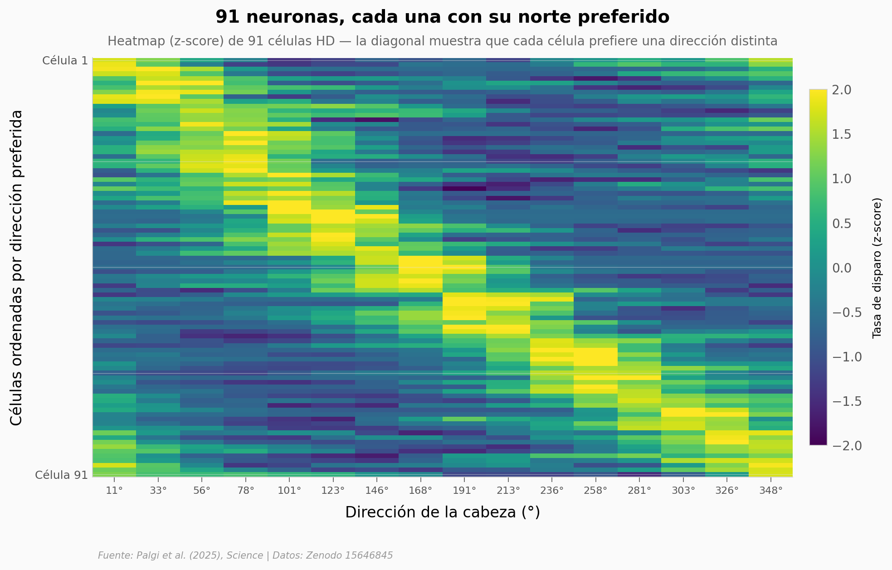

# La brújula del cerebro: 97 neuronas en murciélagos volando sobre una isla

Un equipo israelí registró **97 neuronas brújula** en el cerebro de murciélagos que volaban libres sobre la selva de **Zanzíbar**, sin jaula y sin pistas controladas. El dato más concreto: la dirección preferida de esas neuronas drifteaba ~1,72° por segundo la primera noche — y solo ~0,20° por segundo en la sexta. La brújula se afina con la experiencia.

**El hallazgo:** **La sintonía direccional se estabiliza 8,4× entre la noche 1 y la noche 6** (Spearman ρ = −0,60, p < 1e-8). Los datos también sugieren que la brújula funciona igual con o sin luna en el cielo.

## Gráfica clave



## Reproducir

[](https://colab.research.google.com/github/Ciencia-a-Mordiscos/lab/blob/main/papers/2025-10-16-brujula-cerebral-murcielagos-isla/notebook.ipynb)

O localmente:
```bash
pip install pandas matplotlib numpy scipy
jupyter execute notebook.ipynb
```

## Datos

- `datos/ejemplo_neuronas_brujula.csv` — 2 células de ejemplo × 16 bins direccionales con firing rate, vector de Rayleigh y ajuste von Mises (pnlAB).
- `datos/todas_hd_cells_tuning.csv` — las 97 células × 16 bins z-scored + dirección preferida (91 tras dropna).
- `datos/direcciones_preferidas.csv` — dirección preferida canónica de las 97 células (pnlG).
- `datos/estabilidad_por_noche.csv` — drift de la dirección preferida por noche (1-6), 77 registros.
- `datos/luna_delta_preferida.csv` — Δ dirección preferida entre sesiones con luna arriba vs abajo (20 células).
- `datos/luna_delta_normalizada.csv` — versión normalizada para comparar con shuffle.
- `datos/luna_shuffle.csv` — distribución shuffle (460 valores).
- `datos/delta_hd_real.csv` / `delta_hd_shuffle.csv` — estabilidad intra-sesión para 53 células.
- `datos/mediana_r_espacial_por_noche.csv` — correlación espacial mediana por noche.

## Links

- **Video:** [YouTube Short](https://youtube.com/shorts/-g9NA2iroYM)
- **Paper:** [Science — DOI: 10.1126/science.adw6202](https://doi.org/10.1126/science.adw6202)
- **Datos originales:** [Zenodo — 15646845](https://doi.org/10.5281/zenodo.15646845)
