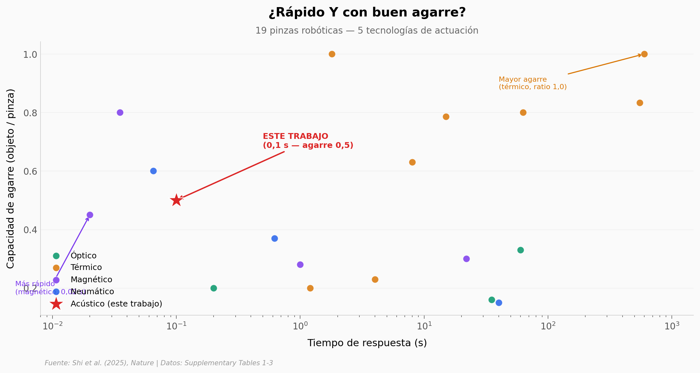

# 10.000 burbujas programables — músculos artificiales controlados con ultrasonido

Más de 10.000 microburbujas con dimensiones precisas, cada una sintonizada a una frecuencia de ultrasonido diferente. Juntas forman un músculo artificial que se deforma de forma programable — sin cables, sin campos magnéticos, a través de hueso y tejido biológico. Este notebook analiza 3 tablas de benchmark del paper, comparando el enfoque acústico contra 73 actuadores publicados en agarre, fuerza y natación.

**El hallazgo:** El stingraybot acústico de 50 mm es **714 veces más grande** que la mediana de nadadores acústicos previos (0,07 mm) — un salto de casi 3 órdenes de magnitud en escala.

## Gráfica clave



## Reproducir

[](https://colab.research.google.com/github/Ciencia-a-Mordiscos/lab/blob/main/papers/2025-10-30-musculos-artificiales-ultrasonido-microburbujas/notebook.ipynb)

O localmente:
```bash
pip install pandas matplotlib numpy
jupyter execute notebook.ipynb
```

## Datos

- `datos/tabla1_grippers.csv` — 19 pinzas robóticas, 5 categorías de actuación (tiempo de respuesta vs capacidad de agarre)
- `datos/tabla2_force_weight.csv` — 15 actuadores, 7 categorías (ratio fuerza/peso vs tamaño)
- `datos/tabla3_swimmers.csv` — 40 nadadores robóticos, 7 categorías (longitud vs velocidad relativa)

## Links

- **Video:** [Ver en YouTube](https://youtube.com/shorts/ISymIIoImuI)
- **Paper:** [Nature — DOI: 10.1038/s41586-025-09650-3](https://doi.org/10.1038/s41586-025-09650-3)
- **Datos originales:** [Supplementary Tables 1-3 (SI PDF)](https://static-content.springer.com/esm/art%3A10.1038%2Fs41586-025-09650-3/MediaObjects/41586_2025_9650_MOESM1_ESM.pdf)
