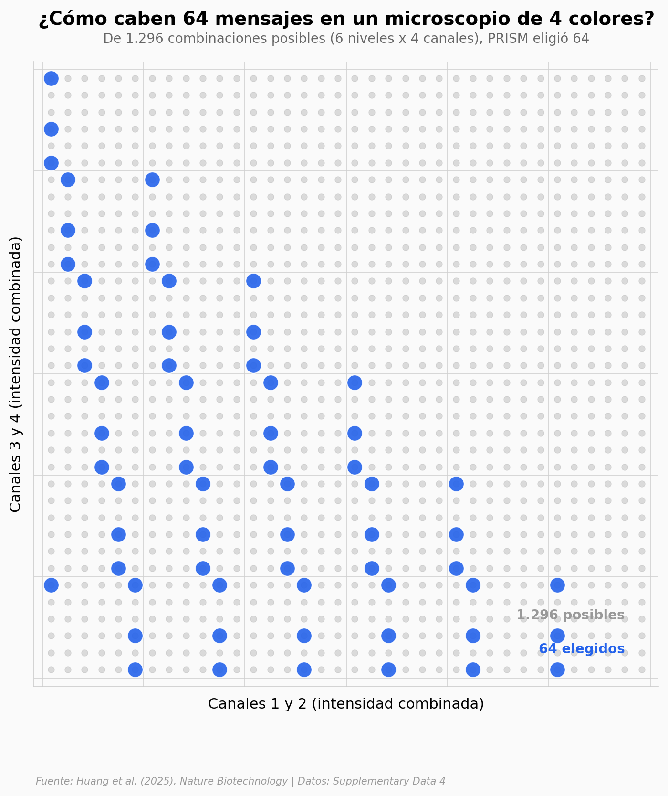

# 64 canales de ARN en una sola imagen

Un microscopio de fluorescencia distingue 4 colores. Los métodos que superan ese límite (MERFISH, seqFISH) necesitan decenas de rondas de imagen para codificar más genes. PRISM empuja el límite sin añadir rondas: codifica cada ARN con una combinación de 4 canales *e intensidad* — y elige 64 puntos del espacio que quedan separados por al menos √2 unidades.

**El hallazgo:** **PRISM elige 64 codewords de un espacio de 1.296 combinaciones posibles (4,9%). La separación mínima entre cualquier par — √2 ≈ 1,414 — es la distancia que un píxel ruidoso no puede cruzar.**

## Gráfica clave



## Reproducir

[](https://colab.research.google.com/github/Ciencia-a-Mordiscos/lab/blob/main/papers/2025-10-30-prism-64-barcodes/notebook.ipynb)

O localmente:

```bash
pip install pandas matplotlib numpy
jupyter execute notebook.ipynb
```

## Datos

- `datos/barcodes_64.csv` — 64 codewords del panel 64-plex (d0-d3, digit_sum, n_nonzero)
- `datos/barcodes_31.csv` — 31 codewords del panel 31-plex (versión previa)
- `datos/gene_panels.csv` — 124 filas: paneles de genes por tejido (Cerebro / Embrión, 30-plex / 64-plex)
- `datos/hcc_probes.csv` — Conteo de sondas por gen en el panel HCC (31 genes, 91 sondas)

Todo viene del Supplementary Data 4 del paper.

## Links

- **Video:** [Ver en YouTube](https://youtube.com/shorts/btbnjawFd44)
- **Paper:** [Nature Biotechnology — DOI: 10.1038/s41587-025-02883-7](https://doi.org/10.1038/s41587-025-02883-7)
- **Datos originales:** [Supplementary Data 4 (MOESM4_ESM.xlsx)](https://static-content.springer.com/esm/art%3A10.1038%2Fs41587-025-02883-7/MediaObjects/41587_2025_2883_MOESM4_ESM.xlsx)
- **Datos de análisis (imágenes, cell typing):** [Zenodo — PRISM Analysis Related Data](https://doi.org/10.5281/zenodo.12755414)
