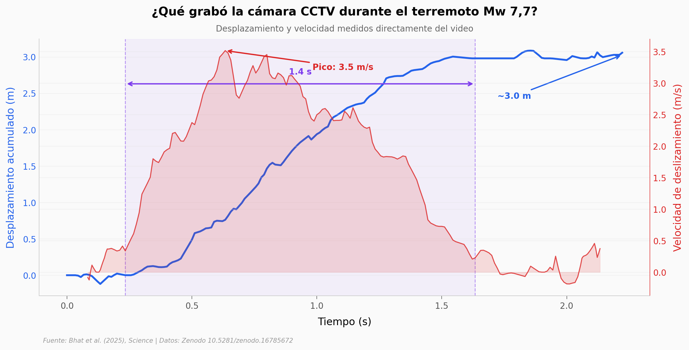

# Una cámara grabó un terremoto desde la falla

Una cámara de seguridad CCTV, ubicada a metros de la falla de Sagaing en Myanmar, grabó la ruptura superficial durante el terremoto Mw 7,7 de Mandalay (28 de marzo de 2025). Del video, un equipo de sismólogos extrajo la primera medición directa de la velocidad de deslizamiento de una ruptura natural: un pulso sísmico de 1,4 segundos con velocidad pico de 3,5 m/s y ~3 metros de desplazamiento acumulado.

**El hallazgo:** La ruptura pasa como una ola concentrada — sube a su pico en 0,4 s y tarda 1,0 s en caer. Dos modelos con distinta velocidad de ruptura ajustan los datos igual de bien, pero implican propiedades mecánicas 5× diferentes.

## Gráfica clave



## Reproducir

[](https://colab.research.google.com/github/Ciencia-a-Mordiscos/lab/blob/main/papers/2025-10-30-terremoto-cctv-falla-myanmar/notebook.ipynb)

O localmente:
```bash
pip install pandas matplotlib numpy
jupyter execute notebook.ipynb
```

## Datos

- `datos/slip_vs_time.csv` — Desplazamiento acumulado vs tiempo (201 puntos, 0–2,22 s)
- `datos/sliprate_vs_time.csv` — Velocidad de deslizamiento vs tiempo (200 puntos)
- `datos/model_results.csv` — Propiedades mecánicas para 2 escenarios de velocidad de ruptura
- `datos/material_parameters.csv` — Parámetros del material y mediciones clave

## Links

- **Video:** [Ver en YouTube](https://youtube.com/shorts/FA2IZR8w6J8)
- **Paper:** [Science — DOI: 10.1126/science.adz1705](https://doi.org/10.1126/science.adz1705)
- **Datos originales:** [Zenodo](https://doi.org/10.5281/zenodo.16785672)
