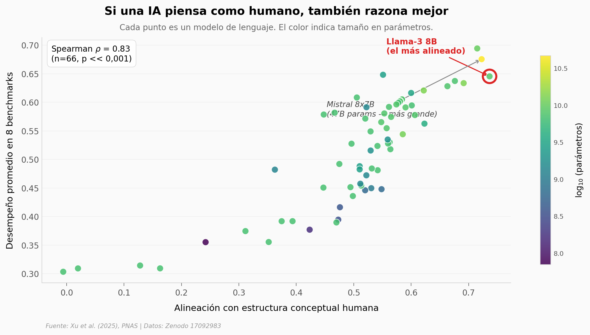

# ¿Puede una IA entender el mundo sin haberlo vivido?

66 modelos de lenguaje entrenados solo con texto. Cuando los comparamos entre sí y con humanos, el que más se parece a un cerebro humano no es el más grande — y esa alineación predice, mejor que el tamaño, qué tan bien razona el modelo en tareas generales.

**El hallazgo:** Llama-3 **8B** tiene la mayor alineación con la estructura conceptual humana (0,74), por encima de Mistral 8x7B (47 mil millones de parámetros, 0,72). La correlación entre alineación y desempeño global es ρ = 0,83 (Spearman, n = 66, p << 0,001).

## Gráfica clave



## Reproducir

[](https://colab.research.google.com/github/Ciencia-a-Mordiscos/lab/blob/main/papers/2025-10-31-ia-conceptos-humanos-sin-vivir/notebook.ipynb)

O localmente:
```bash
pip install pandas matplotlib numpy scipy
jupyter execute notebook.ipynb
```

## Datos

- `datos/modelos_alineacion.csv` — 66 LLMs con alineación, exact match, desempeño global y 8 benchmarks individuales.
- `datos/convergencia_demos_llama3_70b.csv` — 8 puntos de Llama-3-70B con 1 a 96 demostraciones in-context, con intervalos de confianza.
- `datos/noise_ceiling_humano.csv` — 52 ejes semánticos (9 dominios × 17 atributos) con consistencia split-half humana.
- `datos/spose_dimensiones.csv` — 66 dimensiones SPoSE del dataset THINGS.
- `datos/probing_escala.csv` — 36 LLMs en la tarea de probing a 24 demos.

## Links

- **Video:** [Ver en YouTube Shorts](https://youtube.com/shorts/4ZfHcofzrLo)
- **Paper:** [PNAS — DOI: 10.1073/pnas.2512514122](https://doi.org/10.1073/pnas.2512514122)
- **Datos originales:** [Zenodo 17092983](https://doi.org/10.5281/zenodo.17092983)
