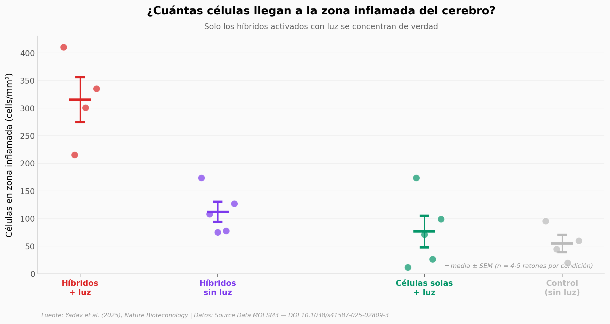

# Un implante cerebral sin cirugía: 5.8x más células donde hay inflamación

Princeton diseñó **células híbridas**: macrófagos recubiertos con proteína conductora y cargados con fotodiodos del tamaño de bacterias. Las inyectaron en la sangre de ratones con una zona inflamada en el cerebro. Los macrófagos migraron a la inflamación, los fotodiodos se activaron desde fuera del cráneo con luz infrarroja, y el sistema generó pulsos eléctricos focalizados con precisión de 30 µm. Sin tornillos, sin electrodos rígidos, sin abrir la cabeza.

**El hallazgo:** Los híbridos activados con luz se concentraron en la zona inflamada a **315 cells/mm²**, contra **55 cells/mm²** del control completo (células sin dispositivo, sin luz). Una proporción de **5.76x**, con un **Cohen's d = 4.24** (efecto enorme) y **p = 0.029** (Mann-Whitney). Los SWEDs persistieron sin decaimiento detectable durante **6 meses**, y el cráneo de ratón redujo la potencia generada por los fotodiodos solo un **11.6%** a 46 mW/mm².

## Gráfica clave



## Reproducir

[](https://colab.research.google.com/github/Ciencia-a-Mordiscos/lab/blob/main/papers/2025-11-05-implantes-cerebrales-circulatronics/notebook.ipynb)

O localmente:

```bash
pip install pandas matplotlib numpy scipy
jupyter execute notebook.ipynb
```

## Datos

- `datos/biodistribucion_fig4f.csv` — 18 mediciones de células/mm² en 4 condiciones (Fig 4f del paper)
- `datos/persistencia_fig5f.csv` — 11 mediciones de SWEDs/mm² en 4 timepoints, hasta 6 meses (Fig 5f)
- `datos/pv_power_fig2g.csv` — Potencia eléctrica generada por los fotodiodos a 11 intensidades de luz, con y sin cráneo de ratón (Fig 2g)

## Links

- **Video:** Pendiente
- **Paper:** [Yadav et al., *Nature Biotechnology* (2025) — DOI 10.1038/s41587-025-02809-3](https://doi.org/10.1038/s41587-025-02809-3)
- **Datos originales:** [Source Data MOESM3 (Springer Nature)](https://static-content.springer.com/esm/art%3A10.1038%2Fs41587-025-02809-3/MediaObjects/41587_2025_2809_MOESM3_ESM.xlsx)
- **Dataset completo:** [Dryad — DOI 10.5061/dryad.pzgmsbd12](https://doi.org/10.5061/dryad.pzgmsbd12) (79.7 GB, status `submitted`)
