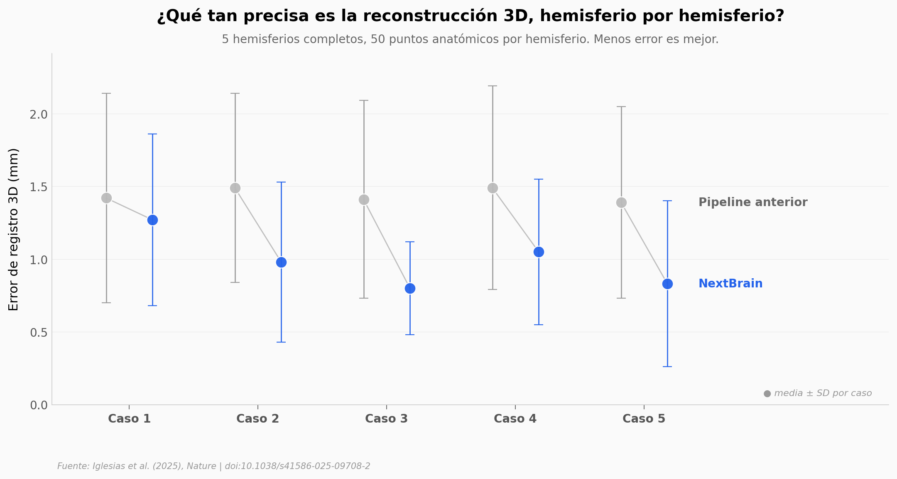

# 333 piezas del cerebro: el atlas que está reescribiendo cómo medimos lo que hay dentro

Un equipo entre UCL y MGH/Harvard tomó cinco hemisferios cerebrales completos, los seccionó en cerca de 10.000 láminas histológicas, las alineó en 3D con métodos de IA y delineó manualmente 333 regiones de interés. Después construyeron una herramienta probabilística que traslada esa anotación de máxima resolución a las resonancias magnéticas clínicas que usa cualquier hospital.

**El hallazgo:** **el error medio de registro 3D baja un 31% (de 1,44 a 0,99 mm)** y los cinco hemisferios mejoran a la vez — sin un solo caso donde el método anterior gane. En la prueba clínica con 383 escáneres del consorcio ADNI, NextBrain clasifica Alzheimer vs control con AUROC 0,953 (acierto 90,3%), por encima de FreeSurfer (0,911) y del atlas Allen MNI (0,929).

## Gráfica clave



## Reproducir

[](https://colab.research.google.com/github/Ciencia-a-Mordiscos/lab/blob/main/papers/2025-11-05-nextbrain-atlas-333-regiones/notebook.ipynb)

O localmente:
```bash
pip install pandas matplotlib numpy
jupyter execute notebook.ipynb
```

## Datos

- `datos/registro_casos_mm.csv` — Error de registro 3D por caso (5 hemisferios × 2 métodos), con SD y p-value de Wilcoxon por caso. **Fuente directa: Tabla 1 del paper.**
- `datos/auroc_alzheimer.csv` — AUROC y acierto de clasificación Alzheimer (ADNI n = 383) para FreeSurfer 7.0, Allen MNI y NextBrain. Extraído del texto del paper (sección Alzheimer's disease).
- `datos/dice_mediana.csv` — Dice mediana a dos resoluciones (200 µm ex vivo, 1 mm in vivo). Contexto complementario.

## Links

- **Video:** [Ver en YouTube](https://youtube.com/shorts/N0jvqX4wV6o)
- **Paper:** [Iglesias et al. (2025) — *Nature*, doi:10.1038/s41586-025-09708-2](https://doi.org/10.1038/s41586-025-09708-2)
- **Datos crudos completos (≈100 GB):** [UCL Research Data Repository — doi:10.5522/04/24243835](https://doi.org/10.5522/04/24243835) — incluye MRI, secciones histológicas, atlas 3D y anotaciones manuales. Excede el presupuesto de este entorno reproducible; los valores graficados aquí provienen de la Tabla 1 y del texto del paper Open Access.
