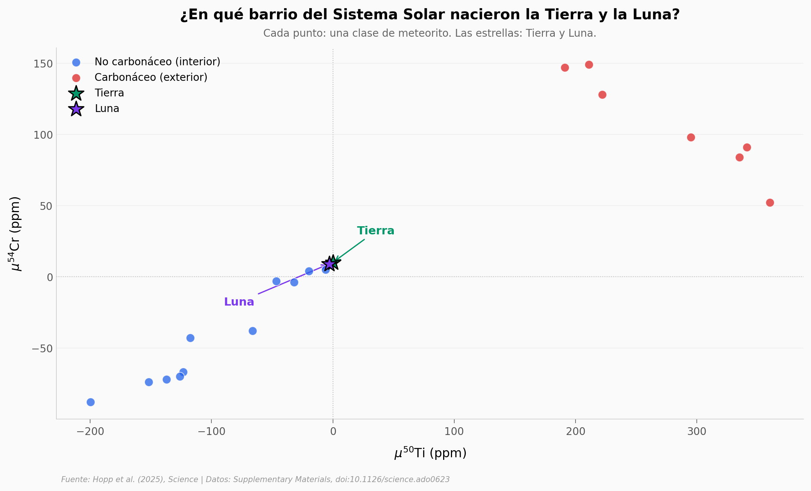

# ¿De dónde vino el planeta que chocó contra la Tierra?

Hace 4.500 millones de años, otro planeta — del tamaño de Marte — chocó contra la proto-Tierra. De ese choque salió la Luna. El paper lo llama Theia, pero nadie sabía dónde se había formado: ¿cerca del Sol, o lejos, donde están los asteroides carbonáceos? Hopp et al. midieron isótopos de hierro en 41 muestras (terrestres, lunares y meteoríticas), las cruzaron con cinco sistemas isotópicos más, y reconstruyeron Theia con un balance de masas.

**El hallazgo:** **Solo las recetas no carbonáceas dan una Theia que existe en la naturaleza.** Theia se formó en el Sistema Solar interior — y el paper sugiere que pudo haber nacido incluso más cerca del Sol que la Tierra.

## Gráfica clave



Cada punto, una clase de meteorito. Las estrellas, Tierra y Luna. Los azules (no carbonáceos, NC) nacieron cerca del Sol; los rojos (carbonáceos, CC) más lejos. Tierra y Luna caen casi en el mismo punto, pegadas al extremo NC.

## Reproducir

[](https://colab.research.google.com/github/Ciencia-a-Mordiscos/lab/blob/main/papers/2025-11-20-theia-sistema-solar-interior/notebook.ipynb)

O localmente:

```bash
pip install pandas matplotlib numpy scipy
jupyter execute notebook.ipynb
```

## Datos

- `datos/fe_isotopes_individual.csv` — 41 muestras Fe isotópico (15 terrestres, 6 lunares con flag de exposición a rayos cósmicos, 14 enstatitas, 4 ordinarias, 2 Rumuruti).
- `datos/isotope_summary.csv` — 27 clases meteoríticas + Tierra + Luna en seis sistemas isotópicos (O, Ti, Cr, Fe, Zr, Mo).
- `datos/theia_mass_balance.csv` — 12 escenarios de balance de masas (4 PEM × 3 tamaños de impactor).

## Links

- **Video:** [Ver en YouTube](https://youtube.com/shorts/DB475dAgomA)
- **Paper:** Hopp et al. (2025), *Science* — [DOI: 10.1126/science.ado0623](https://doi.org/10.1126/science.ado0623)
- **Datos originales:** [Supplementary Materials](https://www.science.org/doi/suppl/10.1126/science.ado0623)
