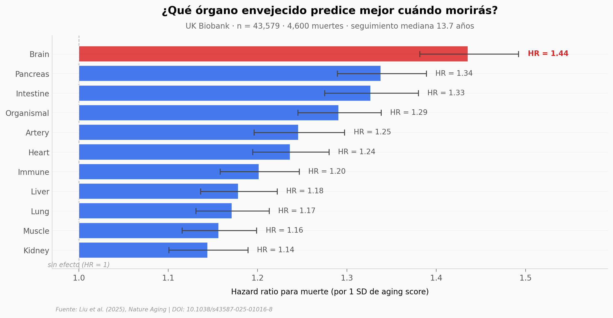

# Tu plasma tiene 11 relojes. Uno por órgano.

Un equipo entrenó 11 modelos de machine learning sobre el proteoma plasmático de **43,616 personas** del UK Biobank, validados en China (n = 3,977) y Estados Unidos (n = 800). Cada modelo predice la edad biológica de un órgano (organismo + 10 órganos: arteria, cerebro, corazón, sistema inmune, intestino, riñón, hígado, pulmón, músculo, páncreas). El residual respecto a la edad cronológica es el *aging score* — y cuanto más alto, mayor riesgo de enfermedad y muerte.

**El hallazgo:** **Por cada SD (desviación estándar) que el reloj cerebral te marca "más viejo" que tu edad real, el riesgo de muerte sube 44 % (HR = 1.44, IC 95 % 1.38–1.49) y el de demencia casi se duplica (HR = 1.88).** Entre 11 órganos, el cerebro es el #1 — el factor de riesgo más fuerte queda *por encima* del corazón, los pulmones y los riñones.

## Gráfica clave



## Reproducir

[](https://colab.research.google.com/github/Ciencia-a-Mordiscos/lab/blob/main/papers/2025-11-26-organ-proteomic-aging-clocks/notebook.ipynb)

O localmente:

```bash
pip install pandas matplotlib numpy
jupyter execute notebook.ipynb
```

## Datos

- `datos/disease_associations.csv` — 198 filas (18 outcomes × 11 relojes): β, SE, HR, IC 95 %, p-value de Cox regression
- `datos/r2_cross_cohort.csv` — R² de cada reloj en las 3 cohortes (UKB descubrimiento, CKB China, NHS USA)
- `datos/organ_correlations_ukb.csv` — matriz 10×10 de correlaciones de Pearson entre los aging scores
- `datos/aging_scores_ukb_sample.csv` — sample aleatorio (semilla 42) de 5,000 personas del UKB con sus 10 aging scores
- `datos/top_proteins_per_organ.csv` — top proteínas Olink usadas en cada uno de los 10 organ-specific clocks

## Links

- **Video:** [Pendiente]
- **Paper:** [Liu et al. (2025), *Nature Aging* — DOI: 10.1038/s43587-025-01016-8](https://doi.org/10.1038/s43587-025-01016-8)
- **Datos originales:** [Supplementary Tables ST1–ST18 (MOESM3) y Source Data (MOESM4)](https://www.nature.com/articles/s43587-025-01016-8)
- **Código del paper:** [github.com/41way5/Organ-PAC](https://github.com/41way5/Organ-PAC)

## Limitaciones

- **Diseño observacional** (Cox regression): los HRs predicen riesgo, no demuestran causalidad
- **HR por 1 SD del aging score residual**, no equivalente a "tu cerebro envejece 44 % más rápido"
- El histograma de brain score muestra un **pico artificial** centrado en la mediana (~11 % del sample): los modelos Olink imputan proteínas faltantes con la mediana antes de pasarlas al reloj
- Los datos crudos del proteoma del UK Biobank requieren solicitud formal al consorcio
