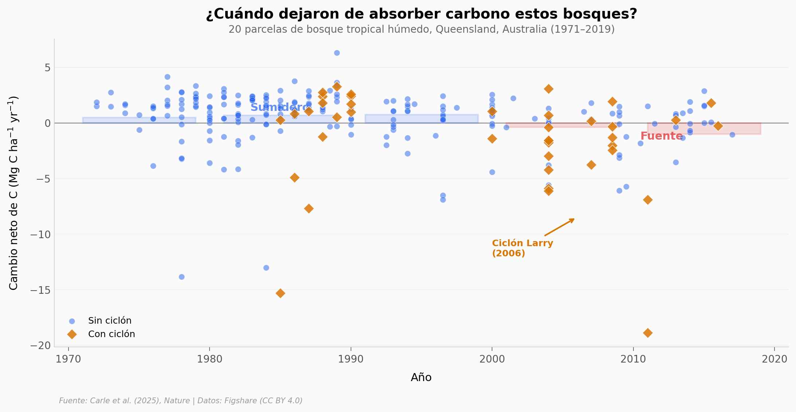

# 🌿 Los bosques tropicales ahora liberan carbono

Un estudio de 48 años (1971–2019) en 20 parcelas de bosque tropical húmedo en Queensland, Australia, revela que estos bosques pasaron de ser sumideros de carbono a fuentes netas. La transición fue impulsada por anomalías climáticas extremas que aumentaron la mortalidad de los árboles, sin evidencia de que el CO₂ extra esté acelerando el crecimiento.

**El hallazgo:** los bosques absorbían +0,62 Mg C ha⁻¹ yr⁻¹ (1971–2000). Para 2010–2019, el balance se invirtió a −0,93 Mg C ha⁻¹ yr⁻¹.

## Gráfica clave



## Reproducir

[](https://colab.research.google.com/github/Ciencia-a-Mordiscos/lab/blob/main/papers/2026-01-17-bosques-tropicales-liberan-carbono/notebook.ipynb)

O localmente:
```bash
pip install pandas matplotlib numpy scipy
jupyter execute notebook.ipynb
```

## Datos

- `datos/agb_plotwise.csv` — 259 censos de biomasa aérea (20 parcelas × ~13 intervalos, 1971–2019)
- `datos/climate_plotwise.csv` — Variables climáticas por parcela e intervalo de censo
- `datos/geographic_locations.csv` — Coordenadas y elevación de las 20 parcelas
- `datos/cyclone_dates.csv` — Fechas de impacto de ciclones por parcela

## Links

- **Video:** [Ver en YouTube](https://youtube.com/shorts/PzrTo36okmQ)
- **Paper:** [Nature — DOI: 10.1038/s41586-025-09497-8](https://doi.org/10.1038/s41586-025-09497-8)
- **Datos originales:** [Figshare Collection](https://doi.org/10.6084/m9.figshare.c.7922084) (CC BY 4.0)
