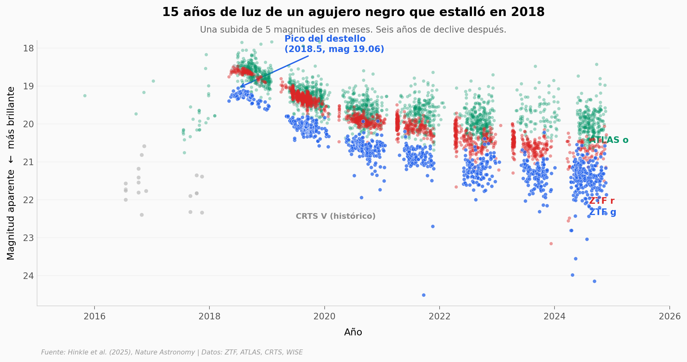

# Un destello 40 veces más brillante: el estallido extremo de un agujero negro

En 2018 un agujero negro supermasivo en la constelación de Pegaso brilló más de 40 veces por encima de su nivel normal y liberó, en luz UV y óptica, la energía equivalente a convertir una masa solar entera en radiación. Seis años después, la luz sigue apagándose lentamente.

**El hallazgo:** El destello, registrado en el objeto J224554.84+374326.5 (z = 2,6), es **30 veces más potente** que cualquier transitorio de núcleo galáctico activo (AGN) previamente catalogado — y su eco infrarrojo, mucho más modesto (factor ~1,9), delata la presencia de polvo que reemite parte de la radiación.

## Gráfica clave



## Reproducir

[](https://colab.research.google.com/github/Ciencia-a-Mordiscos/lab/blob/main/papers/2026-01-17-destello-agujero-negro-extremo/notebook.ipynb)

O localmente:
```bash
pip install pandas matplotlib numpy
jupyter execute notebook.ipynb
```

## Datos

- `datos/ztf_photometry.csv` — Fotometría ZTF g (1.023 obs) y r (1.929 obs), 2018-2024
- `datos/atlas_photometry.csv` — Fotometría ATLAS o y c (2.266 obs), 2015-2024
- `datos/crts_photometry.csv` — Fotometría CRTS V (119 obs), 2016-2020 — baseline histórico
- `datos/wise_photometry.csv` — Fotometría WISE W1 y W2 (52 obs), 2010-2023 — eco infrarrojo

## Links

- **Video:** [Ver en YouTube](https://youtube.com/shorts/CxsyuCwu7s0)
- **Paper:** [Nature Astronomy — DOI: 10.1038/s41550-025-02699-0](https://doi.org/10.1038/s41550-025-02699-0)
- **Datos originales:** Supplementary Materials del paper (Hinkle et al., 2025)
