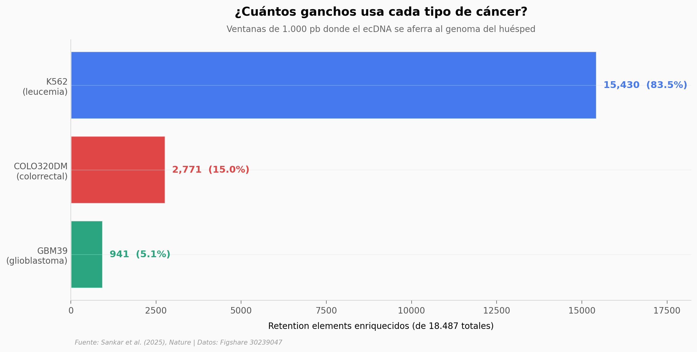

# Miles de elementos genéticos mantienen vivo el cáncer

El ADN extracromosómico (ecDNA) es uno de los mecanismos más temibles del cáncer: cargado de oncogenes, sin centrómero, salta entre células hijas durante la mitosis. Lleva 40 años desconcertando a los biólogos cómo logra hacerlo. Este paper de *Nature* (2025) lo resuelve: encontró los **ganchos**.

**El hallazgo:** **18.487 elementos genéticos** en 23 cromosomas humanos — promotores ricos en CpG — que actúan como puntos de anclaje del ecDNA durante la división celular. **El 83,5%** son específicos a un solo tipo de cáncer; apenas **15** son universales en las 3 líneas analizadas.

## Gráfica clave



## Reproducir

[](https://colab.research.google.com/github/Ciencia-a-Mordiscos/lab/blob/main/papers/2026-01-17-elementos-retencion-ecdna-cancer/notebook.ipynb)

O localmente:
```bash
pip install pandas matplotlib numpy
jupyter execute notebook.ipynb
```

## Datos

- `datos/retention_elements_hg19.csv` — 18.487 ventanas genómicas (1.000 pb cada una) con flags binarios de enriquecimiento por cell line. Coordenadas en hg19. Origen: [Figshare 30239047](https://doi.org/10.6084/m9.figshare.30239047).

## Links

- **Video:** [Ver en YouTube](https://youtube.com/shorts/abzQNiCQsbU)
- **Paper:** [Genetic elements promote retention of extrachromosomal DNA in cancer cells — *Nature*, 2025](https://doi.org/10.1038/s41586-025-09764-8)
- **Datos originales:** [Figshare repository](https://doi.org/10.6084/m9.figshare.30239047)
