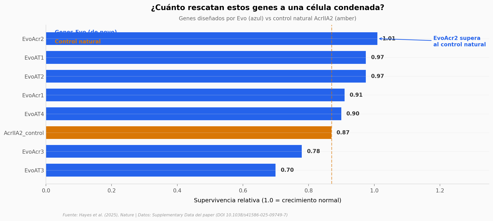

# El gen anti-CRISPR diseñado por una IA que supera al control humano

Un modelo de lenguaje genómico (Evo, entrenado sobre 2,7 millones de genomas procariotas) generó secuencias de ADN nuevas condicionadas por contexto. De 86 anti-CRISPR sintetizadas y testeadas, el 17% mostró actividad medible. El gen que mejor funcionó (EvoAcr2) tiene cero parientes detectables ni en secuencia (BLAST) ni en estructura (Foldseek) — y supera al control natural AcrIIA2 por 16% en supervivencia relativa.

**El hallazgo:** **EvoAcr2 — supervivencia relativa 1.01 vs control AcrIIA2 = 0.87, con 0% de identidad de secuencia con cualquier proteína conocida.**

## Gráfica clave



## Reproducir

[](https://colab.research.google.com/github/Ciencia-a-Mordiscos/lab/blob/main/papers/2026-01-17-evo-syngenome-120mil-genes-ia/notebook.ipynb)

O localmente:

```bash
pip install pandas matplotlib numpy scipy
jupyter execute notebook.ipynb
```

## Datos

Los 5 CSVs en `datos/` son extracciones del paper y de su material suplementario (MOESM3 y MOESM7):

- `evo_validados_actividad.csv` — 8 filas, los genes Evo con actividad cuantitativa validada in vivo + 1 control natural (AcrIIA2).
- `success_rates_categoria.csv` — 3 filas, tasas de éxito por categoría con n explícito (T2 antitoxina 50%/n=8, anti-CRISPR 17%/n=86).
- `secuencias_ordenadas.csv` — 8 filas, desglose de las secuencias sintetizadas físicamente por categoría y tipo de diseño.
- `blast_homologia_secuencia.csv` — 11 filas, hits BLAST y % identidad de cada gen Evo contra NCBI.
- `foldseek_homologia_estructural.csv` — 11 filas, hits Foldseek y % identidad estructural de cada gen Evo contra ~600 mil estructuras conocidas.

## Links

- **Video:** [pendiente]
- **Paper:** [Nature — DOI: 10.1038/s41586-025-09749-7](https://doi.org/10.1038/s41586-025-09749-7)
- **SynGenome dataset (3,7 millones de genes con estructura ESMFold):** [Hugging Face — evo-design/syngenome-uniprot](https://huggingface.co/datasets/evo-design/syngenome-uniprot)
- **Modelo:** [Hugging Face — evo-design/evo-1.5-8k-base](https://huggingface.co/evo-design/evo-1.5-8k-base)
- **Repo de código del paper:** [github.com/evo-design/evo](https://github.com/evo-design/evo/)
