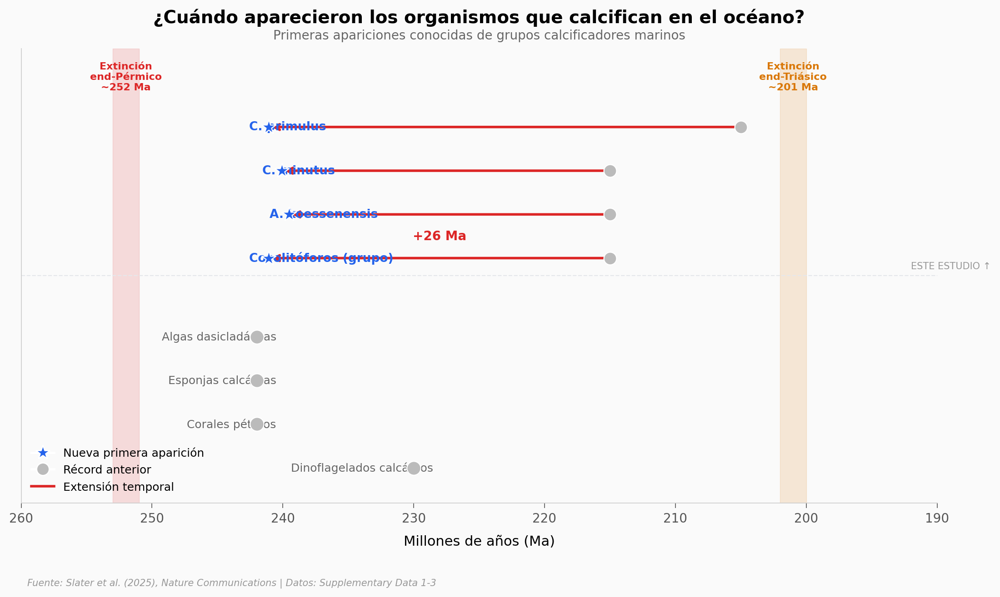

# Fantasmas de 241 millones de años revelan un secreto

Unas huellas invisibles en rocas del Triásico Medio revelan que los cocolitóforos — las microalgas marinas que fabrican placas de calcio — existían 26 millones de años antes de lo que se creía. Más de 100 "fósiles fantasma" (impresiones en materia orgánica fosilizada) aparecieron en muestras de Suiza y Austria, preservados dentro de heces de zooplancton.

**El hallazgo:** Los cocolitóforos datan de ~241 millones de años, no ~215 Ma como se pensaba. Aparecen junto a corales pétreos y esponjas calcáreas, lo que sugiere una diversificación de organismos calcificadores marinos tras la extinción del Pérmico.

## Gráfica clave



## Reproducir

[](https://colab.research.google.com/github/Ciencia-a-Mordiscos/lab/blob/main/papers/2026-01-17-fantasmas-cocolitoforos-triasico/notebook.ipynb)

O localmente:
```bash
pip install pandas matplotlib numpy
jupyter execute notebook.ipynb
```

## Datos

- `datos/timeline_organismos.csv` — 8 grupos calcificadores, edades nuevas vs anteriores
- `datos/palinofacies.csv` — composición de materia orgánica por muestra (8 examinadas)
- `datos/muestras_completas.csv` — 12 muestras con localidad, edad y presencia de fantasmas

## Links

- **Video:** [Ver en YouTube](https://youtube.com/shorts/oCiNL0ZYmfA)
- **Paper:** [Nature Communications — DOI: 10.1038/s41467-025-65116-0](https://doi.org/10.1038/s41467-025-65116-0)
- **Datos originales:** Supplementary Data 1-3 de Nature Communications
