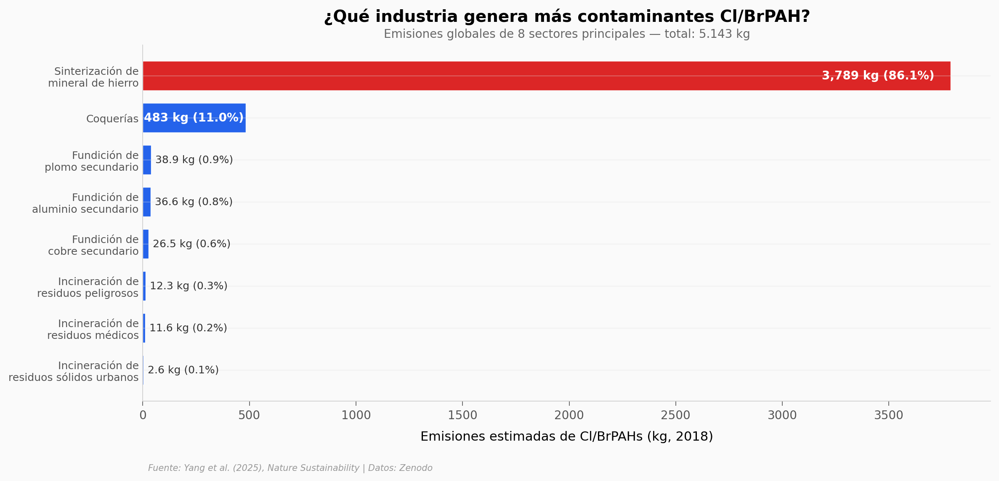

# Una industria causa el 86% de estos contaminantes

5.143 kilogramos. Eso es lo que toda la industria del planeta emitió en contaminantes orgánicos clorados y bromados (Cl/BrPAHs) en 2018. Suena poco — hasta que descubres que **una sola industria, la sinterización de mineral de hierro, genera el 86,1%** del total. Australia, China y Brasil concentran el 58% de las emisiones globales estimadas.

**El hallazgo:** La sinterización de mineral de hierro emite 3.789 kg de Cl/BrPAHs — más que los otros 10 sectores industriales combinados. Australia lidera con 1.393 kg (27% del total global).

## Gráfica clave



## Reproducir

[](https://colab.research.google.com/github/Ciencia-a-Mordiscos/lab/blob/main/papers/2026-01-17-industria-86-contaminantes-emergentes/notebook.ipynb)

O localmente:
```bash
pip install pandas matplotlib numpy
jupyter execute notebook.ipynb
```

## Datos

- `datos/emisiones_por_sector.csv` — 8 sectores industriales, emisiones en kg y % del total
- `datos/emisiones_por_pais.csv` — 184 países, emisiones totales en kg
- `datos/emisiones_per_capita.csv` — 184 países, emisiones per cápita en g/persona
- `datos/factores_emision_stack_gas.csv` — Factores de emisión por sector (mg/kt)
- `datos/emisiones_regionales.csv` — 12 regiones, desglose por tipo de emisión

## Links

- **Video:** [Ver en YouTube](https://youtube.com/shorts/O4Pnh_ESM1M)
- **Paper:** [Nature Sustainability — DOI: 10.1038/s41893-025-01656-z](https://doi.org/10.1038/s41893-025-01656-z)
- **Datos originales:** [Zenodo — Dataset for Cl/Br-PAH Emission Calculations](https://doi.org/10.5281/zenodo.15869972)
