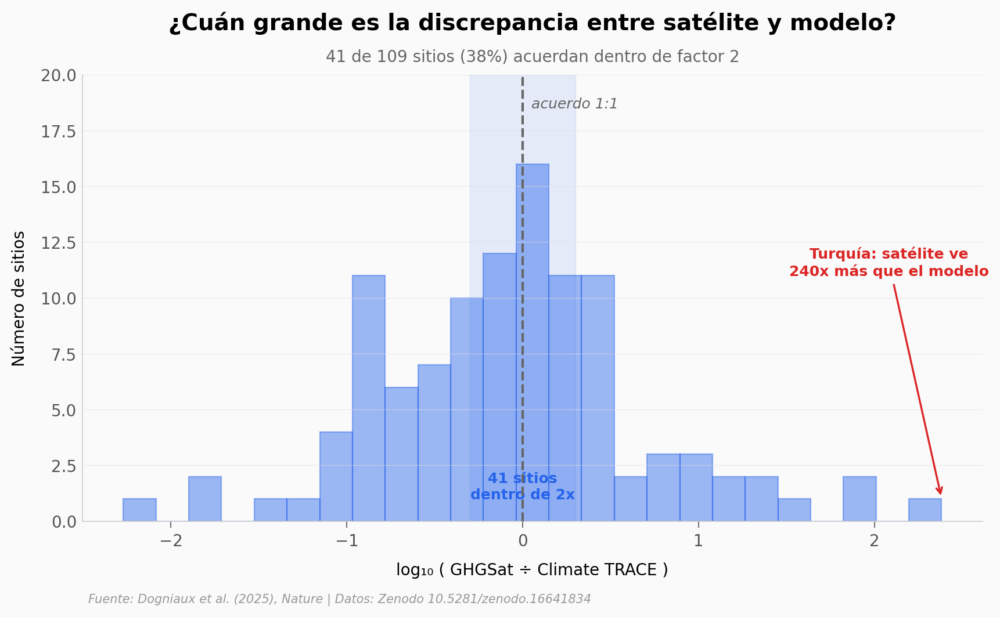

# 151 vertederos del mundo, 1085 detecciones satelitales

Un equipo europeo observó 151 vertederos en 6 continentes con el satélite GHGSat durante 2021-2022. Al cruzar esas observaciones con los reportes nacionales y con el inventario global Climate TRACE, se encontraron con algo incómodo: **no hay correlación a escala de instalación**. El satélite y los modelos no coinciden.

**El hallazgo:** **La correlación entre lo que ven los satélites y lo que estiman los modelos es ρ=0,12 (p=0,21) — estadísticamente indistinguible de cero.** En un vertedero de Turquía, el satélite ve 240 veces más metano que el modelo; en un vertedero de Corea, el modelo estima 186 veces más que lo que ve el satélite.

## Gráfica clave



## Reproducir

[](https://colab.research.google.com/github/Ciencia-a-Mordiscos/lab/blob/main/papers/2026-01-17-metano-151-vertederos-satelite/notebook.ipynb)

O localmente:

```bash
pip install pandas matplotlib numpy scipy
jupyter execute notebook.ipynb
```

## Datos

- `datos/vertederos_151.csv` — 151 filas · resumen por sitio (lat, lon, país, Q_GHGSat, Q_unc, Q_reportado, Q_ClimateTRACE). Transcrito de la Supplementary Table 4 del paper.
- `datos/plumas_detectadas_1085.csv` — 1085 filas · detecciones individuales (site_id, lat, lon, fecha UTC, Q t/h, error, viento). Desde `GHGSat_detected_plumes.csv` del repositorio Zenodo.

## Links

- **Video:** [YouTube Shorts](https://youtube.com/shorts/bm-rFecc720)
- **Paper:** [Nature — DOI: 10.1038/s41586-025-09683-8](https://doi.org/10.1038/s41586-025-09683-8)
- **Datos originales:** [Zenodo · 10.5281/zenodo.16641834](https://doi.org/10.5281/zenodo.16641834)
