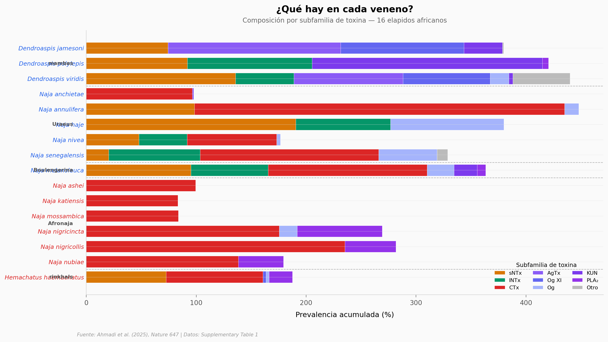

# 8 moléculas contra 17 serpientes letales

Las mordeduras de serpientes cobran miles de vidas en África subsahariana cada año. Los antivenenos actuales, derivados de plasma animal, son caros, provocan reacciones inmunológicas y no cubren todas las especies. Un equipo inmunizó una alpaca y una llama con los venenos de 18 serpientes elapidas africanas y encontró 8 nanobodies que, combinados en un cocktail recombinante, neutralizan 7 familias de toxinas — protegiendo contra 17 de 18 especies en ratones.

**El hallazgo:** 8 nanobodies combinados protegen contra 17 de 18 serpientes elapidas africanas en modelos preclínicos, superando al antiveneno comercial de plasma.

## Gráfica clave



## Reproducir

[](https://colab.research.google.com/github/Ciencia-a-Mordiscos/lab/blob/main/papers/2026-01-17-nanobodies-antivenom-serpientes/notebook.ipynb)

O localmente:
```bash
pip install pandas matplotlib numpy
jupyter execute notebook.ipynb
```

## Datos

- `datos/composicion_veneno.csv` — Proteómica de venenos: 133 entradas de toxinas en 16 especies, con prevalencia (%), subfamilia y subgénero
- `datos/resultados_in_vivo.csv` — Resultados de neutralización in vivo para 18 especies (pre-incubación y rescate)
- `datos/nanobodies.csv` — Los 8 nanobodies del cocktail y sus dianas

## Links

- **Video:** [Ver en YouTube](https://youtube.com/shorts/XnIsVcl8hoQ)
- **Paper:** [Nature — DOI: 10.1038/s41586-025-09661-0](https://doi.org/10.1038/s41586-025-09661-0)
- **Datos originales:** [Supplementary Table 1 (Source Data)](https://static-content.springer.com/esm/art%3A10.1038%2Fs41586-025-09661-0/MediaObjects/41586_2025_9661_MOESM1_ESM.xlsx)
