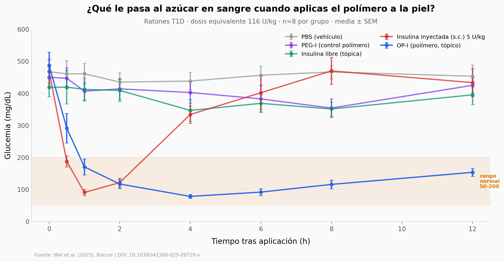

# Un polímero atraviesa la piel y entrega insulina sin agujas

Un equipo en China diseñó un polímero zwitteriónico (OP) que cambia su carga eléctrica con el pH: en el fármaco es eléctricamente neutro, pero al tocar la piel se vuelve catiónico y abre paso a moléculas grandes —incluida la insulina— a través del estrato córneo. Aplicado tópicamente, normalizó la glucemia en ratones diabéticos T1 y lo replicaron en minicerdos diabéticos.

**El hallazgo:** **78 mg/dL en 4 horas** en ratones T1D tras una sola aplicación tópica a 116 U/kg. Y a la cuarta parte de esa dosis, **89 mg/dL en 6 horas** en minicerdos diabéticos.

## Gráfica clave



## Reproducir

[](https://colab.research.google.com/github/Ciencia-a-Mordiscos/lab/blob/main/papers/2026-01-17-polimero-insulina-sin-agujas/notebook.ipynb)

O localmente:
```bash
pip install pandas matplotlib numpy scipy
jupyter execute notebook.ipynb
```

## Datos

- `datos/bgl_mice_116ukg.csv` — BGL en ratones T1D, 5 grupos × 8 timepoints × 8 ratones (320 mediciones).
- `datos/bgl_mice_dose_response.csv` — BGL en ratones T1D, OP-I a 58 y 29 U/kg, 8 timepoints × 8 ratones (128 mediciones).
- `datos/bgl_minipigs_29ukg.csv` — BGL en minicerdos diabéticos, 5 grupos × 7 timepoints × 3 cerdos (105 mediciones).

Todos derivados directamente del Source Data Fig. 3 del paper (Springer ESM, MOESM14_ESM.xlsx).

## Links

- **Video:** [Ver en YouTube Shorts](https://youtube.com/shorts/uGReH2mVx8g)
- **Paper:** [Wei *et al.* (2025), *Nature* — DOI: 10.1038/s41586-025-09729-x](https://doi.org/10.1038/s41586-025-09729-x)
- **Datos originales:** [Springer ESM (Source Data Fig. 3)](https://static-content.springer.com/esm/art%3A10.1038%2Fs41586-025-09729-x/MediaObjects/41586_2025_9729_MOESM14_ESM.xlsx)
