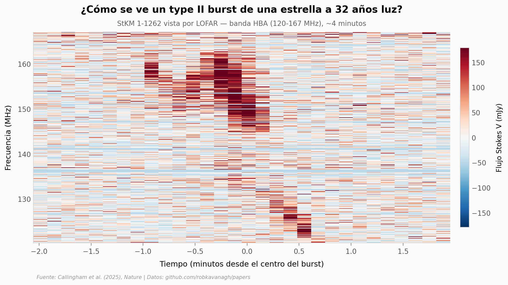

# Primera eyección de masa coronal fuera del Sol

Una M dwarf a 32 años luz, una explosión de radio de 4 minutos en LOFAR, y un argumento físico que apunta a la primera detección directa de una eyección de masa coronal en una estrella distinta del Sol.

**El hallazgo:** **0,84 × 10⁻³ eventos por día por estrella M** — en promedio, ~3 años entre uno y el siguiente, con una varianza enorme.

## Gráfica clave



## Reproducir

[](https://colab.research.google.com/github/Ciencia-a-Mordiscos/lab/blob/main/papers/2026-01-17-primera-eyeccion-estelar-fuera-sol/notebook.ipynb)

O localmente:

```bash
pip install pandas matplotlib numpy
jupyter execute notebook.ipynb
```

## Datos

- `datos/dynamic_spectrum.csv` — 14.400 filas (30 tiempo × 480 frecuencia), Stokes V en mJy
- `datos/posteriors_loop_modelo.csv` — 6.356 muestras MCMC × 9 parámetros del modelo ECMI alternativo
- `datos/parametros_resumen.csv` — medianas e IQR de los 9 parámetros

## Links

- **Video:** [Pendiente]
- **Paper:** [Nature — DOI: 10.1038/s41586-025-09715-3](https://doi.org/10.1038/s41586-025-09715-3)
- **Datos originales:** [Repositorio del autor (Rob Kavanagh, Leiden)](https://github.com/robkavanagh/papers/tree/main/type-II)
