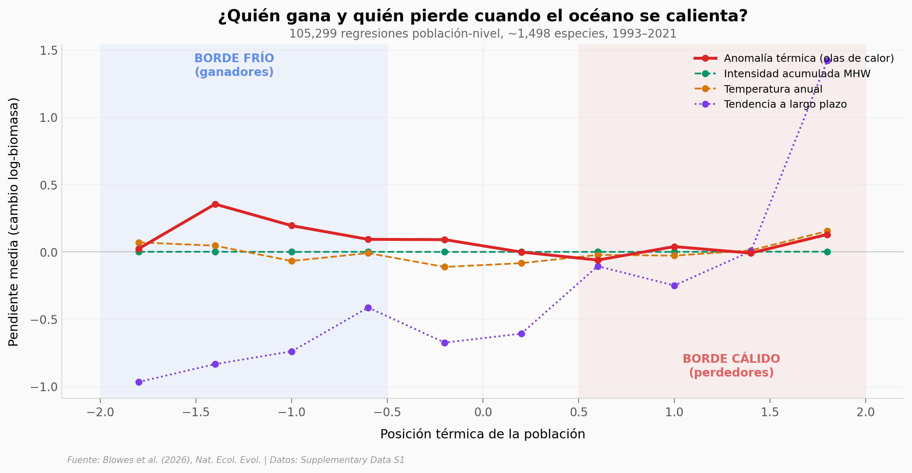

# Las Olas de Calor Cambian 176% la Vida en el Océano

Un análisis masivo de 702.037 estimaciones de biomasa revela que las olas de calor marinas crean ganadores y perdedores entre los peces: las poblaciones en el borde frío de su especie pueden ganar hasta 176% de biomasa, mientras que las del borde cálido pierden hasta 43,4%. A largo plazo, el calentamiento sostenido se asocia con pérdida de biomasa generalizada.

**El hallazgo:** Las olas de calor marinas están ligadas a cambios drásticos de biomasa que dependen de la posición térmica de cada población — ganadores en el borde frío, perdedores en el borde cálido.

## Gráfica clave



## Reproducir

[](https://colab.research.google.com/github/Ciencia-a-Mordiscos/lab/blob/main/papers/2026-02-27-olas-calor-biomasa-peces-oceano/notebook.ipynb)

O localmente:
```bash
pip install pandas matplotlib numpy scipy
jupyter execute notebook.ipynb
```

## Datos

- `datos/biomasa_por_posicion_termica.csv` — Pendiente media de biomasa por posición térmica y estresor (40 filas, 10 bins × 4 estresores)
- `datos/resumen_por_estresor.csv` — Resumen global por estresor térmico (4 filas)
- `datos/distribucion_pendientes_temperatura.csv` — Distribución de pendientes para borde frío/centro/cálido (240 filas)
- `datos/especies_extremas_mhw.csv` — Top 15 ganadores y 15 perdedores por anomalía térmica (30 filas)

Agregados de 105.299 regresiones población-nivel del Supplementary Data S1 (MOESM4).

## Links

- **Video:** [Ver en YouTube](https://youtube.com/shorts/Pzn_RTumA3k)
- **Paper:** [Nature Ecology & Evolution — DOI: 10.1038/s41559-026-03013-5](https://doi.org/10.1038/s41559-026-03013-5)
- **Datos originales:** Supplementary Data S1 (MOESM4), Nature.com
