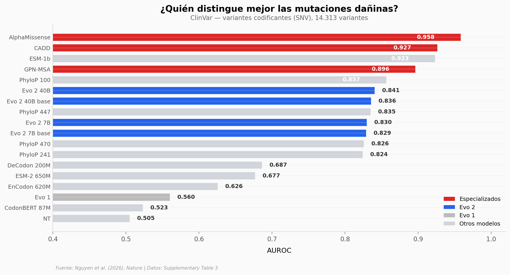

# 9 Billones de Bases de ADN Enseñaron a una IA a Escribir Vida

Evo 2 es un modelo de IA entrenado con 9 billones de pares de bases de ADN de todos los dominios de la vida. Sin entrenamiento específico, predice el impacto funcional de mutaciones genéticas — desde variantes no codificantes hasta el gen BRCA1 del cáncer de mama. Aquí comparamos su rendimiento contra 24 modelos especializados en 705 benchmarks.

**El hallazgo:** Evo 2 no es el mejor en ningún benchmark individual, pero es competitivo en todos — top 3 en el 55% de las tareas, y #1 en predicción de variantes BRCA1 (AUROC 0,901). El salto desde Evo 1 es total: mejora en 49 de 49 tareas.

## Gráfica clave



## Reproducir

[](https://colab.research.google.com/github/Ciencia-a-Mordiscos/lab/blob/main/papers/2026-03-09-evo2-ia-adn-escribir-vida/notebook.ipynb)

O localmente:
```bash
pip install pandas matplotlib numpy scipy
jupyter execute notebook.ipynb
```

## Datos

- `datos/benchmarks_variantes.csv` — 705 comparaciones de rendimiento (AUROC, AUPRC) entre 25 modelos en 4 datasets (ClinVar, BRCA1, BRCA2, SpliceVarDB)

## Links

- **Video:** [Ver en YouTube](https://youtube.com/shorts/i-yFdSiK6m4)
- **Paper:** [Nature — DOI: 10.1038/s41586-026-10176-5](https://doi.org/10.1038/s41586-026-10176-5)
- **Datos originales:** [Supplementary Table 3, Nature](https://doi.org/10.1038/s41586-026-10176-5)
- **Código del modelo:** [arcinstitute/evo2](https://github.com/arcinstitute/evo2)
