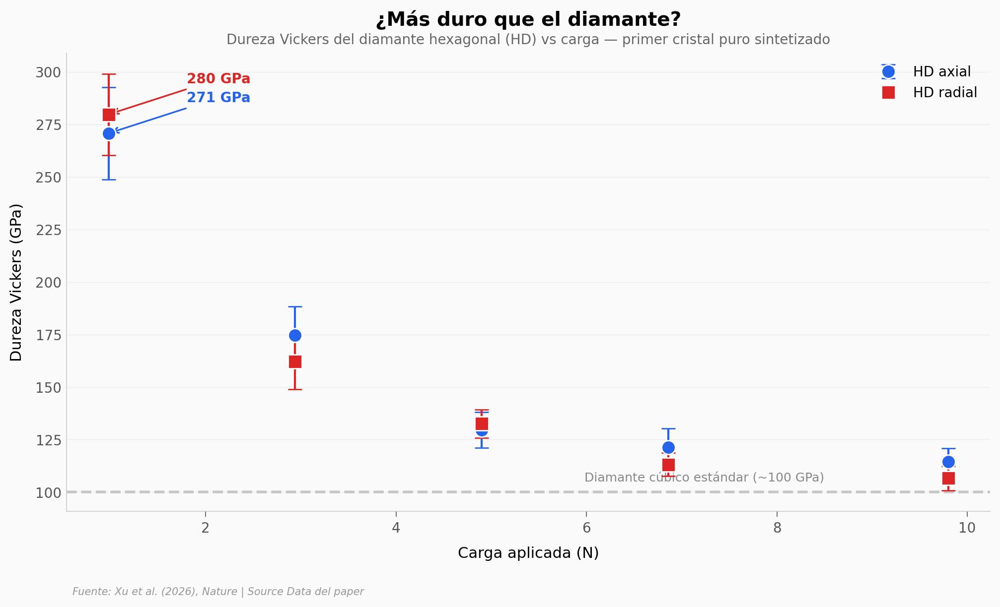

# Crearon el diamante imposible que solo existía en meteoritos

El diamante hexagonal (lonsdaleíta) solo se había encontrado en fragmentos de meteoritos. Nadie estaba seguro de que fuera una fase real del carbono. Ahora lo sintetizaron en el laboratorio — puro, milimétrico, y más duro que el diamante cúbico.

**El hallazgo:** El diamante hexagonal alcanza **280 GPa** de dureza Vickers (a 0,98 N), superando al diamante cúbico estándar (~100 GPa). Su identidad fue confirmada por difracción de rayos X con 9 picos que coinciden con la estructura hexagonal calculada.

## Gráfica clave



## Reproducir

[](https://colab.research.google.com/github/Ciencia-a-Mordiscos/lab/blob/main/papers/2026-03-11-diamante-hexagonal-meteoritos/notebook.ipynb)

O localmente:
```bash
pip install pandas matplotlib numpy
jupyter execute notebook.ipynb
```

## Datos

- `datos/dureza_hd.csv` — Dureza Vickers del HD (axial y radial, 5 cargas, con error)
- `datos/estabilidad_termica.csv` — TGA en aire: HD vs HOPG (600–1280 K)
- `datos/xrd_patrones.csv` — Difracción de rayos X: HD observado + HOPG (downsampled 5x)

## Links

- **Video:** [Ver en YouTube](https://youtube.com/watch?v=EXoqWqt_aeo)
- **Paper:** [Nature — DOI: 10.1038/s41586-026-10212-4](https://doi.org/10.1038/s41586-026-10212-4)
- **Datos originales:** Source Data (MOESM4) del paper
