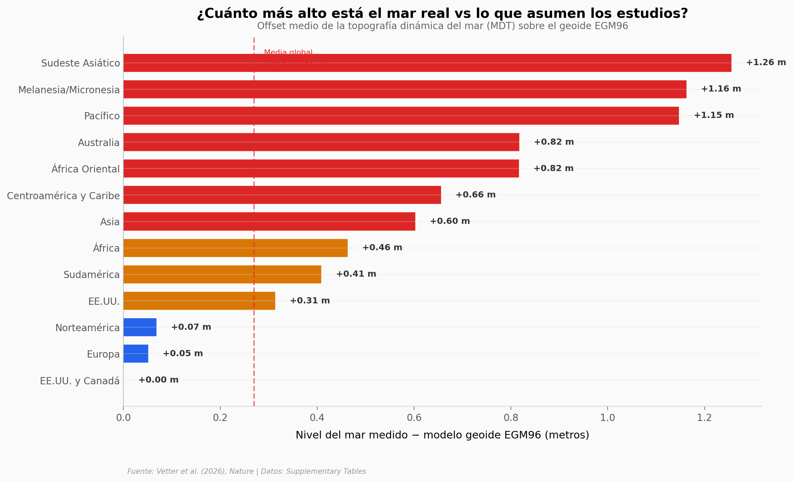

# Nadie midió bien el nivel del mar y 132 millones lo pagarán

El 99,2% de las evaluaciones de riesgo costero usan modelos geoide para estimar el nivel del mar — no mediciones reales. El resultado: subestiman cuánta tierra y cuántas personas están en riesgo.

**El hallazgo:** El nivel del mar medido (altimetría satelital) es en promedio **+0,27 m más alto** que el que asumen los modelos geoide. En el Sudeste Asiático, la diferencia supera **+1,25 m**. Corrigiendo este sesgo, entre **77 y 132 millones** de personas caerían bajo el nivel del mar con +1 m de subida — mucho más de lo estimado.

## Gráfica clave



## Reproducir

[](https://colab.research.google.com/github/Ciencia-a-Mordiscos/lab/blob/main/papers/2026-03-11-nivel-mar-132-millones/notebook.ipynb)

O localmente:
```bash
pip install pandas matplotlib numpy scipy
jupyter execute notebook.ipynb
```

## Datos

- `datos/offset_nivel_mar.csv` — Offset MDT vs geoide por región (18 regiones, 2 modelos geoide)
- `datos/impacto_por_region.csv` — Población y tierra en riesgo: EGM96 vs MDT (18 regiones)
- `datos/evaluacion_literatura.csv` — Calidad de documentación por año (2009–2025, 386 papers)
- `datos/impacto_por_dem.csv` — Comparación de impacto por modelo de elevación (4 DEMs × 9 regiones)

## Links

- **Video:** [Ver en YouTube](https://youtube.com/watch?v=5knq_zYVC04)
- **Paper:** [Nature — DOI: 10.1038/s41586-026-10196-1](https://doi.org/10.1038/s41586-026-10196-1)
- **Datos originales:** Supplementary Tables (MOESM2–MOESM5) del paper
