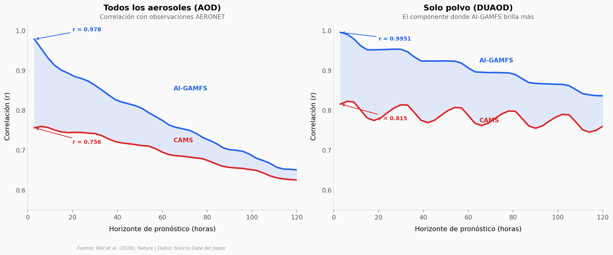

# En 1 minuto esta IA destruye décadas de pronósticos del aire

¿Y si una IA entrenada con 42 años de datos atmosféricos pudiera pronosticar los aerosoles del planeta en 1 minuto? AI-GAMFS lo hace — y los datos sugieren que iguala o supera a los modelos tradicionales que llevan décadas en desarrollo.

**El hallazgo:** AI-GAMFS alcanza correlación r = 0,978 con observaciones reales (AERONET) a 3 horas, vs r = 0,756 de CAMS (Copernicus). Para polvo: r = 0,9951. En concentraciones superficiales, reduce el error hasta 74% comparado con GEOS-FP.

## Gráfica clave



## Reproducir

[](https://colab.research.google.com/github/Ciencia-a-Mordiscos/lab/blob/main/papers/2026-03-12-ia-pronostico-aerosoles/notebook.ipynb)

O localmente:
```bash
pip install pandas matplotlib numpy
jupyter execute notebook.ipynb
```

## Datos

- `datos/rendimiento_aeronet.csv` — Correlación y RMSE vs AERONET por horizonte (40 puntos, 3–120h)
- `datos/mejora_vs_cams.csv` — % mejora sobre CAMS por componente aerosol (12 componentes)
- `datos/rmse_vs_geosfp.csv` — RMSE concentraciones superficiales vs GEOS-FP (5 días)
- `datos/rmse_estaciones.csv` — RMSE en 289 estaciones AERONET con coordenadas

## Links

- **Video:** [Ver en YouTube](https://youtube.com/watch?v=vhKIxzk-eJo)
- **Paper:** [Nature — DOI: 10.1038/s41586-026-10234-y](https://doi.org/10.1038/s41586-026-10234-y)
- **Código AI-GAMFS:** [Zenodo 18298799](https://zenodo.org/records/18298799)
