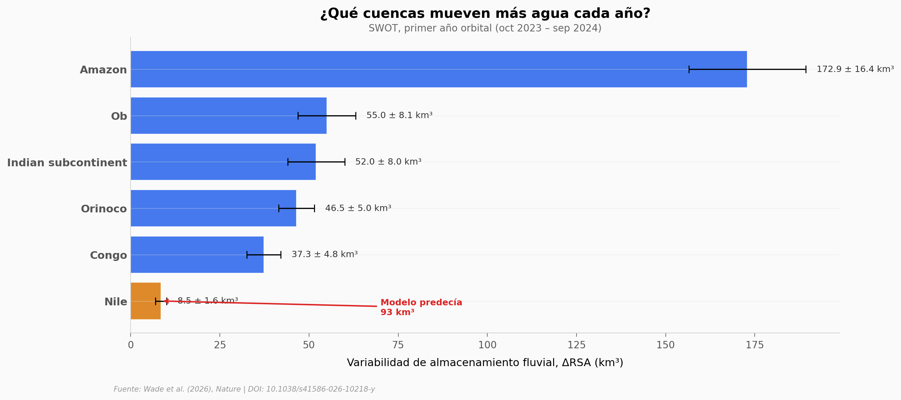

# Un satélite midió 126.674 ríos y nadie esperaba el resultado

El satélite SWOT midió por primera vez la variabilidad del almacenamiento de agua en 126.674 tramos fluviales de todo el mundo. El resultado: los ríos almacenan un 28% menos de agua variable de lo que los modelos predecían.

**El hallazgo:** La variabilidad anual global de almacenamiento fluvial es de 313,1 ± 129,5 km³ — un 28,2% menor que la estimación más baja de los modelos (436,7 km³). El Amazonas domina con el 55% de la variabilidad global, y el Nilo mostró un 91% menos de lo esperado.

## Gráfica clave



## Reproducir

[](https://colab.research.google.com/github/Ciencia-a-Mordiscos/lab/blob/main/papers/2026-03-12-rios-swot-126mil-volumen/notebook.ipynb)

O localmente:
```bash
pip install pandas matplotlib numpy
jupyter execute notebook.ipynb
```

## Datos

- `datos/cuencas_rsa.csv` — ΔRSA de las 6 cuencas principales (km³, con error)
- `datos/comparacion_global.csv` — SWOT vs modelos MeanDRS (9 registros)
- `datos/contexto_agua.csv` — Volumen de agua dulce por reservorio
- `datos/metricas_swot.csv` — Métricas clave del estudio

## Links

- **Video:** [Ver en YouTube](https://youtube.com/watch?v=_oyYJWis70w)
- **Paper:** [Nature — DOI: 10.1038/s41586-026-10218-y](https://doi.org/10.1038/s41586-026-10218-y)
- **Datos originales:** [Zenodo 10.5281/zenodo.18344109](https://zenodo.org/records/18344109) (1,9 GB)
- **Código:** [GitHub jswade/SWOT-river-volume](https://github.com/jswade/SWOT-river-volume)
