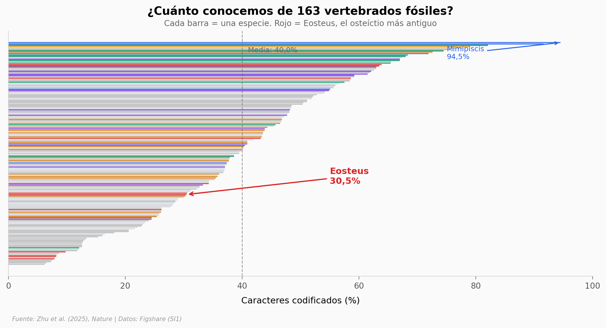

# Descubrieron un Pez Imposible de 436 Millones de Años

Un pez diminuto, casi completo, del Silúrico temprano de Chongqing (China) resulta ser el osteíctio articulado más antiguo jamás encontrado. Con solo el 30% de sus caracteres morfológicos preservados, un análisis filogenético de 163 especies × 709 caracteres lo ubica en la base del árbol de los peces óseos — el grupo que incluye desde el salmón hasta nosotros.

**El hallazgo:** Eosteus comparte el 90,6% de sus caracteres codificados con actinopterigios (peces con aletas de radios), más que con cualquier otro grupo, a pesar de conservar rasgos primitivos típicos de tiburones y placodermos.

## Gráfica clave



## Reproducir

[](https://colab.research.google.com/github/Ciencia-a-Mordiscos/lab/blob/main/papers/2026-03-13-pez-imposible-436-millones-anos/notebook.ipynb)

O localmente:
```bash
pip install pandas matplotlib numpy
jupyter execute notebook.ipynb
```

## Datos

- `datos/completitud_taxa.csv` — 163 taxa, completitud de caracteres morfológicos (6,2–94,5%)
- `datos/similitud_eosteus.csv` — 162 taxa, coincidencia de caracteres con Eosteus

## Links

- **Video:** [Ver en YouTube](https://www.youtube.com/watch?v=yJAgAv2eJGk)
- **Paper:** [Nature — DOI: 10.1038/s41586-026-10125-2](https://doi.org/10.1038/s41586-026-10125-2)
- **Datos originales:** [Figshare — SI1 NEXUS](https://doi.org/10.6084/m9.figshare.28881827)
