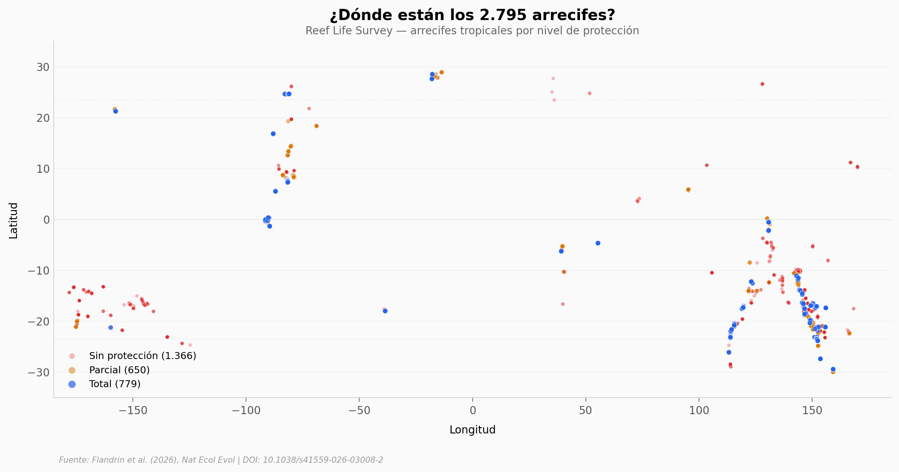

# 2.795 arrecifes: ¿sirve protegerlos?

Un estudio con 2.795 arrecifes tropicales reveló que las áreas marinas protegidas (MPAs) compensan potencialmente solo un 5% de la degradación causada por actividades humanas. La biomasa de piscívoros en arrecifes con protección total es apenas 0,31 desviaciones estándar mayor que en los sin protección — un efecto pequeño-a-mediano (Cohen's d = 0,33). La protección parcial es estadísticamente indistinguible de no tener protección.

**El hallazgo:** Solo las MPAs con protección total muestran alguna diferencia, y aun así el efecto es modesto.

## Gráfica clave



## Reproducir

[](https://colab.research.google.com/github/Ciencia-a-Mordiscos/lab/blob/main/papers/2026-03-16-arrecifes-mpa-solo-5-porciento/notebook.ipynb)

O localmente:
```bash
pip install pandas matplotlib numpy scipy
jupyter execute notebook.ipynb
```

## Datos

- `datos/sitios_arrecifes.csv` — 2.795 sitios con coordenadas, protección y biomasa
- `datos/contribuciones_por_proteccion.csv` — Media, std, n por tipo de protección
- `datos/contribuciones_por_proteccion_detallada.csv` — Desglose: total antigua/grande vs otras
- `datos/efecto_edad_mpa.csv` — Contribuciones por grupo de edad de MPA
- `datos/surveys_contribuciones.csv` — 6.936 surveys con scores NN/NP

## Links

- **Video:** [Ver en YouTube](https://youtube.com/watch?v=pT8m2PGyfwI)
- **Paper:** [Nature Ecology & Evolution — DOI: 10.1038/s41559-026-03008-2](https://doi.org/10.1038/s41559-026-03008-2)
- **Datos originales:** [Zenodo](https://doi.org/10.5281/zenodo.17602130) + [GitHub](https://github.com/FlandrinU/Contributions_prediction)
