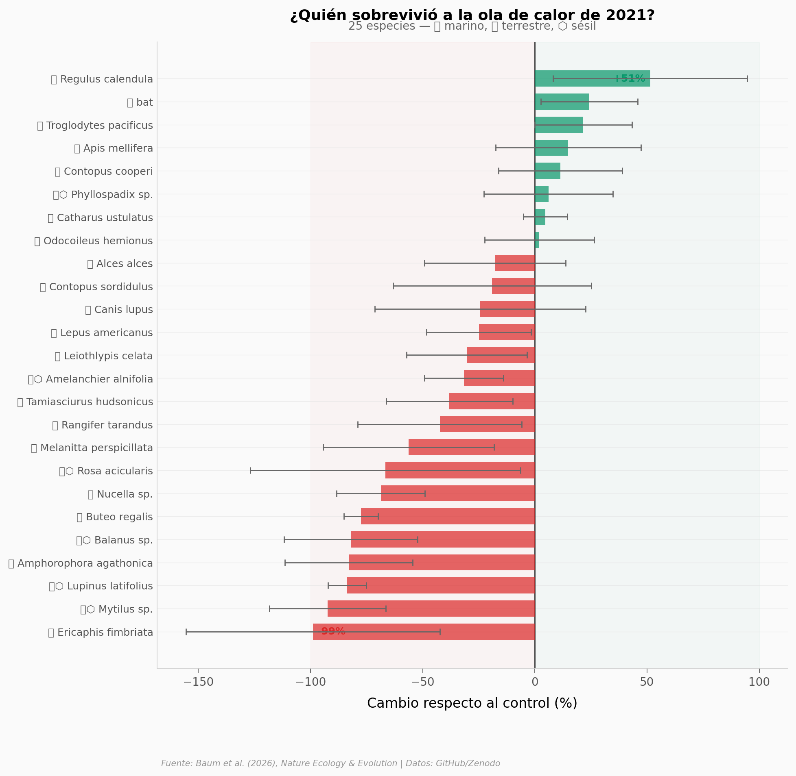

# Nadie Esperaba lo que una Ola de Calor le Hizo a 32 Especies

En junio de 2021, el noroeste de Norteamérica vivió la ola de calor más extrema registrada en la región. Un equipo de más de 60 investigadores midió el impacto en 25 especies — desde áfidos y mejillones hasta lobos y murciélagos — y en los incendios forestales que siguieron. Las respuestas variaron desde declives del 99% hasta aumentos del 89%.

**El hallazgo:** Los organismos sésiles marinos (mejillones, percebes, algas) sufrieron los peores declives (hasta -99%), mientras que aves y mamíferos — que pueden huir a refugios — resistieron mejor. Los incendios se dispararon 3-7x la semana después del pico.

## Gráfica clave



## Reproducir

[](https://colab.research.google.com/github/Ciencia-a-Mordiscos/lab/blob/main/papers/2026-03-17-ola-calor-32-especies/notebook.ipynb)

O localmente:
```bash
pip install pandas matplotlib numpy scipy
jupyter execute notebook.ipynb
```

## Datos

- `datos/effectsizes.csv` — 41 tamaños de efecto (log response ratio) para 25 especies
- `datos/casestudy_metadata.csv` — Metadata de los 68 case studies
- `datos/heatdome_meta.csv` — Meta-análisis completo (57 comparaciones)
- `datos/wildfire_stats_2021.csv` — Actividad de incendios MODIS 2021
- `datos/wildfire_stats_2000_2020.csv` — Histórico de incendios 2000-2020
- `datos/all_flow.csv` — Datos de caudal de ríos

## Links

- **Video:** [Ver en YouTube](https://youtube.com/watch?v=Ia61CV8VKvY)
- **Paper:** [Nature Ecology & Evolution — DOI: 10.1038/s41559-026-02987-6](https://doi.org/10.1038/s41559-026-02987-6)
- **Datos originales:** [GitHub](https://github.com/baumlab/2021NAmericanHeatwave) / [Zenodo](https://doi.org/10.5281/zenodo.17833420)
