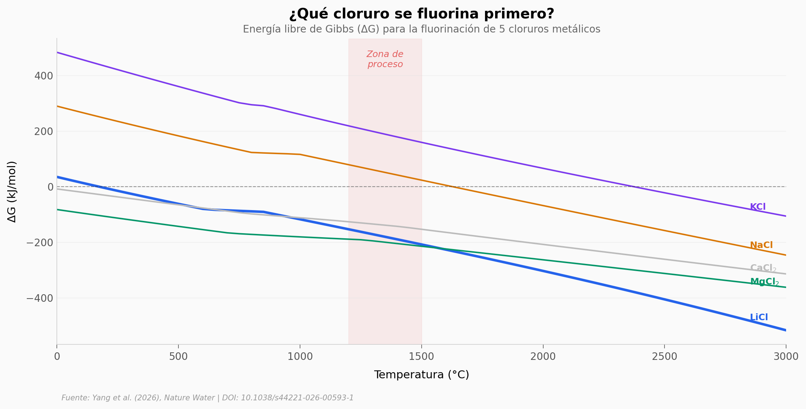

# Los "forever chemicals" ahora fabrican baterías

Los PFAS son los contaminantes más persistentes del planeta: el enlace C-F que los hace indestructibles también los convierte en una fuente de flúor desaprovechada. Un equipo de Rice University desarrolló un método de fluorinación electrotérmica que usa PFAS absorbidos en carbón activado como agente fluorinante para convertir cloruros de salmuera en fluoruros metálicos — recuperando litio con 99% de pureza.

**El hallazgo:** 10 tipos de PFAS se degradan >99,8% mientras el flúor liberado produce LiF con ~82% de rendimiento. El carbón activado se convierte en grafeno.

## Gráfica clave



## Reproducir

[](https://colab.research.google.com/github/Ciencia-a-Mordiscos/lab/blob/main/papers/2026-03-17-pfas-fabrican-baterias-litio/notebook.ipynb)

O localmente:
```bash
pip install pandas matplotlib numpy scipy
jupyter execute notebook.ipynb
```

## Datos

- `datos/termodinamica_dg.csv` — ΔG de fluorinación para 5 cloruros, 0-3000 °C (61 puntos)
- `datos/degradacion_pfas.csv` — Eficiencia de degradación de 10 tipos de PFAS
- `datos/voltaje_fluor.csv` — Conversión F orgánico → F⁻ por voltaje (5 puntos)
- `datos/rendimiento_litio.csv` — Yield de Li vs ratio Na/Li, 3 métodos de lavado
- `datos/solubilidad_fluoruros.csv` — Solubilidad en agua de 5 compuestos
- `datos/voltaje_temperatura.csv` — Temperatura alcanzada por voltaje aplicado

## Links

- **Video:** [Ver en YouTube](https://youtube.com/watch?v=jJeBEpjSmww)
- **Paper:** [Nature Water — DOI: 10.1038/s44221-026-00593-1](https://doi.org/10.1038/s44221-026-00593-1)
- **Datos originales:** Supplementary Information, Nature Water
