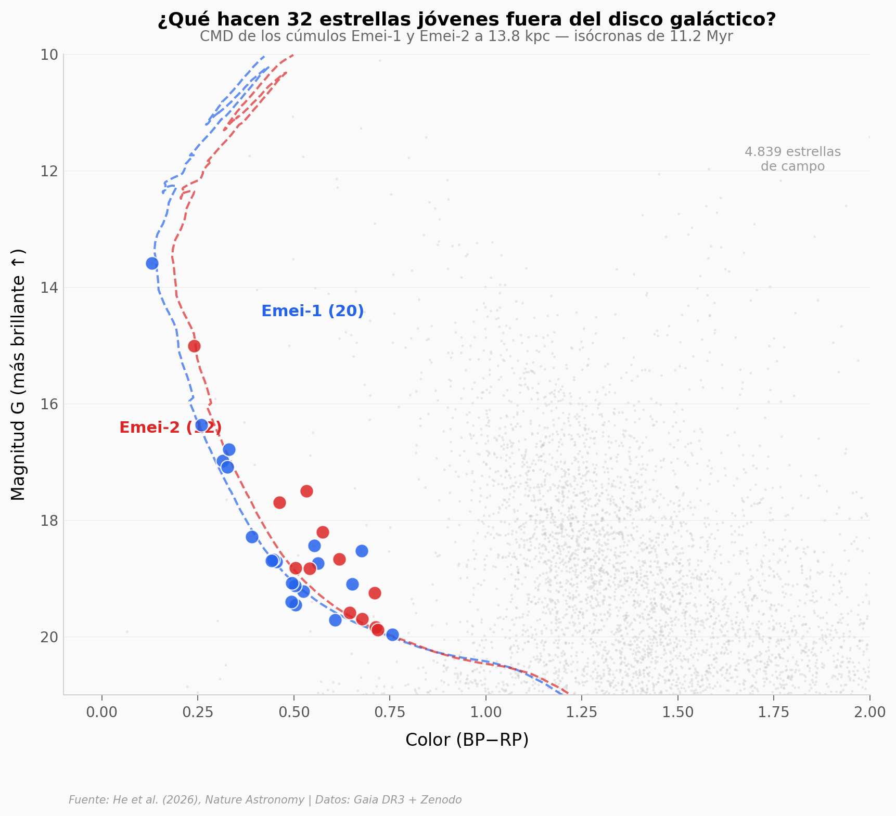

# Nadie Esperaba Estrellas Naciendo Fuera de la Vía Láctea

Dentro de una nube de gas que cae hacia nuestra galaxia a más de 100 km/s, un equipo encontró 32 estrellas recién nacidas — agrupadas en dos cúmulos abiertos llamados Emei-1 y Emei-2. Con solo 11,2 millones de años de edad y una metalicidad 20 veces menor que la del Sol, son la primera evidencia directa de formación estelar en una nube de alta velocidad del halo galáctico.

**El hallazgo:** Dos cúmulos abiertos (20 + 12 estrellas) a 13.800 parsecs del Sol, dentro del Complejo H — una nube de hidrógeno que se estrella contra el disco de la Vía Láctea.

## Gráfica clave



## Reproducir

[](https://colab.research.google.com/github/Ciencia-a-Mordiscos/lab/blob/main/papers/2026-03-19-estrellas-fuera-via-lactea/notebook.ipynb)

O localmente:
```bash
pip install pandas matplotlib numpy scipy
jupyter execute notebook.ipynb
```

## Datos

- `datos/estrellas_campo.csv` — 4.839 estrellas Gaia DR3 del campo (17 columnas astrométricas)
- `datos/miembros_emei1.csv` — 20 estrellas miembro de Emei-1
- `datos/miembros_emei2.csv` — 12 estrellas miembro de Emei-2
- `datos/isocrona_emei1.csv` — Isócrona PARSEC de 11,2 Myr para Emei-1
- `datos/isocrona_emei2.csv` — Isócrona PARSEC de 11,2 Myr para Emei-2
- `datos/gradiente_velocidad.csv` — 6 puntos del gradiente de velocidad de los grumos

## Links

- **Video:** [Ver en YouTube](https://youtube.com/watch?v=nlptNKxW4Xg)
- **Paper:** [Nature Astronomy — DOI: 10.1038/s41550-026-02814-9](https://doi.org/10.1038/s41550-026-02814-9)
- **Datos originales:** [Zenodo (10.5281/zenodo.18408415)](https://doi.org/10.5281/zenodo.18408415)
