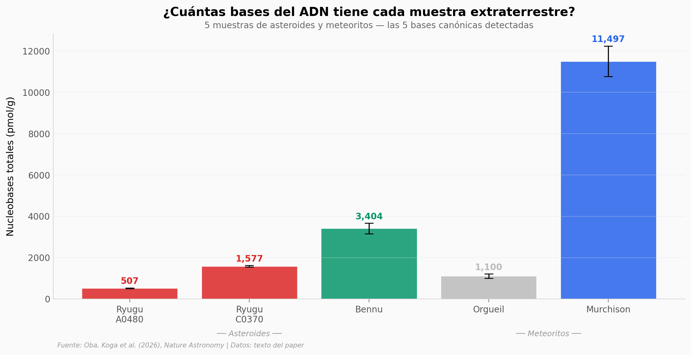

# Las 5 Bases del ADN en un Asteroide

Las cinco bases canónicas que codifican la vida — adenina, guanina, citosina, timina y uracilo — detectadas en muestras del asteroide Ryugu traídas por Hayabusa2. Comparación con Bennu (OSIRIS-REx), Orgueil y Murchison.

**El hallazgo:** Ryugu contiene las 5 bases en proporciones equilibradas (Pu/Py ≈ 1.0), mientras que Murchison tiene 3.4x más purinas y Orgueil 10x más pirimidinas. Cada cuerpo tiene su "receta".

## Gráfica clave



## Reproducir

[](https://colab.research.google.com/github/Ciencia-a-Mordiscos/lab/blob/main/papers/2026-03-20-adn-bases-asteroide-ryugu/notebook.ipynb)

O localmente:
```bash
pip install pandas matplotlib numpy scipy
jupyter execute notebook.ipynb
```

## Datos

- `datos/nucleobases_resumen.csv` — 5 muestras: concentración total y ratio Pu/Py
- `datos/ratios_purina_pirimidina.csv` — ratios purina/pirimidina por muestra
- `datos/uracilo_comparacion.csv` — uracilo en 4 muestras de Ryugu (2 estudios)
- `datos/nucleobases_presencia.csv` — las 5 bases y su presencia en cada fuente

## Links

- **Video:** [Ver en YouTube](https://youtube.com/watch?v=8gJTRw-XgQ0)
- **Paper:** [Nature Astronomy — DOI: 10.1038/s41550-026-02791-z](https://doi.org/10.1038/s41550-026-02791-z)
- **Datos originales:** Supplementary Materials (XLSX con cromatogramas)
