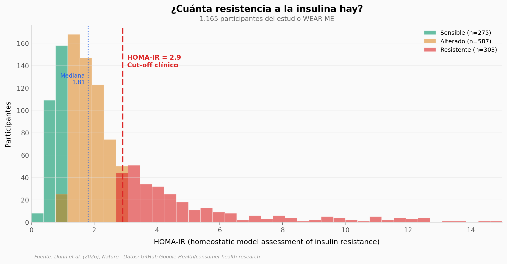

# Tu reloj ya predice diabetes tipo 2

Un modelo de IA entrenado con 1.165 personas puede estimar el riesgo de resistencia a la insulina usando datos de smartwatch y análisis de sangre rutinarios. La resistencia a la insulina es el paso previo a la diabetes tipo 2.

**El hallazgo:** La frecuencia cardíaca en reposo (d=0,96) y los pasos diarios (d=0,78) del wearable diferencian significativamente a personas sensibles de resistentes a la insulina. El modelo combinado alcanza un AUROC de 0,80.

## Gráfica clave



## Reproducir

[](https://colab.research.google.com/github/Ciencia-a-Mordiscos/lab/blob/main/papers/2026-03-20-reloj-predice-diabetes/notebook.ipynb)

O localmente:
```bash
pip install pandas matplotlib numpy scipy
jupyter execute notebook.ipynb
```

## Datos

- `datos/participantes.csv` — 1.165 participantes con wearable, sangre y demografía (25 variables)
- `datos/wearables_por_grupo.csv` — Resumen wearable por grupo HOMA-IR (3 filas)

## Links

- **Video:** [Ver en YouTube](https://youtube.com/watch?v=vB7xqNB999g)
- **Paper:** [Nature — DOI: 10.1038/s41586-026-10179-2](https://doi.org/10.1038/s41586-026-10179-2)
- **Datos originales:** [GitHub Google-Health](https://github.com/Google-Health/consumer-health-research/tree/main/insulin_resistance_prediction)
