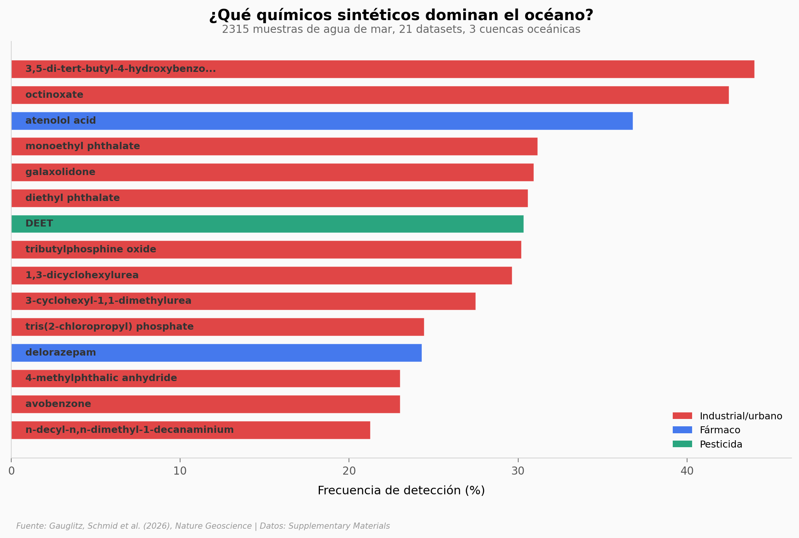

# El Océano Esconde 248 Químicos Sintéticos que Nadie Esperaba

Protector solar, fármacos, pesticidas, plásticos industriales — un meta-análisis de 2,315 muestras de agua de mar revela 248 compuestos químicos sintéticos distribuidos desde arrecifes de coral hasta mar abierto. Los más frecuentes: un antioxidante industrial (44% de muestras), octinoxate de protectores solares (42.5%), y metabolitos de fármacos cardiovasculares (36.8%).

**El hallazgo:** En zonas costeras, hasta el **21.7% de la materia orgánica disuelta** es de origen sintético. En mar abierto baja al 0.35%, pero no llega a cero.

## Gráfica clave



## Reproducir

[](https://colab.research.google.com/github/Ciencia-a-Mordiscos/lab/blob/main/papers/2026-03-21-oceano-248-quimicos-sinteticos/notebook.ipynb)

O localmente:
```bash
pip install pandas matplotlib numpy openpyxl
jupyter execute notebook.ipynb
```

## Datos

- `datos/datasets.csv` — 20 datasets con ecosistema, año y número de muestras
- `datos/xenobioticos_frecuencia.csv` — 58 xenobióticos con frecuencia por ecosistema
- `datos/contribucion_por_muestra.csv` — 2,321 mediciones de contribución química (%)
- `datos/xenobioticos_por_dataset_tipo.csv` — conteo de xenobióticos por dataset y tipo
- `datos/clases_quimicas.csv` — 15 familias químicas principales

## Links

- **Video:** [Ver en YouTube](https://youtube.com/watch?v=zbwjncU6ECs)
- **Paper:** [Nature Geoscience — DOI: 10.1038/s41561-026-01928-z](https://doi.org/10.1038/s41561-026-01928-z)
- **Datos originales:** [Supplementary Materials](https://www.nature.com/articles/s41561-026-01928-z) + [GitHub](https://github.com/Functional-Metabolomics-Lab/Marine-Xenobiotics)
