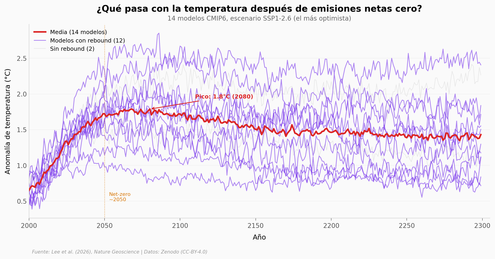

# El Océano Profundo Destruye la Promesa de Emisiones Cero

14 modelos climáticos, 300 años de simulación. Después de lograr emisiones netas cero, la temperatura de la superficie baja... pero en 12 de 14 modelos, vuelve a subir. El océano profundo devuelve el calor que absorbió durante décadas.

**El hallazgo:** En el escenario más optimista (SSP1-2.6), el **rebound** promedio es de +0.26°C — una fracción que no estaba en el presupuesto climático.

## Gráfica clave



## Reproducir

[](https://colab.research.google.com/github/Ciencia-a-Mordiscos/lab/blob/main/papers/2026-03-21-oceano-profundo-emisiones-cero/notebook.ipynb)

O localmente:
```bash
pip install pandas matplotlib numpy scipy
jupyter execute notebook.ipynb
```

## Datos

- `datos/cmip_temperatura_superficie.csv` — 14 modelos CMIP6, anomalía de temperatura 2000-2299
- `datos/cmip_temperatura_oceano_profundo.csv` — 14 modelos, anomalía del océano profundo 2015-2299
- `datos/ebm_temperatura_por_gamma.csv` — modelo de balance de energía, 5 valores de γ
- `datos/co2_rcp26.csv` — trayectoria CO₂ SSP1-2.6 (285 años)
- `datos/cmip_rebound_resumen.csv` — resumen de rebound por modelo

## Links

- **Video:** [Ver en YouTube](https://youtube.com/watch?v=dVfrDJzvF_Y)
- **Paper:** [Nature Geoscience — DOI: 10.1038/s41561-026-01934-1](https://doi.org/10.1038/s41561-026-01934-1)
- **Datos originales:** [Zenodo](https://zenodo.org/records/18203190) (CC-BY-4.0)
