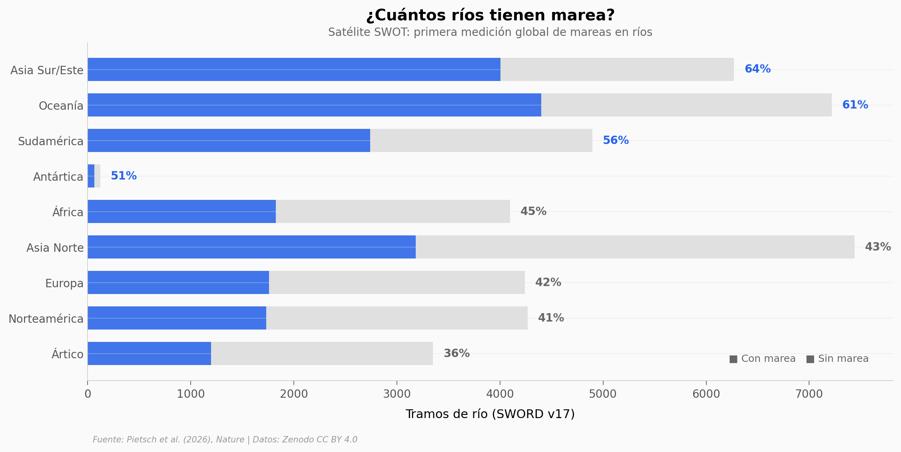

# Nadie Sabía que 3172 Ríos Esconden el Pulso del Océano

El satélite SWOT (Surface Water and Ocean Topography) midió por primera vez las mareas en miles de ríos costeros del planeta. El resultado: más de 165,000 km de ríos están influenciados por el océano, afectando a 700 millones de personas.

**El hallazgo:** La mitad de los tramos de río monitoreados (49.9% de 41,910) tienen influencia de mareas. Oceanía y Asia Sur/Este lideran con más del 60% de ríos afectados. La amplitud mediana es 0.78 m, pero los extremos llegan a casi 5 m.

## Gráfica clave



## Reproducir

[](https://colab.research.google.com/github/Ciencia-a-Mordiscos/lab/blob/main/papers/2026-03-22-rios-mareas-swot-satelite/notebook.ipynb)

O localmente:
```bash
pip install pandas matplotlib numpy scipy
jupyter execute notebook.ipynb
```

## Datos

- `datos/rios_mareas.csv` — 41,910 tramos de río: clasificación tidal, amplitud, continente
- `datos/resumen_continentes.csv` — Resumen por continente (9 regiones)
- `datos/tipo_marea_por_rio.csv` — 8,421 tramos con tipo de marea (semidiurna/mixta/diurna)
- `datos/distribucion_amplitudes.csv` — Histograma pre-computado de amplitudes

## Links

- **Video:** [Ver en YouTube](https://youtube.com/watch?v=wLwm8P0S1LY)
- **Paper:** [Nature — DOI: 10.1038/s41586-026-10287-z](https://doi.org/10.1038/s41586-026-10287-z)
- **Datos originales:** [Zenodo — SWOT River Tides](https://doi.org/10.5281/zenodo.15223861)
