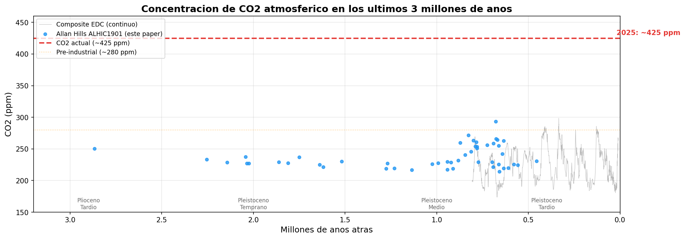

# El CO2 No Cambió en 3 Millones de Años y Nadie lo Sabía

Un equipo perforó hielo antártico de 3 millones de años en Allan Hills, Antártida. Las burbujas de aire atrapadas son cápsulas del tiempo que contienen la atmósfera exacta de cuando se formaron.

**El hallazgo:** El CO2 atmosférico se mantuvo estable alrededor de **250 ppm** durante 3 millones de años — a través de glaciaciones, cambios orbitales y enfriamiento global. Hoy estamos en **~425 ppm**, un nivel sin precedentes en todo ese registro.

## Gráfica clave



Los puntos azules son las mediciones nuevas de Allan Hills. La línea gris es el registro continuo conocido (EPICA Dome C, 800,000 años). La línea roja es el CO2 actual.

## Datos

Los datos provienen de los Supplementary Materials del paper, disponibles públicamente:

- `datos/allan_hills_co2_ch4.csv` — 158 mediciones de CO2 y CH4 del núcleo ALHIC1901
- `datos/edc_composite_co2.csv` — 1,270 puntos del registro continuo EPICA Dome C

## Reproducir

Abre el notebook en Google Colab o ejecútalo localmente:

```bash
pip install pandas matplotlib numpy
jupyter execute notebook.ipynb
```

## Links

- **Video:** [Ver en YouTube](https://youtube.com/shorts/OXIDk92qBKc)
- **Paper:** [Nature — DOI: 10.1038/s41586-025-10032-y](https://doi.org/10.1038/s41586-025-10032-y)
- **Datos originales:** [US Antarctic Program Data Center — DOI: 10.15784/601878](https://doi.org/10.15784/601878)
