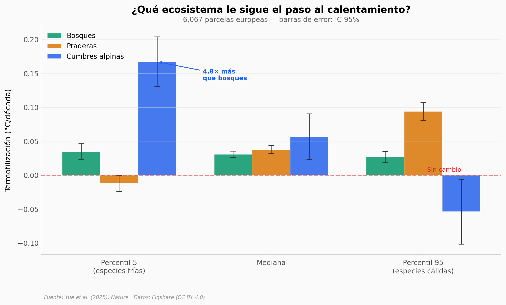

# Las Cumbres Cambian 5 Veces Más Rápido y Nadie lo Esperaba

6,067 parcelas de vegetación en Europa, re-visitadas durante décadas (12-78 años). Bosques, praderas y cumbres alpinas. Las comunidades vegetales se "termofilizan" — las especies de climas cálidos ganan terreno. Pero las cumbres alpinas van 4.8 veces más rápido que los bosques.

**El hallazgo:** Las cumbres alpinas muestran termofilización 4.8x mayor que bosques en las especies frías (percentil 5). Mientras los bosques y praderas apenas cambian, las cumbres pierden especies adaptadas al frío a un ritmo que acumula deuda climática de 0.37°C.

## Gráfica clave



## Reproducir

[](https://colab.research.google.com/github/Ciencia-a-Mordiscos/lab/blob/main/papers/2026-03-24-termofilizacion-cumbres-alpinas/notebook.ipynb)

O localmente:
```bash
pip install pandas matplotlib numpy scipy
jupyter execute notebook.ipynb
```

## Datos

- `datos/parcelas.csv` — 6,067 parcelas con termofilización y deuda por ecosistema
- `datos/termofilizacion_resumen.csv` — resumen por ecosistema y percentil
- `datos/deuda_climatica_resumen.csv` — deuda climática por ecosistema

## Links

- **Video:** [Ver en YouTube](https://youtube.com/watch?v=eKxXV4bGJzY)
- **Paper:** [Nature — DOI: 10.1038/s41586-025-09622-7](https://doi.org/10.1038/s41586-025-09622-7)
- **Datos originales:** [Figshare (CC BY 4.0)](https://doi.org/10.6084/m9.figshare.28368743)
