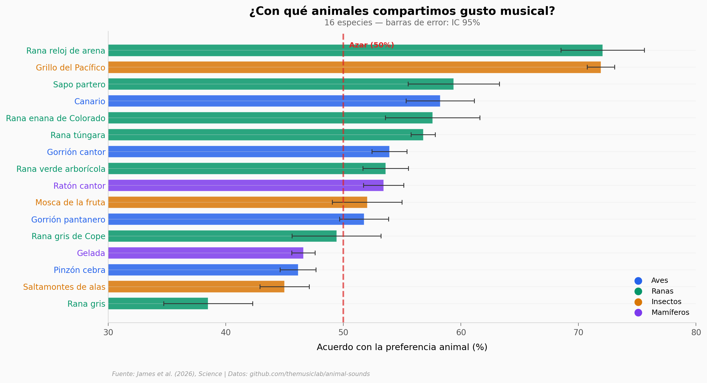

# Tu Música Favorita Esconde un Origen que Nadie Esperaba

4196 personas de todo el mundo escucharon pares de sonidos de 16 especies animales. Sin saber cuál preferían los propios animales, eligieron el mismo un 54% de las veces — 4 puntos por encima del azar puro.

**El hallazgo:** Los humanos compartimos preferencias acústicas con ranas, grillos, aves y mamíferos. El acuerdo es mayor para sonidos adornados (61.5%) y de baja frecuencia (56.2%). La rana reloj de arena lidera con 72% de coincidencia.

## Gráfica clave



## Reproducir

[](https://colab.research.google.com/github/Ciencia-a-Mordiscos/lab/blob/main/papers/2026-03-26-musica-preferencias-animales/notebook.ipynb)

O localmente:
```bash
pip install pandas matplotlib numpy scipy openpyxl
jupyter execute notebook.ipynb
```

## Datos

- `datos/acuerdo_por_especie.csv` — acuerdo humano-animal por especie (16 especies, 4 categorías)
- `datos/acuerdo_por_rasgo.csv` — acuerdo por rasgo acústico (10 rasgos)
- `datos/estimulos_fuerza_vs_acuerdo.csv` — 106 estímulos con fuerza de preferencia animal y acuerdo humano
- `datos/features_acusticos.csv` — 168 estímulos con 12 features acústicos (pitch, roughness, entropy...)

## Links

- **Video:** [Ver en YouTube](https://youtube.com/watch?v=29gpV1ttp6s)
- **Paper:** [Science — DOI: 10.1126/science.aea1202](https://doi.org/10.1126/science.aea1202)
- **Datos originales:** [github.com/themusiclab/animal-sounds](https://github.com/themusiclab/animal-sounds)
