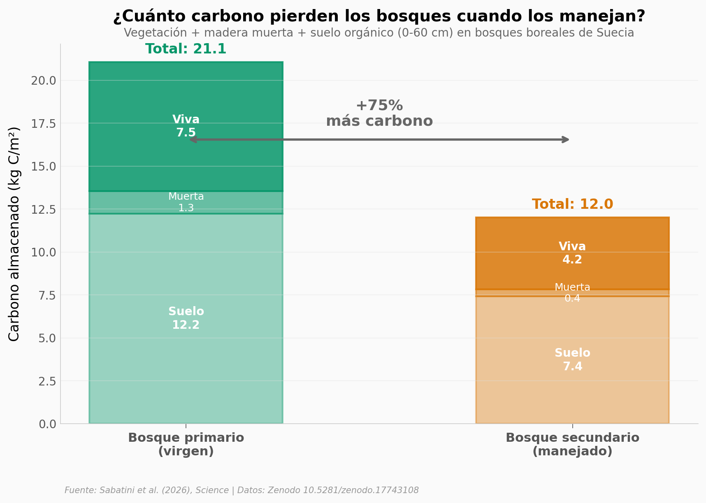

# Los bosques vírgenes de Suecia almacenan ~72% más carbono

Los bosques boreales primarios (vírgenes) de Suecia almacenan ~72% más carbono que los bosques secundarios manejados. La diferencia es 2.7-8.0x mayor que estimaciones previas. El suelo es el mayor almacén y la mayor diferencia — los datos apuntan a que el manejo forestal transforma no solo los árboles sino también el suelo.

**El hallazgo:** 324 parcelas primarias vs 28,580 secundarias. Biomasa viva +79% (d=0.88), madera muerta +223% (d=1.30), suelo +65% (d=0.79). Todos p < 0.001.

## Gráfica clave



## Reproducir

[](https://colab.research.google.com/github/Ciencia-a-Mordiscos/lab/blob/main/papers/2026-03-28-carbono-bosques-virgenes/notebook.ipynb)

O localmente:
```bash
pip install pandas matplotlib numpy scipy
jupyter execute notebook.ipynb
```

## Datos

- `datos/vegetacion_pareado.csv` — 28,904 parcelas (324 primarias + 28,580 secundarias), biomasa viva y madera muerta
- `datos/suelo_pareado.csv` — 1,115 parcelas (212 primarias + 903 secundarias), carbono orgánico del suelo

## Links

- **Video:** [Ver en YouTube](https://youtube.com/watch?v=ZspFSOCVxio)
- **Paper:** [Science — DOI: 10.1126/science.adz8554](https://doi.org/10.1126/science.adz8554)
- **Datos originales:** [Zenodo](https://doi.org/10.5281/zenodo.17743108)
