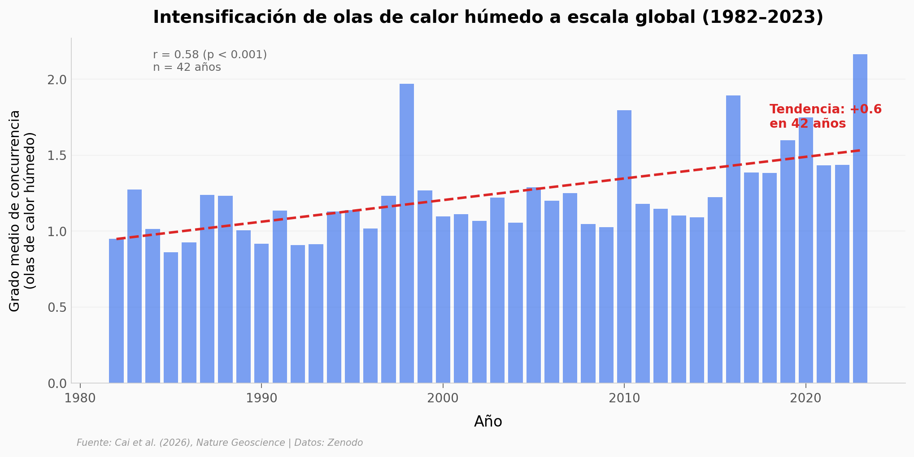

# Nadie Sabe Que el Océano Dispara las Peores Olas de Calor

El calentamiento costero oceánico está intensificando las olas de calor húmedo a escala global. Un estudio con redes complejas aplicadas a 42 años de datos climáticos (1982–2023) muestra que los océanos adyacentes explican hasta el 64% de la intensificación.

**El hallazgo:** Las olas de calor húmedo — las más peligrosas porque impiden que el cuerpo se enfríe — aumentaron un **46%** en intensidad entre la primera y la última década del período. Los trópicos concentran las zonas de mayor riesgo.

## Gráfica clave



## Reproducir

[](https://colab.research.google.com/github/Ciencia-a-Mordiscos/lab/blob/main/papers/2026-03-28-oceano-dispara-olas-de-calor/notebook.ipynb)

O localmente:

```bash
pip install pandas matplotlib numpy scipy
jupyter execute notebook.ipynb
```

## Datos

- `datos/heatwave_annual_global.csv` — 42 años de grado medio de concurrencia global (1982–2023)
- `datos/heatwave_mean_grid.csv` — 3,849 celdas de grilla global con intensidad media y tendencia

## Links

- **Video:** [Ver en YouTube](https://youtube.com/shorts/47ZWz1uCVsk)
- **Paper:** [Nature Geoscience — DOI: 10.1038/s41561-026-01952-z](https://doi.org/10.1038/s41561-026-01952-z)
- **Datos originales:** [Zenodo — DOI: 10.5281/zenodo.18061821](https://doi.org/10.5281/zenodo.18061821)
