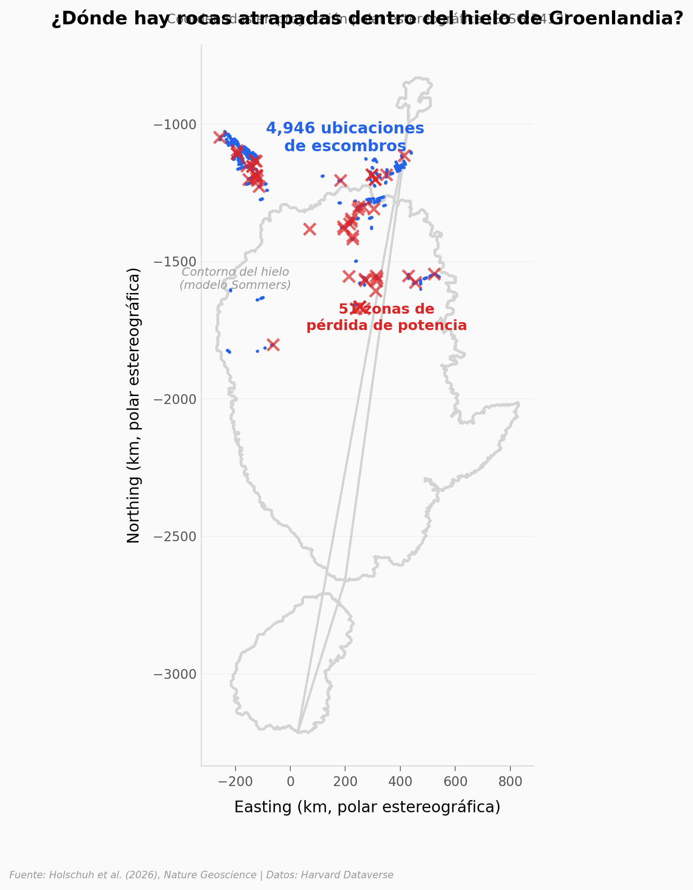

# Rocas atrapadas dentro del hielo de Groenlandia

Radar 3D aerotransportado revela 4,946 ubicaciones de "trenes de escombros" — estructuras dentro del manto de hielo que contienen material rocoso elevado más de 1,000 m sobre el lecho. Se concentran en el norte de Groenlandia y no aparecen en la Antártida.

**El hallazgo:** Todo apunta a que se formaron hace ~120,000 años cuando el hielo se regeneró tras el último interglacial, arrastrando rocas del lecho hacia arriba. 11 modelos independientes muestran que Groenlandia era más pequeña entonces.

## Gráfica clave



## Reproducir

[](https://colab.research.google.com/github/Ciencia-a-Mordiscos/lab/blob/main/papers/2026-03-28-rocas-hielo-groenlandia/notebook.ipynb)

O localmente:
```bash
pip install pandas matplotlib numpy scipy
jupyter execute notebook.ipynb
```

## Datos

- `datos/trenes_escombros.csv` — 4,946 ubicaciones de escombros (coordenadas polares estereográficas)
- `datos/perdida_potencia.csv` — 51 zonas de pérdida de potencia del radar
- `datos/extensiones_hielo_mis5e.csv` — 11 modelos de extensión del hielo durante MIS 5e
- `datos/escombros_literatura.csv` — 5 referencias previas de escombros en hielo

## Links

- **Video:** [Ver en YouTube](https://youtube.com/watch?v=7RyzExZhEUs)
- **Paper:** [Nature Geoscience — DOI: 10.1038/s41561-026-01950-1](https://doi.org/10.1038/s41561-026-01950-1)
- **Datos originales:** [Harvard Dataverse](https://doi.org/10.7910/DVN/9K2J6R)
- **Código original:** [github.com/nholschuh/DebrisTrains](https://github.com/nholschuh/DebrisTrains)
