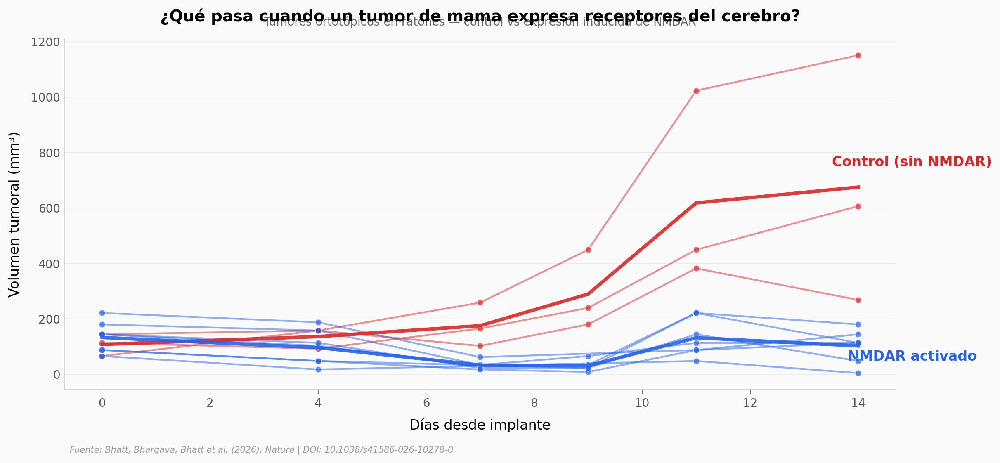

# Un tumor de mama que despierta anticuerpos contra tu cerebro

Algunos tumores de mama triple negativo expresan receptores NMDA — proteínas normalmente exclusivas del cerebro. Cuando el sistema inmune los detecta, produce anticuerpos que atacan el tumor... pero esos mismos anticuerpos pueden cruzar al cerebro y causar encefalitis autoinmune. Un trade-off brutal entre inmunidad anti-cáncer y daño neurológico.

**El hallazgo:** Activar la expresión de receptores NMDA en tumores reduce su volumen un 85% (p = 0.021, d = 2.51), pero los anticuerpos generados pueden causar daño neurológico.

## Gráfica clave



## Reproducir

[](https://colab.research.google.com/github/Ciencia-a-Mordiscos/lab/blob/main/papers/2026-03-29-cancer-despierta-armas-cerebro/notebook.ipynb)

O localmente:
```bash
pip install pandas matplotlib numpy scipy
jupyter execute notebook.ipynb
```

## Datos

- `datos/crecimiento_tumor_nmdar.csv` — Volumen tumoral de 3 ratones con NMDAR, 6 timepoints
- `datos/tumor_veh_vs_dox.csv` — Crecimiento tumoral VEH vs DOX, 10 ratones, 56 mediciones
- `datos/anticuerpos_sk3d_vs_mgo53.csv` — Transferencia pasiva de anticuerpos, 7 ratones
- `datos/pacientes_demograficos.csv` — Metadatos de 63 muestras de pacientes

## Links

- **Video:** [Ver en YouTube](https://youtube.com/watch?v=20DRfz2D5Bg)
- **Paper:** [Nature — DOI: 10.1038/s41586-026-10278-0](https://doi.org/10.1038/s41586-026-10278-0)
- **Datos originales:** [Supplementary Table 6](https://doi.org/10.1038/s41586-026-10278-0)
- **Código original:** [github.com/Janowitz-Lab/nmdar](https://github.com/Janowitz-Lab/nmdar)
