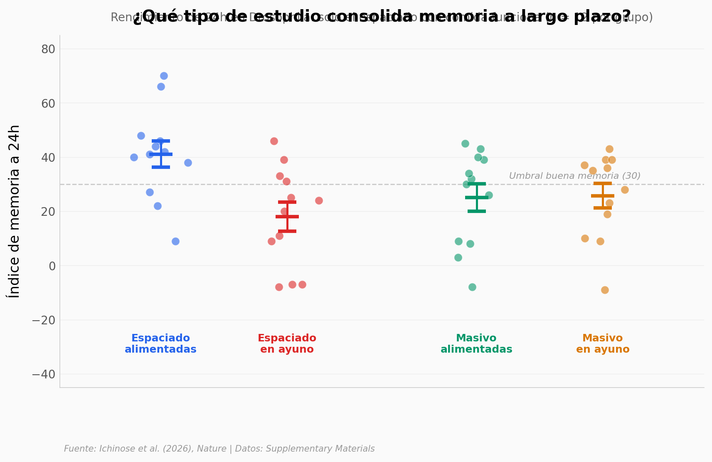

# Nadie Sabe Por Qué Te Da Tanta Hambre Después de Estudiar

Un sensor de fructosa en el cerebro de *Drosophila* conecta la consolidación de memoria con el hambre. El entrenamiento espaciado — el mismo que de verdad funciona para aprender — activa neuronas Gr43a que generan "hambre emocional" después de estudiar.

**El hallazgo:** Las moscas que aprenden con entrenamiento espaciado (alimentadas) tienen un índice de memoria de 41 puntos vs 18 para las que están en ayuno. Silenciar las neuronas sensoras de fructosa reduce la memoria un 33% — y elimina el 82% de la preferencia por azúcar post-entrenamiento.

## Gráfica clave



## Reproducir

[](https://colab.research.google.com/github/Ciencia-a-Mordiscos/lab/blob/main/papers/2026-03-30-hambre-despues-estudiar/notebook.ipynb)

O localmente:
```bash
pip install pandas matplotlib numpy scipy
jupyter execute notebook.ipynb
```

## Datos

- `datos/memoria_tipo_entrenamiento.csv` — Índice de memoria 24h: spaced/massed × fed/starved (48 mediciones)
- `datos/silenciar_gr43a.csv` — Efecto de silenciar neuronas Gr43a en 3 réplicas (102 mediciones)
- `datos/preferencia_sucrosa.csv` — Preferencia por sucrosa post-entrenamiento (65 mediciones)
- `datos/preferencia_knockdown_gr43a.csv` — Preferencia con knockdown Gr43a (100 mediciones)

## Links

- **Video:** [Ver en YouTube](https://youtube.com/shorts/e14oe0wa2bY)
- **Paper:** [Nature — DOI: 10.1038/s41586-026-10306-z](https://doi.org/10.1038/s41586-026-10306-z)
- **Datos originales:** [Supplementary Materials](https://www.nature.com/articles/s41586-026-10306-z#Sec27) (Source Data Figs. 1, 4)
