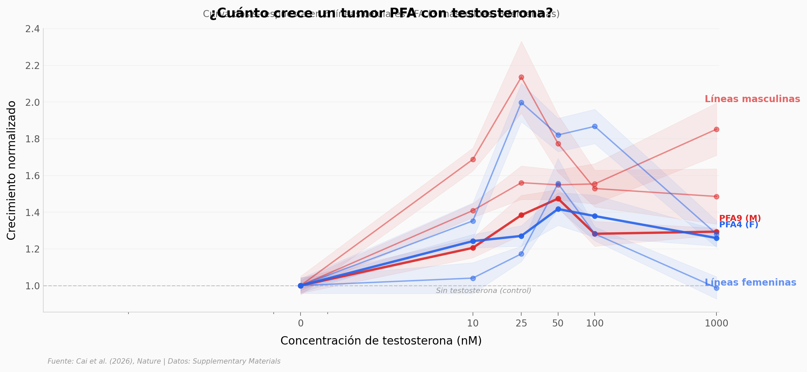

# Nadie Sabía que Esta Hormona Alimenta Tumores en Niños

El ependimoma PFA es uno de los tumores cerebrales infantiles más difíciles de tratar. Afecta más a niños varones que a niñas — y durante décadas nadie supo por qué.

**El hallazgo:** Los andrógenos (testosterona, DHT) promueven directamente el crecimiento de células PFA. A 25 nM de testosterona, el crecimiento aumenta ~60% respecto al control. El efecto es específico: otros tumores cerebrales pediátricos (ST-EPN, DIPG) no responden.

## Gráfica clave



## Reproducir

[](https://colab.research.google.com/github/Ciencia-a-Mordiscos/lab/blob/main/papers/2026-03-30-hormona-alimenta-tumores-ninos/notebook.ipynb)

O localmente:
```bash
pip install pandas matplotlib numpy scipy
jupyter execute notebook.ipynb
```

## Datos

- `datos/testosterone_dosis_pfa.csv` — Crecimiento normalizado de 6 líneas PFA a 6 dosis de testosterona (216 mediciones)
- `datos/hormonas_crecimiento_pfa.csv` — Comparación de 5 hormonas en PFA9 y PFA4 (40 mediciones)
- `datos/testosterone_otros_tumores.csv` — Control negativo: testosterona en ST-EPN y DIPG (144 mediciones)
- `datos/pvalues_sexo_tipos_celulares.csv` — P-values de proporción de tipos celulares por sexo

## Links

- **Video:** [Ver en YouTube](https://youtube.com/shorts/fSOCN38a_v8)
- **Paper:** [Nature — DOI: 10.1038/s41586-026-10264-6](https://doi.org/10.1038/s41586-026-10264-6)
- **Datos originales:** [Supplementary Materials](https://www.nature.com/articles/s41586-026-10264-6#Sec31) (Source Data Figs. 5, 10, 11)
