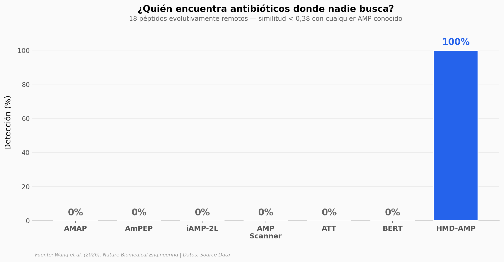

# Descubrieron 74 Antibióticos Imposibles de Encontrar

Una IA entrenada con el lenguaje de las proteínas escaneó los genomas de 9 mamíferos y encontró más de 37 millones de posibles antibióticos naturales — invisibles para los métodos convencionales. De 91 candidatos validados experimentalmente, 74 mostraron actividad antibacteriana fuerte.

**El hallazgo:** HMD-AMP detecta el 100% de péptidos antimicrobianos evolutivamente remotos donde los 6 métodos de referencia detectan 0%. Cuatro de los péptidos descubiertos funcionan contra bacterias Gram-positivas Y Gram-negativas con baja toxicidad.

## Gráfica clave



## Reproducir

[](https://colab.research.google.com/github/Ciencia-a-Mordiscos/lab/blob/main/papers/2026-03-31-antibioticos-imposibles-ia-proteinas/notebook.ipynb)

O localmente:
```bash
pip install pandas matplotlib numpy scipy
jupyter execute notebook.ipynb
```

## Datos

- `datos/deteccion_amps_remotos.csv` — 18 péptidos remotos, scores de 7 métodos
- `datos/mic_valores.csv` — MIC de 18 AMPs contra 4 patógenos (72 mediciones)
- `datos/perfil_seguridad.csv` — Hemólisis y citotoxicidad (79 puntos)
- `datos/similitud_distribucion.csv` — 7.646 AMPs candidatos con score de similitud

## Links

- **Video:** [Ver en YouTube](https://www.youtube.com/watch?v=VbpoT1r9N5A)
- **Paper:** [Nature Biomedical Engineering — DOI: 10.1038/s41551-026-01630-w](https://doi.org/10.1038/s41551-026-01630-w)
- **Código:** [github.com/ml4bio/HMD-AMP](https://github.com/ml4bio/HMD-AMP)
- **Datos originales:** Source Data (MOESM4) del paper
