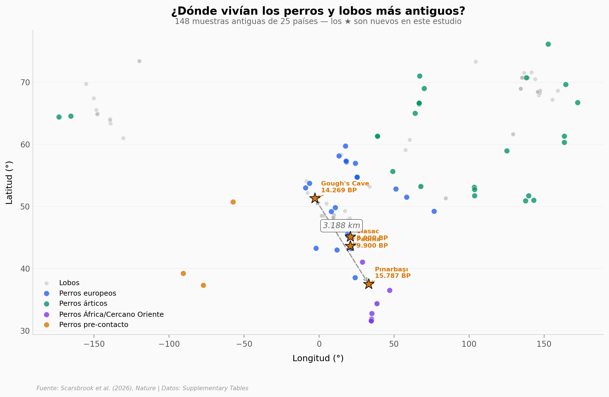

# Nadie sabe cómo los mismos perros cruzaron toda Europa

Hace 14.000 años, los mismos perros vivían en una cueva inglesa y en un asentamiento turco — a 3.188 km de distancia. Los datos sugieren que una población canina genéticamente homogénea ya estaba distribuida por toda Europa occidental y Anatolia.

**El hallazgo:** Genomas de 148 cánidos antiguos (74 perros, 73 lobos, 1 dhole) de 25 países indican que para hace 14.300 años, perros casi idénticos vivían con tres culturas humanas completamente distintas.

## Gráfica clave



## Reproducir

[](https://colab.research.google.com/github/Ciencia-a-Mordiscos/lab/blob/main/papers/2026-04-01-perros-cruzaron-europa/notebook.ipynb)

O localmente:
```bash
pip install pandas matplotlib numpy scipy
jupyter execute notebook.ipynb
```

## Datos

- `datos/muestras.csv` — 148 muestras antiguas con especie, grupo, coordenadas, edad (Table 1)
- `datos/cronologia.csv` — 240 entradas cronológicas de 11 estudios (Table 5)
- `datos/isotopos.csv` — 12 muestras isotópicas δ¹³C/δ¹⁵N (Table 6)

## Links

- **Video:** [Ver en YouTube](https://youtube.com/watch?v=62WFFzEFzNM)
- **Paper:** [Nature — DOI: 10.1038/s41586-026-10170-x](https://doi.org/10.1038/s41586-026-10170-x)
- **Datos originales:** [Nature Supplementary Tables](https://www.nature.com/articles/s41586-026-10170-x#Sec25)
