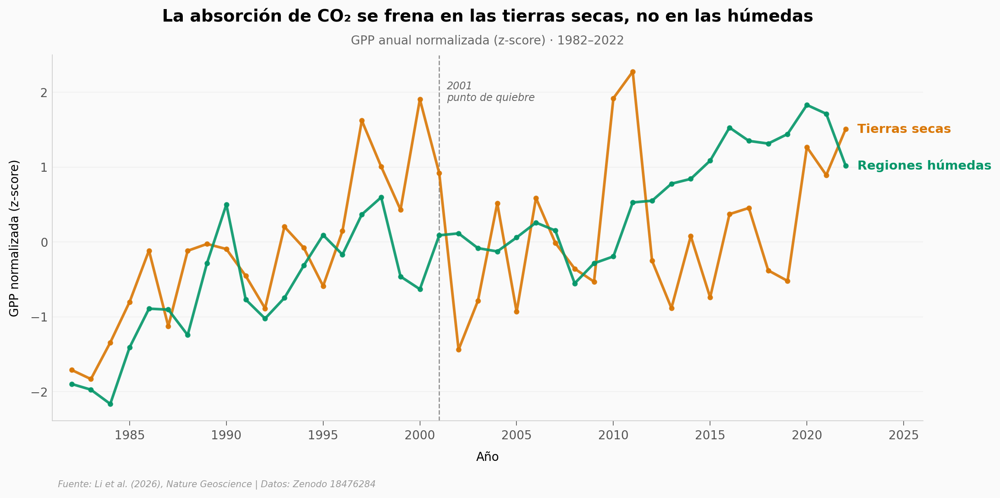

# Las plantas absorben menos CO₂ desde 2001 — y son las tierras secas las culpables

Li y su equipo cruzaron 40 años de datos satelitales (1982–2022) con torres FLUXNET y *machine learning*. La absorción de carbono vegetal del planeta se está frenando, pero el frenado no se reparte por igual: en las regiones húmedas la fotosíntesis sigue subiendo casi al mismo ritmo que antes, mientras que en las tierras secas el ritmo cayó **72%** después del año 2000. El sospechoso principal es el VPD — la "sed" del aire — que aceleró ×12 en esas mismas zonas.

**El hallazgo:** **El slope del GPP en tierras secas pasó de +2.7 a +0.8 gC/m²/año por año (p=0.21 — ya no significativo), mientras el VPD subió de +0.35 a +4.31 Pa/año por año.**

## Gráfica clave



## Reproducir

[](https://colab.research.google.com/github/Ciencia-a-Mordiscos/lab/blob/main/papers/2026-04-01-tierras-secas-frenan-co2-vegetal/notebook.ipynb)

O localmente:
```bash
pip install pandas matplotlib numpy scipy
jupyter execute notebook.ipynb
```

## Datos

- `datos/serie_anual_clima_gpp.csv` — Serie anual 1982–2022 (41 años) de CO₂ atmosférico, GPP, ET, temperatura y VPD para tierras secas y regiones húmedas. Fuente: Source Data Fig. 2a-d del paper.
- `datos/tendencia_gpp_por_aridez.csv` — Tendencia GPP por bin de aridez (39 bins, 0.15–3.95) comparando 1982–2000 vs 2001–2022.
- `datos/observacion_vs_dgvm_por_aridez.csv` — ML observado vs DGVMs (Dynamic Global Vegetation Models) por bin de aridez (100 bins).
- `datos/observacion_vs_esm_por_aridez.csv` — ML observado vs ESMs (Earth System Models, CMIP6) por bin de aridez (100 bins).

## Links

- **Video:** [Pendiente]
- **Paper:** [Nature Geoscience — DOI: 10.1038/s41561-026-01957-8](https://doi.org/10.1038/s41561-026-01957-8)
- **Datos originales:** [Zenodo 18476284](https://doi.org/10.5281/zenodo.18476284) (CC-BY 4.0)
