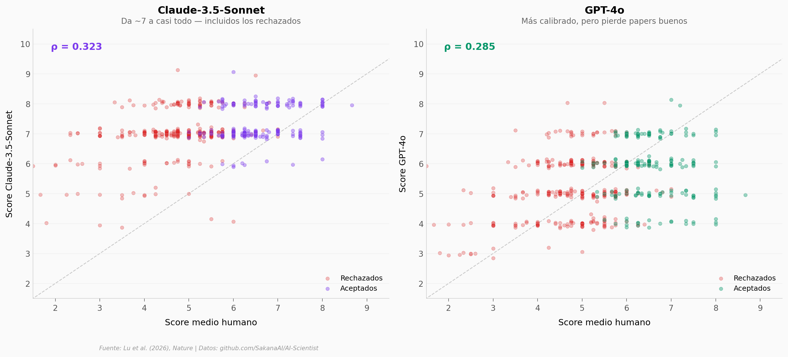

# ¿Puede una IA revisar papers científicos como lo haría un humano?

500 papers de ICLR 2024 fueron evaluados por revisores humanos Y por modelos de lenguaje (Claude-3.5-Sonnet y GPT-4o). El resultado: la correlación entre IA y humanos es modesta (ρ ≈ 0,3), y cada modelo falla de forma diferente — Claude acepta casi todo, GPT-4o es demasiado conservador.

**El hallazgo:** Claude da un score medio de 7,00 a papers que los humanos rechazan (score medio humano: 4,75). GPT-4o está mejor calibrado pero pierde el 67% de los papers que los humanos aceptan.

## Gráfica clave



## Reproducir

[](https://colab.research.google.com/github/Ciencia-a-Mordiscos/lab/blob/main/papers/2026-04-02-ia-scientist-paper-autonomo/notebook.ipynb)

O localmente:
```bash
pip install pandas matplotlib numpy scipy
jupyter execute notebook.ipynb
```

## Datos

- `datos/revisiones_comparadas.csv` — 500 papers con scores humanos, Claude y GPT-4o (29 columnas)
- `datos/scores_por_decision.csv` — Scores medios por categoría de decisión

## Links

- **Video:** [Ver en YouTube](https://youtube.com/watch?v=U1Tzpx5wbtM)
- **Paper:** [Nature — DOI: 10.1038/s41586-026-10265-5](https://doi.org/10.1038/s41586-026-10265-5)
- **Código:** [github.com/SakanaAI/AI-Scientist](https://github.com/SakanaAI/AI-Scientist)
